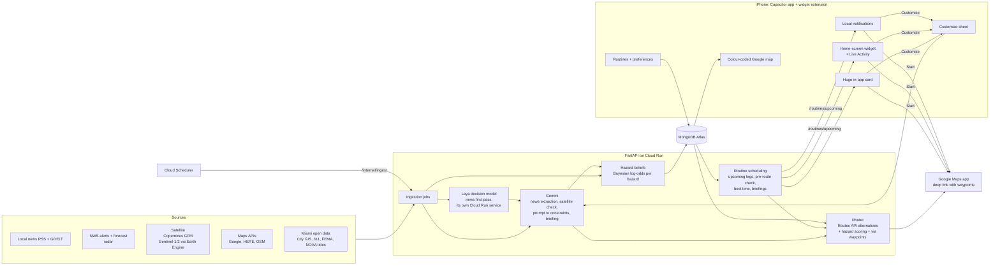
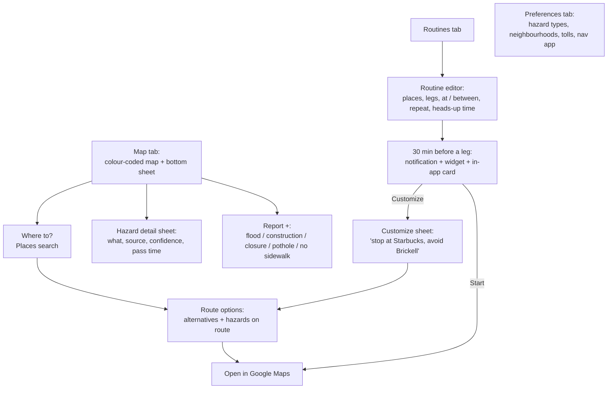

# MAPAY — Agent Build Guide

Miami-native hazard-aware navigation for iPhone. Built at ShellHacks 2026, ~20-24hrs of dev time, 2 devs + an optional 3rd on data, AI and the pitch.

**One-line pitch:** MAPAY shows, colour-coded on one map, which Miami streets are flooded, under construction, congested, closed or missing sidewalks, and before your daily trips it pops up a big widget on your iPhone to start the route or change it with a prompt.

`README.md` is the product spec and `docs/design.md` is the design spec (Apple-like). This file is how we build it this weekend: how to work on a task, platform, priorities, stack, algorithms, data sources, schema and the hour-by-hour plan. The tasks themselves are GitHub issues ([task board #45](https://github.com/TomasPessagno/mapay/issues/45)).

---

## What we're building

1. **Colour-coded hazard map.** Every report category has one colour, one icon and one line style. See [Map and colour legend](#map-and-colour-legend).
2. **Routine routes.** Saved places (e.g. MMC, BBC) and legs in both directions. Each leg runs at a specific time (`at 09:30`) or inside a range (`between 17:00 and 19:00`), repeating every day, every week or on custom weekdays. "Arrive by" comes later. See [Routines](#routines).
3. **Preferences.** Avoid / prefer to avoid / don't care per category, plus avoiding neighbourhoods by name. User defaults with per-routine overrides. See [Preferences](#preferences).
4. **Heads-up widget.** Before each routine leg: a local notification, a huge in-app card and a large home-screen widget that switches into "leave now" mode (plus a Live Activity, P1), with **Start** (Google Maps) and **Customize** (prompt → Gemini → new route). See [Pre-route heads-up (iPhone)](#pre-route-heads-up-iphone).
5. **Data.** Local news scraped and interpreted by Gemini, weather from NWS, near-real-time satellite for floods and construction, and everything else from maps APIs (Google, HERE, OSM, …) and Miami open data. See [Data pipelines](#data-pipelines).

---

## Working on a task (people and coding agents)

Every task is a GitHub issue: [task board #45](https://github.com/TomasPessagno/mapay/issues/45), overview and testing guide in [`TASKS.md`](TASKS.md). To work on one:

1. Check that the issues under **Blocked by** are closed. If not, pick another task.
2. Branch from `main` using the branch name in the issue. One issue per branch, one agent per issue.
3. Only touch the files listed under **Scope**. `backend/**` and `frontend/**` belong to different tracks.
4. API shapes must match `frontend/public/mocks/`. If one has to change, update the mock, `frontend/src/lib/types.ts` and `backend/app/db/models.py` in the same PR.
5. Tests never hit the network or a live database. Keys come from `.env` / `frontend/.env` and are never committed.
6. Run the checks before opening the PR:
   - backend: `cd backend && ruff check . && pytest` (CI also requires `tests/test_beliefs.py::BeliefMathTests::test_natural_log_odds_and_posterior`, so keep it)
   - frontend: `cd frontend && npm run lint && npx tsc -b --noEmit && npm run build`
7. Open a PR into `main` that says `Closes #<issue>` and merge when CI is green. Merges that touch `backend/` deploy to Cloud Run.
8. `needs-mac` issues (Swift, Simulator, iPhone) can be drafted anywhere but must be built and checked on the Mac.

Gemini interprets and explains; routing stays deterministic. Never analyse Google Maps imagery or Street View.

---

## Platform: iPhone only

- **Strictly Apple.** One app, for iPhone (iOS 17+). The browser is only for development and a public web preview; no Android build.
- **Dev loop:** build the UI in the browser (Vite + Ionic) on any laptop. The Mac builds the Capacitor iOS app for the **iOS Simulator**, where widgets, local notifications and Live Activities all work.
- **Demo device:** sideload onto the iPhone with **AltStore** (free Apple ID):
  1. `npx cap sync ios`
  2. In `frontend/ios/App`: `xcodebuild -workspace App.xcworkspace -scheme App -configuration Release -sdk iphoneos -derivedDataPath build CODE_SIGNING_ALLOWED=NO build` (use `-project App.xcodeproj` if the iOS project uses Swift Package Manager instead of CocoaPods).
  3. Put `build/Build/Products/Release-iphoneos/App.app` in a folder named `Payload`, zip it and rename to `Mapay.ipa`.
  4. Open the `.ipa` in AltStore on the iPhone; AltStore re-signs it with the Apple ID (AltServer running on the Mac, same Wi-Fi).
- **What a free Apple ID can't do:** remote push (APNs), App Groups, Sign in with Apple, Associated Domains (universal links), iCloud. So the phone schedules its own reminders ([Pre-route heads-up](#pre-route-heads-up-iphone)), the widget fetches its own data, deep links use the custom scheme `mapay://`, and users are anonymous device ids.
- **AltStore limits:**
  - 3 active apps including AltStore, and app extensions count. AltStore + Mapay + the widget extension = 3, so we get **exactly one extension**. Widgets and the Live Activity share it; no notification service/content extensions.
  - Apps expire after 7 days: refresh in AltStore before demo day, and again right before judging.
  - 10 App IDs per 7 days: fix the bundle ids in hour 0 (e.g. `com.<you>.mapay` and `com.<you>.mapay.widget`) and don't change them.
- **With a paid Apple Developer account (later):** server push via APNs (fresh data at T−30 without opening the app), time-sensitive notifications, push-started Live Activities, App Groups, TestFlight, Sign in with Apple.

---

## Scope and priorities

**P0: must work live in the demo**
- Runs on the iPhone (AltStore build) and in the iOS Simulator, with the Apple-like UI from `docs/design.md`. Web build on Vercel as a public preview for judges.
- Colour-coded map with legend and tap-for-details: flood, construction, congestion, closure, no sidewalk, weather, incidents from news.
- Hazard-aware routing (Routes API alternatives + our scoring + via waypoints) that respects preferences, including avoided neighbourhoods. "Open in Google Maps" keeps our route through waypoints.
- Routines: the MMC ↔ BBC example works end to end (there at 09:30, back between 17:00 and 19:00; daily / weekly / custom weekdays).
- Heads-up: local notification with Start / Customize, huge in-app card, and a large home-screen widget that switches into heads-up mode, plus a "fire heads-up now" demo button.
- Customize with a prompt: Gemini → constraints JSON → router → new route + explanation.
- News → Gemini → pins on the map with source links.
- Satellite on the map, labelled with the pass time: Sentinel-1 flood extent (Copernicus GFM or our own Earth Engine run) and satellite evidence for construction (automatic Sentinel-2 detection, or Gemini-checked image chips at permit sites as the fallback).
- Tide + rain driven flood prediction on curated hotspots, the most reliable street-level flood signal.

**P1: should have**
- Live Activity (Lock Screen + Dynamic Island countdown) and Lock Screen widgets.
- Best time to leave inside a time range.
- Precomputed heads-up briefings (Cloud Scheduler) so the app and widget load instantly.
- Typical congestion from Google Routes API samples.
- Radar overlay, 311 potholes.

**P2: if time allows**
- Time scrubber (Now / +30m / +1h), holiday + event warnings, walk/jog mode, toll/gas context, daily "chronic spots" memory, saving preferences learned from prompts, Apple Maps / TomTom ETA cross-check.

**Later (after ShellHacks)**
- "Arrive by" routines (aspirational, see [Routines](#routines)), paid Apple Developer account features (above), in-app turn-by-turn, commercial high-res imagery.

**DO NOT attempt this weekend**
- Android or any non-Apple build.
- Server push (FCM/APNs). A free Apple ID can't receive it, so don't build the plumbing.
- CarPlay (needs an entitlement from Apple).
- Live per-station gas prices or a real toll-pricing API. Neither exists publicly at usable cost/effort.
- Running Gemini or CV on Google Maps satellite tiles or Street View. Google Maps Platform terms forbid creating content from Google Maps content, and those tiles aren't live anyway. All imagery analysis uses Copernicus Sentinel data, so the `street_view` evidence source in `belief_config.py` stays without a producer.

---

## Tech stack

- **Backend:** FastAPI (Python) on Cloud Run. Shapely + GeoPandas for hazard geometry (route/hazard intersections, buffers).
- **Hazard confidence:** a Bayesian log-odds belief per hazard (`backend/app/routing/beliefs.py`, tuning in `belief_config.py`, explained in `docs/hazard-beliefs.md`). Source layers register hazards with priors; news, reports and satellite add evidence; a hazard is *active* for routing at log-odds ≥ 1.0 (p ≈ 0.73).
- **DB:** MongoDB Atlas (free M0 cluster) via `motor` (async). `2dsphere` indexes for geo queries, TTL indexes for expiring hazards.
- **App:** React + Vite + TypeScript + **Ionic React in iOS mode** (iOS-style sheets, lists, segmented controls, tab bar), wrapped with **Capacitor** for iOS. Plugins: `@capacitor/local-notifications` (schedule, actions, image attachments), `@capacitor/app` (`mapay://` deep links), `@capacitor/app-launcher` (open Google Maps), `@capacitor/device` (device id), `@capacitor/geolocation`, `@capacitor/haptics`, `@capacitor/filesystem` (notification images).
- **Native (Swift, on the Mac):** one widget extension `MapayWidget` (WidgetKit widgets + ActivityKit Live Activity UI) and a small local Capacitor plugin `MapayNative` (reload widget timelines, start/end the Live Activity).
- **Map:** fully on Google Maps Platform. Maps JavaScript API via `@vis.gl/react-google-maps` inside the app's web view, with light + dark cloud-styled Map IDs that follow the system; Google `TrafficLayer` for live congestion; Places API for search, saved places and stops. No MapLibre or MapKit: Google's terms don't allow showing Google routes/places on a non-Google map. Deep links use the Google Maps URLs API (`https://www.google.com/maps/dir/?api=1&origin=...&destination=...&waypoints=...`); only Google Maps preserves multi-waypoint shaping, Apple Maps / Waze get origin → destination.
- **Routing:** Google Routes API with our own deterministic hazard scoring. See [Routing](#routing). The committed `routing/engine.py` still searches an OSMnx graph (its loader is a stub, so `/route` returns 503); the path search moves to Routes API, while the beliefs and the pre-route check stay.
- **LLM:** Gemini via the Google GenAI SDK (`google-genai`) with an API key from **Google AI Studio** (`GEMINI_API_KEY`), structured JSON output. Gemini *interprets* (news → events, prompt → constraints, satellite chips → yes/no + description) and *explains*. It never picks the route. AI Studio keys have per-minute and per-day request limits: batch news articles per call, never re-process an article, and cache results.
- **Decision model:** [Laya](https://github.com/NandhaKishorM/laya), open source (Apache-2.0), which we host ourselves on Cloud Run as `mapay-laya` (A24).
  - It answers typed questions about a text (`noul` = yes/no, `choice`, `score`) with a probability per answer, in about 0.2 s on CPU.
  - It speaks TypeSafe Jev's `POST /v1/systemone` API; the backend reads `LAYA_URL` and `LAYA_API_KEY`.
  - The news pipeline uses it as a first pass before Gemini. Without `LAYA_URL` it runs Gemini-only.
  - Like Gemini, it never picks the route.
- **Satellite:** Copernicus GFM (ready-made Sentinel-1 flood maps) + Google Earth Engine (`earthengine-api`) for our own Sentinel-1 / Sentinel-2 processing.
- **Identity:** anonymous. The device id is `identifierForVendor`: `Device.getId()` in the app and `UIDevice.current.identifierForVendor` in the widget. Both are signed by the same team, so they should match; verify on the iPhone in hour 0 (fallback for the demo: bake the demo user's id into the build). Sent as `X-Device-Id`. Not real auth, fine for the hackathon.
- **Jobs:** Cloud Scheduler → authenticated `POST /internal/*` endpoints (ingestion + briefing precompute). Don't rely on in-process pollers: Cloud Run throttles CPU between requests by default.
- **Deploy:** Backend on Cloud Run (`min-instances=1` during judging to kill cold starts). `.github/workflows/ci-cd.yml` runs lint + tests on every push and deploys when a push to `main` touches `backend/`. The app ships as the iOS build; the web build on Vercel is a public preview.

**Accounts and keys to set up in hour 0**
- Google Maps Platform: a browser key (Maps JS, Places) restricted to the app's web-view origin `capacitor://localhost`, `http://localhost:5173` and the Vercel domain (if Google rejects the `capacitor://` referrer, restrict that key by API only during the event); a server key (Routes, Places, Geocoding, Static Maps) + the Static Maps URL-signing secret; light and dark Map IDs with muted cloud styling.
- Apple: Xcode on the Mac, AltServer on the Mac, AltStore with a free Apple ID on the demo iPhone.
- Earth Engine: register the GCP project for noncommercial use (Community tier, 150 EECU-hours/month) and give the Cloud Run service account access.
- Copernicus GFM account (free) for flood-map API/WMS-T access.
- Gemini API key from Google AI Studio (`GEMINI_API_KEY`), HERE API key, NWS `User-Agent` string. P2 only: Ticketmaster, EIA.

---

## API contract

| Method + path | What |
|---|---|
| `GET /layers?t=&bbox=` | One FeatureCollection per legend category (`flood`, `weather`, `construction`, `closure`, `congestion`, `no_sidewalk`, `pothole`, `incident`, `event`) for time `t`, plus `freshness` per source (e.g. last satellite pass) |
| `POST /route` | origin, destination, `depart_at`, preferences, optional constraints, optional `routine_id` (saves the route + belief snapshot on the routine) → chosen route + scored alternatives, hazards on route, deep links, briefing |
| `POST /customize` | prompt + routine leg (or origin/destination) → constraints JSON, new route vs old, explanation |
| `GET/POST/PUT/DELETE /places` | saved places |
| `GET/POST/PUT/DELETE /routines` | routines |
| `GET /routines/upcoming?days=7` | next leg occurrences with route summary, top hazards, best time (windows) and a signed Static Maps image URL. The app schedules notifications from it; the widget uses `?compact=1&limit=3` for its timeline |
| `POST /routines/{id}/pre-route-check` | `{departure}`, called 30–60 min before a leg: re-checks the beliefs on the saved route and recalculates (with a Gemini explanation) only if a hazard crossed the threshold. Exists; see `docs/hazard-beliefs.md` |
| `GET/PUT /me/preferences` | user default preferences |
| `GET /neighborhoods` | ids + names for the neighbourhood search (polygons stay on the server) |
| `POST /report`, `GET /report` | user reports; with `hazard_id` (and `cleared`) a report adds crowd / cleared evidence to that hazard's belief |
| `GET /alerts` | NWS alerts + news items |
| `POST /demo/heads-up` | `{routine_id, leg}`: makes that leg "due in 30 min" in `/routines/upcoming`, for the live demo |
| `POST /internal/ingest/{job}` | Cloud Scheduler: `news`, `weather`, `here`, `tides`, `gfm`, `s1`, `s2`, `traffic`, `sidewalks`, `briefings` |

User endpoints take `X-Device-Id` (anonymous device id). `/internal/*` accepts only Cloud Scheduler's OIDC token. Example responses for every endpoint live in `frontend/public/mocks/` and are the contract both sides build against.

---

## Map and colour legend

One source of truth for colours, icons and line styles: `frontend/src/map/legend.ts`, used by both the map layers and the legend sheet. `docs/legend.svg` is the reference picture and `docs/design.md` has the full visual spec. The palette uses Apple's system colours (light / dark). Colour is never the only signal: every category also has its own icon and line style.

| Category (`/layers` key) | Colour | Light / dark | Drawn as | Main sources |
|---|---|---|---|---|
| Your route | Blue | `#007AFF` / `#0A84FF` | Solid line with white casing; alternatives at 45 % | Routes API |
| Flooded street (`flood`) | Cyan | `#32ADE6` / `#64D2FF` | Wide translucent band on streets + areas with outline, water-waves icon | Tides + rain on hotspots, satellite (GFM / Sentinel-1), news, user reports |
| Heavy rain / weather alert (`weather`) | Indigo | `#5856D6` / `#5E5CE6` | Translucent area (25 %), no outline, cloud-rain icon | NWS alerts, radar |
| Construction (`construction`) | Orange | `#FF9500` / `#FF9F0A` | Cone icon + area outline | City of Miami GIS, HERE roadworks, satellite (Sentinel-2), news |
| Road closure (`closure`) | Label | `#1C1C1E` / `#F2F2F7` | Dashed line + no-entry icon | HERE incidents, City GIS, news |
| Congestion (`congestion`) | Yellow → red → dark red | `#FFCC00` → `#FF3B30` → `#A50E0E` | Line along the road (same idea as Google's traffic colours) | Google `TrafficLayer` (live), Routes API samples (typical) |
| No sidewalk (`no_sidewalk`) | Purple | `#AF52DE` / `#BF5AF2` | Dotted line, zoom ≥ 15 only | OSM `sidewalk=no/none` |
| Pothole (`pothole`) | Brown | `#A2845E` / `#AC8E68` | Small dot with halo | Miami-Dade 311, user reports |
| Incident / police / news (`incident`) | Pink | `#FF2D55` / `#FF375F` | Pin with `!` | News → Gemini |
| Event / holiday (`event`) | Green | `#34C759` / `#30D158` | Pin with calendar icon | Ticketmaster, Nager.Date, news |

- **Severity** (1–5) → line width / marker size. **Confidence** = the belief probability → opacity; below the routing threshold (p ≈ 0.73) the sheet says "unconfirmed". **Predicted** hazards (a belief with only its prior, e.g. a tide-driven flood) use lower opacity and say "predicted".
- **Focus mode:** when a route is shown, hazards more than ~150 m from it fade to 30 % and hazards on it get an icon badge along the line.
- Tapping anything opens a sheet: what, where, source(s) with links, confidence, observed/pass time, expires.
- The legend sheet doubles as layer toggles.
- Check the colours on the iPhone over the muted basemap (light and dark) in hour 0–1 and adjust the tokens there, not in components.

---

## Routing

1. Call `computeRoutes` with `computeAlternativeRoutes: true`, `routingPreference: TRAFFIC_AWARE_OPTIMAL`, `departureTime`, and Google's own `avoidTolls` / `avoidHighways` from preferences. It returns up to 3 routes. **No intermediate waypoints on this call**: Routes API returns no alternatives when intermediates are set.
2. Score each route: `cost = predicted_minutes + Σ penalty` over **active** hazard beliefs (log-odds ≥ 1.0) that intersect its ~30 m corridor (the same threshold and buffer as `belief_config.py`), where `penalty = weight(preference) × severity × p × 3 min` and `p` is the belief probability. Weights: `avoid` 10, `prefer_avoid` 2, `ignore` 0. Avoided neighbourhoods count as severity-5 hazards with p = 1.
3. If the best route still crosses an `avoid` hazard with severity ≥ 4, add one `via: true` intermediate waypoint about 300 m past the hazard's edge, on the side with fewer hazards, and call again (one route comes back). At most 2 detour rounds.
4. Deep link: `https://www.google.com/maps/dir/?api=1&origin=…&destination=…&waypoints=…&travelmode=driving`, opened with `AppLauncher.openUrl` so iOS hands it to the Google Maps app (Safari if it isn't installed). Keep it to **≤ 3 waypoints**: mobile only accepts 3. Apple Maps / Waze links get origin → destination only.
5. If nothing avoids the hazard (e.g. the destination is inside an avoided neighbourhood), return the best route and say so in the briefing.

Routes with stops (from Customize) also come back as a single route, so only step 3 applies to them. Results are cached in `routes_cache` for 15 min.

---

## Routines

A routine is a set of **legs** between saved places. Each leg has its own time. The spec example (FIU campuses):

| Leg | When | Repeat |
|---|---|---|
| MMC → BBC | at 09:30 | Mon–Fri (custom weekdays) |
| BBC → MMC | between 17:00 and 19:00 | Mon–Fri |

- **Time per leg:** `at` (specific time) or `window` (range). Mixing them across legs is the "combination" case.
- **Repeat:** `daily`, `weekly` (one weekday) or `custom` (a set of weekdays). Set on the routine; a leg can override `days`.
- **Return trip:** the editor offers "add the way back", which creates the reverse leg with its own time.
- **Timezone:** stored per routine (default `America/New_York`). Compute occurrences in local time so DST works, store UTC.
- **Upcoming occurrences:** for each active leg, the next local dates matching the repeat rule whose departure (or window start) is still ahead. `GET /routines/upcoming` returns them soonest first.
- **Best time in a window (P1):** try departures every 15 min across the window with Routes API (future `departureTime`) plus hazard penalties *at that time* (tide- and rain-driven floods change inside a window). Suggest the best: "Leave at 17:45: 24 min instead of 38".
- **Arrive by (later, aspirational):** `anchor: "arrive"`. Routes API only accepts `arrivalTime` for transit, so for driving we search departure times ourselves: binary-search `departureTime` in [arrive_by − 3 h, arrive_by] until `departure + predicted duration + 5 min buffer ≤ arrive_by` (~6 Routes API calls), then schedule the heads-up `heads_up_minutes` before that departure.
- **Current code:** a routine is one origin/destination with `days` + a single `time_window`, plus `route_state` (saved route + belief snapshot for the pre-route check). Moving to legs means one `route_state` per leg.

---

## Preferences

- **Per category:** `avoid` | `prefer_avoid` | `ignore`. Defaults: flood, closure → `avoid`; construction, congestion, incident, weather → `prefer_avoid`; pothole, no_sidewalk, event → `ignore` (walk mode: no_sidewalk → `avoid`).
- **Neighbourhoods:** `avoid_neighborhoods` holds ids from `data/neighborhoods.geojson` (City of Miami neighbourhoods such as Brickell or Little Havana, Miami-Dade municipalities, and Census places such as Westchester or Kendall). The UI searches them by name; in Customize prompts Gemini maps names to ids.
- **Google flags:** `avoid_tolls`, `avoid_highways` go straight to Routes API.
- **Navigation app:** Google Maps (default, keeps our waypoints), Apple Maps or Waze.
- **Where stored:** `users.preferences` (defaults) and `routines.preferences` (overrides, merged at compute time).
- **P2:** when a Customize prompt implies a lasting rule ("always avoid Brickell"), offer to save it.

---

## Pre-route heads-up (iPhone)

A real objective, not a demo timer. `heads_up_minutes` before each leg (default 30; for a window, before the window starts), the iPhone shows a Duolingo-style heads-up: route, leave time + countdown, trip time, top hazards (and the best time for windows), **Start** (Google Maps) and **Customize** (prompt → Gemini → new route). A free Apple ID can't receive server push, so the phone schedules and refreshes everything itself from `GET /routines/upcoming`.

**Local notifications (P0)**
- The app fetches `/routines/upcoming?days=7` and schedules one local notification per leg occurrence at `departure − heads_up_minutes`, with the id `routine:leg:date` so rescheduling replaces it. iOS keeps up to 64 pending notifications per app; a weekday routine with two legs needs 10.
- Category `HEADS_UP` with actions **Start** and **Customize** (both open the app), and the route image (signed Static Maps URL, downloaded to the cache) as the attachment.
- Reschedule with fresh hazards on app launch and foreground, after routine edits, and in Background App Refresh (best effort; iOS decides when).
- Start → the app opens the Google Maps link right away. Customize → the Customize sheet.

**Re-check before leaving (P0, endpoint exists)**
- 30–60 min before a leg, whichever runs first (the app in the foreground or in Background App Refresh, or the widget's reload at ~T−45) calls `POST /routines/{id}/pre-route-check`. If a hazard on the saved route crossed the threshold, the backend recalculates the route and Gemini explains what changed; the app reschedules the notification with the new content and the widget updates its heads-up entry. No crossing means no recalculation and no Gemini call.

**Home-screen widget (P0)**
- WidgetKit, sizes large (the Duolingo-style one), medium and small. The timeline provider fetches `/routines/upcoming?compact=1&limit=3` with the device id and builds entries: idle ("Next: MMC → BBC · Mon 9:30 AM") → heads-up at `departure − heads_up_minutes` (countdown with `Text(date, style: .timer)`, top hazards, Start / Customize) → the next leg after departure. Entries switch at their dates without a reload.
- Reload policy `.after(heads-up start − 15 min)` so hazards are fresh when heads-up mode begins; iOS gives a widget roughly 40–70 reloads a day. The app also calls `WidgetCenter.shared.reloadAllTimelines()` (through `MapayNative`) after routine edits.
- Buttons are deep links: `mapay://start?routine=…&leg=…` and `mapay://customize?routine=…&leg=…` (custom URL scheme; universal links need Associated Domains, which free signing lacks).
- Tinted and clear Home Screen styles: see `docs/design.md`.

**In-app card (P0):** the huge card at the top of the map sheet whenever a leg is inside its heads-up window, with a haptic when it appears.

**Lock Screen widgets + Live Activity (P1)**
- Lock Screen: rectangular, inline and circular accessory widgets from the same timeline.
- Live Activity: started by the app when it's opened during the heads-up window (from the notification, widget or card). Lock Screen banner + Dynamic Island with the countdown, top hazard, Start / Customize; ends at departure or when Start is tapped. Without server push a Live Activity can't start while the app is in the background, and it only updates while the app runs (the countdown text runs on its own).

**Demo**
- "Fire heads-up now" (debug menu): calls `POST /demo/heads-up` for a leg, schedules its notification 10 s out (lock the phone), and reloads widget timelines, so the notification, widget and card switch to heads-up mode together.
- Rehearse in the iOS Simulator, then on the iPhone.

---

## Customize with a prompt

1. Input: the prompt, the leg (origin, destination, departure) and the merged preferences.
2. Gemini (structured output) returns **constraints only**, e.g. `{"add_stops": [{"query": "Starbucks"}], "avoid_categories": ["flood"], "avoid_neighborhoods": ["brickell"], "avoid_roads": ["SR 826"], "avoid_tolls": null, "avoid_highways": null, "depart_at": "18:15", "arrive_by": null, "travel_mode": null, "save_as_preference": false}`.
3. Stops are resolved with Places Text Search biased to the current route; neighbourhood names are matched to ids; road names ("the Palmetto") are resolved to geometry with the Overpass API (`ref` / `name`) and avoided like neighbourhoods.
4. The router runs with those constraints ([Routing](#routing)).
5. Gemini writes a 1–2 sentence explanation from the router's output. The response has old vs new route; the sheet shows both and "Open in Google Maps".

---

## Data pipelines

Every hazard is a **belief** (`docs/hazard-beliefs.md`). Source layers (tides + FEMA, City GIS permits, 311, HERE, GFM, OSM) call `register_hazard(stable_id, kind, geometry, properties)` with a prior; news, reports and satellite confirmations add evidence to that id (`record_evidence` / `add_evidence`), which moves its log-odds. Crowd and cleared evidence fade over 2 h. The map's opacity and the router both read the belief probability. Hazard ids must stay stable across refreshes.

### News → Gemini (P0)
- **Sources:** RSS from NBC6, WLRN, Local10, Miami Herald and CBS News Miami, plus GDELT DOC API queries (Miami + crash / flood / closure / construction / police). Official press-release feeds where they exist.
- **Every 15 min:** new items (dedupe by URL/hash) → **Laya first pass** when `LAYA_URL` is set → article text (respect robots.txt and paywalls; fall back to the RSS summary) → Gemini structured extraction: `{relevant, category, location_text, starts_at, ends_at, severity, summary, confidence}`.
- **Laya first pass:** one yes/no question on the title and summary: is this a street problem in Miami-Dade?
  - Items below p 0.2 are dropped. The threshold is deliberately permissive, because zero-shot Laya is modest and a dropped story never reaches the map.
  - Category, severity and the rest still come from Gemini.
- **Location:** geocode `location_text` with Google Geocoding bounded to Miami-Dade. Neighbourhood-only mentions map to a polygon from `data/neighborhoods.geojson`. Skip items that can't be placed.
- **Into the beliefs:** news that matches a registered hazard adds `news` evidence to it; news about something new (a crash, police activity) registers a new `incident` hazard with a fixed `probability` prior (add it to `belief_config.py`).
- **Expiry by category:** crash/incident 3 h, flood 12 h, closure = stated end or 24 h, construction 30 days. Beliefs themselves never expire and news evidence doesn't decay, so until it does, filter news-only hazards on the map by `last_updated` with these windows.
- **Daily memory (P2):** a nightly job counts items per street/intersection over the last 90 days and adds a "chronic" badge ("floods at high tide"). This is the spec's *mente diaria*.

### Weather (P0)
- NWS active alert polygons for Miami-Dade (every 5 min) and the hourly forecast (precipitation) at routine times. Requires a `User-Agent` header.
- NOAA/NWS radar mosaic as a map overlay (P1).
- Rain and tide feed the flood prediction below.

### Floods: predicted + observed (P0)
- **Predicted:** NOAA tide at Virginia Key vs the minor-flood threshold, plus NWS rain, applied to curated hotspots + FEMA zones → flood hazards for the departure time. This is the most reliable street-level signal (king tide season is Sept–Nov). The belief prior already combines the FEMA zone with the tide (`tide_ft_mhhw` vs `flood_threshold_ft_mhhw`); rain still needs a term in `belief_config.py`.
- **Observed:** satellite (below), news, user reports.
- The map shows both kinds; predicted ones are marked as such.

### Satellite: near-real-time feed (P0)
"Live" here means near real time: each new pass shows up hours to ~2 days after the satellite flies over. No free source gives street-level imagery every few minutes.

| Layer | Data and method | Cadence | Priority |
|---|---|---|---|
| Flood extent | **Copernicus GFM**: automatic flood maps for every Sentinel-1 radar pass (radar sees through clouds), free, via API / WMS-T. Poll hourly for new Miami passes. | Every Sentinel-1 pass (every few days) | P0 |
| Flood extent (own run) | Earth Engine `COPERNICUS/S1_GRD`: latest pass vs a dry-season baseline (VV backscatter drop), minus permanent water (JRC Global Surface Water). EE ingests new scenes within ~2 days. | Daily check | P0 fallback if GFM access fails |
| Construction | Earth Engine `COPERNICUS/S2_SR_HARMONIZED`: cloud-masked last 30 days vs a year earlier (NDVI drop + brightness rise) → candidate polygons ≥ ~0.5 ha → Gemini vision on before/after chips confirms and describes; confidence goes up when a City permit/project is nearby. | Weekly (clouds) | P0 |
| Construction (fallback) | Gemini vision on Sentinel-2 before/after chips at the City's active permit/project sites only | Weekly | P0 fallback |
| Live storm context | GOES-East imagery | Every 5–10 min, km-scale | P2 |

Satellite results enter the belief model through a new `satellite` evidence source (add it to `belief_config.py`, e.g. +1.0): flood extents add evidence to the flood hazards they overlap and register new flood hazards elsewhere; Gemini-confirmed construction adds evidence to the nearby permit hazard or registers a new one.

Limits to be upfront about, including in the pitch:
- Radar often misses water between buildings (walls reflect the signal back), and GFM ships an exclusion mask for exactly those pixels. Satellite confirms and extends floods; it's never the only flood signal.
- Sentinel-2 is 10 m resolution and blocked by clouds: it catches large sites (buildings, lots, road widening), not a single lane closure.
- Every satellite item shows its pass time on the card.
- Demo prep: pre-run on a recent rain / king-tide pass so real detections are on the map, and say when that pass was.
- Upgrade path: commercial daily high-res imagery (e.g. Planet) if we get access.

### Maps APIs (P0 unless noted)
- **Google Maps Platform:** Maps JS (+ `TrafficLayer`), Routes (routes, alternatives, predicted durations), Places (search, saved places, stops), Geocoding (news locations), Static Maps (notification + widget image). Caching: store `place_id` for saved places; Places/Geocoding coordinates may be cached for up to 30 days.
- **HERE Traffic API v7:** incidents (closures, roadworks, accidents) + flow, every 5 min → closure / construction / congestion.
- **OpenStreetMap (Overpass API):** ways tagged `sidewalk=no` or `none` → no-sidewalk layer, refreshed daily into a cached file. A missing tag means *unknown*, not "no sidewalk". Check coverage around MMC and BBC in hour 0.
- **Typical congestion (P1):** Routes API `computeRoutes` with `TRAFFIC_AWARE_OPTIMAL` and a *future* `departureTime` returns Google's predicted duration for that hour/day, based on its historical traffic. `duration / staticDuration` = congestion ratio per corridor per hour-of-week. Sample routine legs + key corridors (I-95, 836, 826, US-1, Brickell Ave, Biscayne Blvd). FDOT AADT stays as a fallback layer. Check Google Maps Platform caching terms before storing samples long term.
- **Optional (P2):** TomTom Traffic (backup incidents/flow), Apple Maps Server API (ETA cross-check; needs a paid Apple Developer membership). Waze has no public data API (Waze for Cities is for government partners), so Waze is deep link only.

---

## Data sources

| Category | Source | Endpoint / notes | Key needed | Priority |
|---|---|---|---|---|
| Flood: tides | NOAA CO-OPS, station 8723214 (Virginia Key) | `api.tidesandcurrents.noaa.gov/api/prod/datagetter?station=8723214&product=predictions&datum=MHHW&interval=h&units=english&time_zone=lst_ldt&format=json` | No | P0 |
| Flood: thresholds | NWS/NOAA local minor-flood level for 8723214 | Cross-check at bmcnoldy.earth.miami.edu/vk | No | P0 |
| Flood: zones | FEMA NFHL ArcGIS REST | `hazards.fema.gov/arcgis/rest/services/public/NFHL/MapServer` — query Miami bbox, `f=geojson` | No | P0 |
| Flood: hotspots | Curated list | `data/flood_hotspots.geojson` (committed) | N/A | P0 |
| Flood: satellite | Copernicus GFM (Sentinel-1 flood extent + exclusion mask) | global-flood.emergency.copernicus.eu — API / WMS-T | Yes, free registration | P0 |
| Flood: satellite (own run) | Earth Engine `COPERNICUS/S1_GRD` + JRC Global Surface Water | `earthengine-api`, noncommercial project | Yes, free | P0 fallback |
| Construction: satellite | Earth Engine `COPERNICUS/S2_SR_HARMONIZED` + Gemini vision | `earthengine-api` | Yes, free | P0 |
| Construction/closures: city | City of Miami Public Works | `gis.miami.gov/gis/rest/services/PublicWorks/RPW_Roadway_Infrastructure_Projects/FeatureServer` and `RPW_Permit_Status/MapServer` | No | P0 |
| Closures, roadworks, incidents, flow | HERE Traffic API v7 (replaces FL511 — no public API) | `data.traffic.hereapi.com/v7/incidents?in=bbox:-80.45,25.55,-80.10,25.98&locationReferencing=shape` and `/v7/flow` | Yes, free tier | P0 |
| Congestion: live | Google Maps JS `TrafficLayer` | Display only | Yes (Maps key) | P0 |
| Congestion: typical | Google Routes API `computeRoutes`, future `departureTime` + `TRAFFIC_AWARE_OPTIMAL`; `duration` vs `staticDuration` | developers.google.com/maps/documentation/routes | Yes | P1 |
| Congestion: fallback | FDOT AADT | gis-fdot.opendata.arcgis.com | No | P2 |
| Weather | NWS API | `api.weather.gov/alerts/active?point=25.7617,-80.1918` + hourly forecast (requires `User-Agent` header) | No | P0 |
| Weather: radar | NOAA/NWS radar mosaic (WMS) | Map overlay | No | P1 |
| No sidewalk | OpenStreetMap via Overpass API | `sidewalk=no` / `none`; missing tag = unknown | No | P0 |
| Potholes | Miami-Dade 311 (2023 dataset — frame as "chronic corridors," not live) | opendata.miamidade.gov | No | P1 |
| Incidents / police / news | RSS (NBC6, WLRN, Local10, Miami Herald, CBS News Miami) + GDELT → Laya first pass → Gemini | `api.gdeltproject.org/api/v2/doc/doc?query=miami+crash&mode=artlist&format=json` | Gemini key; Laya is self-hosted (A24) | P0 |
| Neighbourhoods | City of Miami "Miami Neighborhoods" layer + Miami-Dade municipal boundaries + Census TIGER/Line places (e.g. Westchester, Kendall) | datahub-miamigis.opendata.arcgis.com, gis-mdc.opendata.arcgis.com, census.gov → `data/neighborhoods.geojson` | No | P0 |
| Routing | Google Routes API (`computeRoutes`, `computeAlternativeRoutes: true`) — only supports avoidTolls/avoidHighways/avoidFerries/avoidIndoor, NOT custom hazard polygons, so hazard-awareness = our scoring + `via` waypoints | developers.google.com/maps/documentation/routes | Yes | P0 |
| Search, saved places, stops | Google Places API | Autocomplete + Text Search | Yes | P0 |
| News locations | Google Geocoding API | Bounded to Miami-Dade | Yes | P0 |
| Notification + widget image | Google Static Maps API | Signed URL, route path + hazard markers | Yes | P0 |
| Events | Ticketmaster Discovery | developer.ticketmaster.com | Yes, free | P2 |
| Holidays | Nager.Date | `date.nager.at/api/v3/PublicHolidays/2026/US` | No | P2 |
| ETA cross-check | Apple Maps Server API / TomTom Routing | Optional | Yes | P2 |
| Gas price context | EIA Open Data (FL weekly avg regular, NOT per-station) | `api.eia.gov/v2/petroleum/pri/gnd/data/` | Yes, instant free | P2 |
| Toll segments | No public API — hardcode posted rates for routes you cover (Turnpike/826/836/Dolphin Expwy) | `data/tolls.json` | N/A | P2 |

---

## MongoDB schema

```python
# users — one per device (anonymous identifierForVendor this weekend)
{ "_id": str, "preferences": {
    "categories": {"flood": "avoid", "closure": "avoid", "construction": "prefer_avoid", ...},
    "avoid_neighborhoods": ["brickell"], "avoid_tolls": bool, "avoid_highways": bool,
    "nav_app": "google_maps"|"apple_maps"|"waze" },
  "created_at": datetime }

# places — saved places ("MMC", "BBC")
{ "_id": str, "user_id": str, "name": str, "google_place_id": str,
  "location": {"type":"Point","coordinates":[lng,lat]}, "refreshed_at": datetime }
# index: user_id  (refresh coordinates from place_id at least every 30 days)

# routines — persistent, saved scheduled legs
{ "_id": str, "user_id": str, "name": "FIU campuses", "active": bool,
  "repeat": {"kind": "daily"} | {"kind": "weekly", "weekday": "mon"} | {"kind": "custom", "weekdays": ["mon","wed","fri"]},
  "legs": [
    { "from_place": str, "to_place": str,
      "when": {"kind": "at", "time": "09:30"} | {"kind": "window", "start": "17:00", "end": "19:00"},
      "anchor": "depart",          # "arrive" = later (aspirational)
      "days": None | ["mon", ...],   # optional per-leg override of repeat
      "route_state": {...} }         # saved route + belief snapshot for the pre-route check
  ],
  "tz": "America/New_York", "heads_up_minutes": 30,
  "preferences": {...} }           # same shape as users.preferences; overrides
# index: user_id, active

# intel_cache — hazard beliefs + their evidence (docs/hazard-beliefs.md, backend/app/routing/beliefs.py)
# canonical belief: one per stable hazard id; no expires_at, so a TTL never erases a prior
{ "_id": "belief:<hazard_id>", "type": "hazard_belief", "hazard_id": str,
  "hazard_type": "flood"|"weather"|"construction"|"closure"|"congestion"|"no_sidewalk"|"pothole"|"incident"|"event",
  "geometry": {GeoJSON Point | LineString | Polygon | MultiPolygon}, "severity": int,
  "prior_log_odds": float, "log_odds": float,
  "evidence": {"<sha256(source:id)>": {"source": "news"|"crowd"|"cleared"|"satellite", "observed_at": datetime,
                                       "applied": float, "evaluated_at": datetime}},
  "created_at": datetime, "last_updated": datetime }
# evidence documents: news items, satellite detections (summary, source URL, pass time, images); expire via expires_at
{ "_id": "evidence:<source>:<id>", "hazard_id": str, "type": "news"|"satellite_check", "summary": str,
  "source_url": str, "log_odds": float, "created_at": datetime, "expires_at": datetime, ... }
# index: expires_at, expireAfterSeconds=0; type; hazard_id; location "2dsphere" (add one on geometry for beliefs)

# hazard_reports — persistent, user-submitted
{ "_id": str, "user_id": str,
  "type": "flood"|"construction"|"closure"|"pothole"|"no_sidewalk"|"other",
  "location": {"type":"Point","coordinates":[lng,lat]},
  "hazard_id": str | None, "cleared": bool,   # linked reports add crowd / cleared evidence
  "reported_at": datetime, "confirmed_count": int }
# index: location, "2dsphere"

# routes_cache — TTL 15 min, keyed by hash(origin, destination, departure_bucket, preferences)
{ "_id": str, "origin": [lat,lng], "destination": [lat,lng], "depart_bucket": str,
  "route_geojson": {...}, "alternatives": [...], "hazards_on_route": [...], "computed_at": datetime }
# index: computed_at, expireAfterSeconds=900

# briefings — precomputed heads-up content per leg occurrence (P1)
{ "_id": "routine_id:leg:local_date", "routine_id": str, "leg": int, "local_date": "2026-09-28",
  "departure_at": datetime, "route_summary": {...}, "top_hazards": [...], "best_time": datetime | None,
  "image_url": str, "computed_at": datetime }
# index: computed_at, expireAfterSeconds=86400

# demo_overrides — "fire heads-up now" for the live demo
{ "_id": str, "routine_id": str, "leg": int, "departure_at": datetime, "expires_at": datetime }
# index: expires_at, expireAfterSeconds=0

# traffic_samples — Google Routes API predictions per corridor and hour-of-week (P1)
{ "_id": str, "corridor_id": str, "hour_of_week": int, "duration_s": int, "static_duration_s": int,
  "congestion_ratio": float, "sampled_at": datetime }
# index: (corridor_id, hour_of_week); TTL per Google Maps Platform caching terms
```

The committed `backend/app/db/models.py` and `mongo.py` still have the older `Routine` (`days` + one `time_window`) and `IntelItem` shapes; move them to this schema, keeping the belief documents exactly as `beliefs.py` writes them.

---

## Folder structure

```
mapay/
  frontend/
    src/
      components/         # bottom sheet, search, route options, hazard detail sheet, report
      map/                # Google Maps wrapper, hazard layer renderers
        legend.ts         # colour / icon / line-style tokens per category (single source of truth)
      routines/           # Routines tab + editor (legs, at/between, repeat), Preferences tab
      headsup/            # in-app heads-up card, Customize sheet, notification scheduling, mapay:// deep links
      lib/                # API client (X-Device-Id), deep-link builders (Google/Apple/Waze), native bridge
      theme/              # Ionic iOS theme variables, glass materials, typography (docs/design.md)
    public/mocks/         # API contract: example response for every endpoint
    ios/                  # Capacitor iOS project (Xcode, on the Mac)
      App/                # app target + MapayNative plugin (reload widgets, Live Activity)
      MapayWidget/        # the one widget extension: WidgetKit widgets + Live Activity UI
    capacitor.config.ts
  backend/
    app/
      main.py
      routers/
        routes.py         # /route — hazard-aware routing
        customize.py      # /customize — prompt → constraints → route
        layers.py         # /layers?t= — colour-coded categories for time t
        alerts.py         # /alerts — NWS + news-derived
        reports.py        # /report — crowd hazard POST
        places.py         # saved places
        routines.py       # routines CRUD + /routines/upcoming
        me.py             # /me/preferences
        demo.py           # /demo/heads-up
        internal.py       # /internal/ingest/{job} — Cloud Scheduler entry point
      routing/            # beliefs.py + belief_config.py (hazard beliefs), pre_route.py (pre-route check),
                          # engine.py (OSMnx today → Routes API client, scoring, via-waypoint detours), deep links
      scheduling/         # occurrence engine (at/window, repeat, tz), best time in window, arrive-by (later)
      briefings/          # heads-up briefing builder + signed Static Maps image URL
      ingestion/          # tides, nws, radar, news (RSS/GDELT), here, city GIS, 311, osm sidewalks,
                          # gfm, earth engine s1/s2, traffic samples, holidays, events
      agents/             # Gemini: news extraction, customize (prompt → constraints), satellite check (vision),
                          # briefing text; evidence.py records news/satellite evidence on beliefs
      db/
        mongo.py          # motor client + init_indexes()
        models.py
      data/               # committed static files: flood hotspots, neighborhoods, FEMA export, tolls.json
    tests/                # unit tests (CI requires the belief-math test)
  services/
    laya/                 # Dockerfile + deploy notes for our self-hosted Laya service (Cloud Run: mapay-laya)
  docs/
    hazard-beliefs.md     # the belief model, evidence sources and pre-route check
    design.md             # design spec (Apple-like)
    legend.svg            # map legend picture
    data-sources.md
    architecture.md       # mermaid diagrams below live here
  .github/workflows/ci-cd.yml   # lint + tests on every push; deploys the backend on pushes to main
  .env.example
  README.md
  TASKS.md                # two-person task board: tasks, branches, dependencies, testing
```

---

## Architecture (data flow)



## UI flow



---

## Demo scenario (90 s)

1. The app on the iPhone (AltStore build), king-tide morning: predicted flooding on hotspots, a Sentinel-1 flood pass (with its time), satellite-confirmed construction, live congestion, no-sidewalk streets near campus.
2. Routine "FIU campuses": MMC → BBC at 09:30, BBC → MMC between 17:00 and 19:00, Mon–Fri; preferences: avoid floods, avoid Brickell.
3. Tap "Fire heads-up now" and lock the phone → the notification arrives with the route image; long-press → Start / Customize. On the Home Screen, the large widget is in heads-up mode with the countdown.
4. Customize: "stop at a Starbucks and stay off the Palmetto" → new route + one-line explanation → Open in Google Maps with the waypoints.
5. Close on the data: news read by Gemini, satellite passes, weather, all colour-coded.

Backup: a screen recording of the iPhone (and the Simulator) in case the live demo fails.

---

## Roadmap (~20-24 hrs)

**Two people?** Work from [`TASKS.md`](TASKS.md): Tomas's and Jean's queues split the tasks evenly (Tomas: the iPhone app + six backend tasks, including the news pipeline; Jean: the rest of the backend + data), and every issue is assigned to its owner.

Tracks: **A** = backend core (routing, routines, heads-up briefings, Customize). **B** = iPhone app (Ionic UI in the browser, then Capacitor iOS + the Swift widget on the Mac). **C** = data + AI (ingestion, news → Gemini, weather, satellite) and pitch material. Anything native needs the Mac, so B owns it. Hours count from when we start building; if we're already in, keep the order and re-slot the rest. P1/P2 items are marked; everything else is P0.

| Hours | A: backend core | B: iPhone app | C: data + AI |
|---|---|---|---|
| 0-1 | API contract, Atlas cluster + indexes, Maps keys, `X-Device-Id` handling | Ionic React (iOS mode) + Capacitor iOS project with fixed bundle ids and an empty widget extension; run it in the Simulator and sideload it once with AltStore to prove the pipeline and check the device id matches in the widget; Google map with light/dark Map IDs, `legend.ts` | Earth Engine + GFM registration; check GFM coverage over Miami and OSM sidewalk coverage near MMC/BBC; build `data/neighborhoods.geojson` |
| 1-4 | Routes API client replacing the OSMnx path search in `engine.py`: `/route` with alternatives + predicted durations, scoring against active beliefs, deep links | Map tab: bottom sheet + search, colour-coded layers from mock `/layers`, route options + Open in Google Maps | Fast layers into `register_hazard` with stable ids and priors: tides + FEMA → floods, City GIS construction/closures, HERE incidents + flow, NWS alerts, OSM no-sidewalk |
| 4-6 | Via-waypoint detour, preferences + neighbourhoods in scoring, `/layers` from beliefs (probability, predicted/observed) + freshness | Layers/legend sheet, hazard detail sheet, Preferences tab | News pipeline: RSS + GDELT → Gemini extraction → geocode → `record_evidence` on matching hazards (new `incident` hazards otherwise), every 15 min |
| 6-7 | **Integration #1 + deploy** (Cloud Run, Cloud Scheduler jobs, Vercel preview, AltStore build on the iPhone) | | |
| 7-10 | Places / routines / preferences CRUD, routines → legs (from one `time_window`), occurrence engine (at/window, daily/weekly/custom, tz), `/routines/upcoming`, `/demo/heads-up`; best time in window (P1) | Routines tab + editor (places, legs + "add the way back", at vs between, repeat, heads-up time, per-routine preferences); in-app heads-up card | Satellite floods: add the `satellite` evidence source; GFM flood extent → evidence / new flood hazards with pass time (fallback: Earth Engine Sentinel-1 run) |
| 10-13 | Briefing builder (route + hazards + signed Static Maps image) on top of the existing pre-route check; precomputed briefings (P1) | Local notifications (schedule/refresh, Start/Customize actions, image), `mapay://` deep links; widget extension: large/medium/small timeline from `/routines/upcoming`, `MapayNative.reloadWidgets` | Satellite construction: Sentinel-2 change candidates → Gemini vision check → evidence with before/after images (fallback: chips at permit sites) |
| 13-14 | **Integration #2**: routine → notification + widget + card → Start opens Google Maps, Customize opens the sheet (Simulator and iPhone) | | |
| 14-16 | `/customize`: Gemini → constraints → router → explanation; route briefing text | Customize sheet (prompt, old vs new route); Live Activity + Lock Screen widgets (P1); final AltStore build | Pre-run satellite for the demo date, seed the demo scenario; typical congestion samples, radar overlay, 311 potholes (P1) |
| 16-17 | **Feature freeze**, bug bash on the iPhone + Simulator, refresh the AltStore install so it can't expire during judging | | |
| 17-18 | Backup demo video (iPhone screen recording), Devpost draft | | |
| 18-20 | Rehearse 90s pitch, buffer |  |  |

**Only two devs:** use the queues in [`TASKS.md`](TASKS.md). If time runs short, drop the P1 items first and use the cut list there; pitch material moves to hours 16-18.
