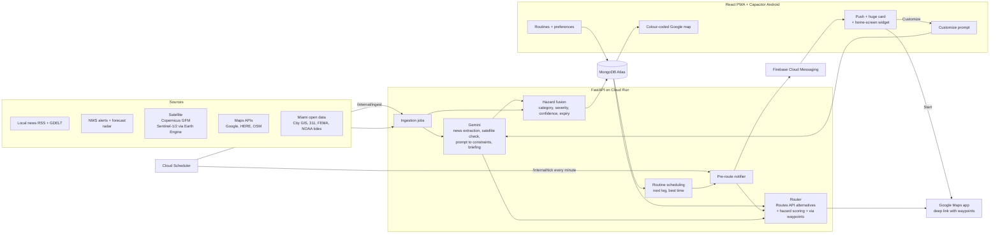
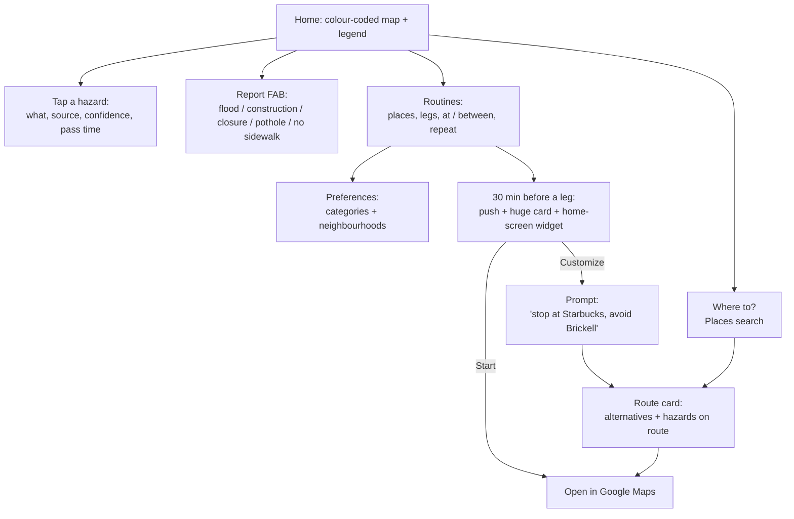

# MAPAY — Agent Build Guide

Miami-native hazard-aware navigation. Built at ShellHacks 2026, ~20-24hrs of dev time, 2 devs + an optional 3rd on data, AI and the pitch.

**One-line pitch:** MAPAY shows, colour-coded on one map, which Miami streets are flooded, under construction, congested, closed or missing sidewalks, and before your daily trips it pops up a big widget to start the route or change it with a prompt.

`README.md` is the product spec. This file is how we build it this weekend: priorities, stack, algorithms, data sources, schema and the hour-by-hour plan.

---

## What we're building

1. **Colour-coded hazard map.** Every report category has one colour, one icon and one line style. See [Map and colour legend](#map-and-colour-legend).
2. **Routine routes.** Saved places (e.g. MMC, BBC) and legs in both directions. Each leg runs at a specific time (`at 09:30`) or inside a range (`between 17:00 and 19:00`), repeating every day, every week or on custom weekdays. "Arrive by" comes later. See [Routines](#routines).
3. **Preferences.** Avoid / prefer to avoid / don't care per category, plus avoiding neighbourhoods by name. User defaults with per-routine overrides. See [Preferences](#preferences).
4. **Heads-up widget.** Before each routine leg: a real push notification, a huge in-app card and an Android home-screen widget, with **Start** (Google Maps deep link) and **Customize** (prompt → Gemini → new route). See [Pre-route widget + push notifications](#pre-route-widget--push-notifications).
5. **Data.** Local news scraped and interpreted by Gemini, weather from NWS, near-real-time satellite for floods and construction, and everything else from maps APIs (Google, HERE, OSM, …) and Miami open data. See [Data pipelines](#data-pipelines).

---

## Scope and priorities

**P0: must work live in the demo, deployed at a public URL**
- Colour-coded map with legend and tap-for-details: flood, construction, congestion, closure, no sidewalk, weather, incidents from news.
- Hazard-aware routing (Routes API alternatives + our scoring + via waypoints) that respects preferences, including avoided neighbourhoods. "Open in Google Maps" keeps our route through waypoints.
- Routines: the MMC ↔ BBC example works end to end (there at 09:30, back between 17:00 and 19:00; daily / weekly / custom weekdays).
- Heads-up: real FCM push + huge in-app card with Start / Customize, plus a force-fire button for the demo.
- Customize with a prompt: Gemini → constraints JSON → router → new route + explanation.
- News → Gemini → pins on the map with source links.
- Satellite on the map, labelled with the pass time: Sentinel-1 flood extent (Copernicus GFM or our own Earth Engine run) and satellite evidence for construction (automatic Sentinel-2 detection, or Gemini-checked image chips at permit sites as the fallback).
- Tide + rain driven flood prediction on curated hotspots, the most reliable street-level flood signal.

**P1: should have**
- Android home-screen widget (Capacitor + native App Widget).
- Best time to leave inside a time range.
- Typical congestion from Google Routes API samples.
- Radar overlay, 311 potholes.

**P2: if time allows**
- Time scrubber (Now / +30m / +1h), holiday + event warnings, walk/jog mode, toll/gas context, daily "chronic spots" memory, saving preferences learned from prompts, Apple Maps / TomTom ETA cross-check.

**Later (after ShellHacks)**
- "Arrive by" routines (aspirational, see [Routines](#routines)), iOS WidgetKit widget, in-app turn-by-turn, commercial high-res imagery.

**DO NOT attempt this weekend**
- CarPlay / Android Auto (needs Apple/Google entitlements + physical devices).
- Live per-station gas prices or a real toll-pricing API. Neither exists publicly at usable cost/effort.
- Running Gemini or CV on Google Maps satellite tiles or Street View. Google Maps Platform terms forbid creating content from Google Maps content, and those tiles aren't live anyway. All imagery analysis uses Copernicus Sentinel data.

---

## Tech stack

- **Backend:** FastAPI (Python) on Cloud Run. Shapely + GeoPandas for hazard geometry (route/hazard intersections, buffers). No OSMnx/NetworkX routing graph: Google Routes API does the routing.
- **DB:** MongoDB Atlas (free M0 cluster) via `motor` (async). `2dsphere` indexes for geo queries, TTL indexes for expiring hazards.
- **Frontend:** React + Vite + TypeScript, installable PWA. Wrapped with Capacitor for Android (native push + home-screen widget).
- **Map:** fully on Google Maps Platform. Maps JavaScript API via `@vis.gl/react-google-maps` with a muted, cloud-styled Map ID so hazard colours stand out; Google `TrafficLayer` for live congestion; Places API for search, saved places and stops. No MapLibre/OSM tiles. Ship "Open in Google Maps / Apple Maps / Waze" deep links using the Google Maps URLs API (`https://www.google.com/maps/dir/?api=1&origin=...&destination=...&waypoints=...`); only Google Maps preserves multi-waypoint shaping.
- **Routing:** Google Routes API with our own deterministic hazard scoring. See [Routing](#routing).
- **LLM:** Gemini via Google GenAI SDK, structured JSON output. Gemini *interprets* (news → events, prompt → constraints, satellite chips → yes/no + description) and *explains*. It never picks the route.
- **Satellite:** Copernicus GFM (ready-made Sentinel-1 flood maps) + Google Earth Engine (`earthengine-api`) for our own Sentinel-1 / Sentinel-2 processing.
- **Push + auth:** Firebase. Cloud Messaging (Web Push for the PWA, native FCM for the Android app) sent with `firebase-admin`; Anonymous Auth so every device gets a `user_id` without sign-up.
- **Jobs:** Cloud Scheduler → authenticated `POST /internal/*` endpoints (pre-route tick + ingestion jobs). Don't rely on in-process pollers: Cloud Run throttles CPU between requests by default.
- **Deploy:** Backend on Cloud Run (`min-instances=1` during judging to kill cold starts), frontend on Vercel.

**Accounts and keys to set up in hour 0**
- Google Maps Platform: a browser key (referrer-restricted: Maps JS, Places) and a server key (Routes, Places, Geocoding, Static Maps) + the Static Maps URL-signing secret. A Map ID with muted cloud styling.
- Firebase project on the same GCP project: Anonymous Auth, Cloud Messaging, web push (VAPID) key, service account for the backend.
- Earth Engine: register the GCP project for noncommercial use (Community tier, 150 EECU-hours/month) and give the Cloud Run service account access.
- Copernicus GFM account (free) for flood-map API/WMS-T access.
- HERE API key, Gemini API key, NWS `User-Agent` string. P2 only: Ticketmaster, EIA.

---

## API contract

| Method + path | What |
|---|---|
| `GET /layers?t=&bbox=` | One FeatureCollection per legend category (`flood`, `weather`, `construction`, `closure`, `congestion`, `no_sidewalk`, `pothole`, `incident`, `event`) for time `t`, plus `freshness` per source (e.g. last satellite pass) |
| `POST /route` | origin, destination, `depart_at`, preferences, optional constraints → chosen route + scored alternatives, hazards on route, deep links, briefing |
| `POST /customize` | prompt + routine leg (or origin/destination) → constraints JSON, new route vs old, explanation |
| `GET/POST/PUT/DELETE /places` | saved places |
| `GET/POST/PUT/DELETE /routines`, `GET /routines/next` | routines; the soonest upcoming leg with route summary + top hazards (for the card and widget) |
| `GET/PUT /me/preferences` | user default preferences |
| `POST /devices` | register/refresh an FCM token |
| `POST /report`, `GET /report` | user reports |
| `GET /alerts` | NWS alerts + news items |
| `POST /internal/tick` | Cloud Scheduler, every minute: pre-route pushes. `?routine_id=&leg=&force=true` fires one now (demo) |
| `POST /internal/ingest/{job}` | Cloud Scheduler: `news`, `weather`, `here`, `tides`, `gfm`, `s1`, `s2`, `traffic`, `sidewalks` |

All user endpoints take the Firebase ID token (`Authorization: Bearer`) and verify it with `firebase-admin`. `/internal/*` accepts only Cloud Scheduler's OIDC token.

---

## Map and colour legend

One source of truth for colours, icons and line styles: `frontend/src/map/legend.ts`, used by both the map layers and the legend component. `docs/legend.svg` is the reference picture (used in the README). Colour is never the only signal: every category also has its own icon and line style.

| Category (`/layers` key) | Colour | Drawn as | Main sources |
|---|---|---|---|
| Flooded street (`flood`) | Blue `#1565C0` | Street segments + areas, solid outline | Tides + rain on hotspots, satellite (GFM / Sentinel-1), news, user reports |
| Heavy rain / weather alert (`weather`) | Light blue `#4FC3F7`, translucent | Areas, no outline, cloud icon | NWS alerts, radar |
| Construction (`construction`) | Orange `#EF6C00` | Cone icon + area outline | City of Miami GIS, HERE roadworks, satellite (Sentinel-2), news |
| Road closure (`closure`) | Black `#212121` | Dashed line + no-entry icon | HERE incidents, City GIS, news |
| Congestion (`congestion`) | Amber `#F9A825` → red `#E53935` → dark red `#8E0000` | Line along the road (same idea as Google's traffic colours) | Google `TrafficLayer` (live), Routes API samples (typical) |
| No sidewalk (`no_sidewalk`) | Purple `#8E24AA` | Dotted line, zoom ≥ 15 only | OSM `sidewalk=no/none` |
| Pothole (`pothole`) | Brown `#6D4C41` | Small dot | Miami-Dade 311, user reports |
| Incident / police / news (`incident`) | Magenta `#D81B60` | Pin with `!` | News → Gemini |
| Event / holiday (`event`) | Teal `#00897B` | Pin with calendar icon | Ticketmaster, Nager.Date, news |

- **Severity** (1–5) → line width / marker size. **Confidence** (0–1) → opacity; below 0.5 the card says "unconfirmed". **Predicted** hazards (e.g. tide-driven floods) use lower opacity and say "predicted".
- Tapping anything opens a card: what, where, source(s) with links, confidence, observed/pass time, expires.
- Legend is always one tap away and doubles as layer toggles.
- Check the colours on a real phone over the muted basemap in hour 0–1 and adjust the tokens there, not in components.

---

## Routing

1. Call `computeRoutes` with `computeAlternativeRoutes: true`, `routingPreference: TRAFFIC_AWARE_OPTIMAL`, `departureTime`, and Google's own `avoidTolls` / `avoidHighways` from preferences. It returns up to 3 routes. **No intermediate waypoints on this call**: Routes API returns no alternatives when intermediates are set.
2. Score each route: `cost = predicted_minutes + Σ penalty` over hazards within 20 m of the polyline (or intersecting it, for areas), where `penalty = weight(preference) × severity × confidence × 3 min`. Weights: `avoid` 10, `prefer_avoid` 2, `ignore` 0. Avoided neighbourhoods count as severity-5 hazards.
3. If the best route still crosses an `avoid` hazard with severity ≥ 4, add one `via: true` intermediate waypoint about 300 m past the hazard's edge, on the side with fewer hazards, and call again (one route comes back). At most 2 detour rounds.
4. Deep link: `https://www.google.com/maps/dir/?api=1&origin=…&destination=…&waypoints=…&travelmode=driving`. Keep it to **≤ 3 waypoints**: mobile browsers only accept 3 (9 elsewhere). Apple Maps / Waze links get origin → destination only.
5. If nothing avoids the hazard (e.g. the destination is inside an avoided neighbourhood), return the best route and say so in the briefing.

Routes with stops (from Customize) also come back as a single route, so only step 3 applies to them. Results are cached in `routes_cache` for 15 min.

---

## Routines

A routine is a set of **legs** between saved places. Each leg has its own time. The spec example (FIU campuses):

| Leg | When | Repeat |
|---|---|---|
| MMC → BBC | at 09:30 | Mon–Fri (custom weekdays) |
| BBC → MMC | between 17:00 and 19:00 | Mon–Fri |

- **Time per leg:** `at` (specific time) or `window` (range). Mixing them across legs is the "combination" case.
- **Repeat:** `daily`, `weekly` (one weekday) or `custom` (a set of weekdays). Set on the routine; a leg can override `days`.
- **Return trip:** the editor offers "add the way back", which creates the reverse leg with its own time.
- **Timezone:** stored per routine (default `America/New_York`). Compute occurrences in local time so DST works, store UTC.
- **Next occurrence:** for each active leg, the next local date matching the repeat rule whose departure (or window start) is still ahead. `GET /routines/next` returns the soonest one.
- **Best time in a window (P1):** at notify time, try departures every 15 min across the window with Routes API (future `departureTime`) plus hazard penalties *at that time* (tide- and rain-driven floods change inside a window). Suggest the best: "Leave at 17:45: 24 min instead of 38".
- **Arrive by (later, aspirational):** `anchor: "arrive"`. Routes API only accepts `arrivalTime` for transit, so for driving we search departure times ourselves: binary-search `departureTime` in [arrive_by − 3 h, arrive_by] until `departure + predicted duration + 5 min buffer ≤ arrive_by` (~6 Routes API calls), then notify `heads_up_minutes` before that departure.

---

## Preferences

- **Per category:** `avoid` | `prefer_avoid` | `ignore`. Defaults: flood, closure → `avoid`; construction, congestion, incident, weather → `prefer_avoid`; pothole, no_sidewalk, event → `ignore` (walk mode: no_sidewalk → `avoid`).
- **Neighbourhoods:** `avoid_neighborhoods` holds ids from `data/neighborhoods.geojson` (City of Miami neighbourhoods such as Brickell or Little Havana, Miami-Dade municipalities, and Census places such as Westchester or Kendall). The UI searches them by name; in Customize prompts Gemini maps names to ids.
- **Google flags:** `avoid_tolls`, `avoid_highways` go straight to Routes API.
- **Where stored:** `users.preferences` (defaults) and `routines.preferences` (overrides, merged at compute time).
- **P2:** when a Customize prompt implies a lasting rule ("always avoid Brickell"), offer to save it.

---

## Pre-route widget + push notifications

A real objective, not a demo timer. `heads_up_minutes` before a leg's departure (default 30; for a window, before the window starts), the phone gets a Duolingo-style heads-up: route summary, top hazards, best time to leave (windows), and two actions: **Start** (Google Maps deep link) and **Customize** (prompt → Gemini → new route → deep link).

**Backend**
- `POST /internal/tick`: called every minute by Cloud Scheduler (OIDC auth). Finds legs due within `heads_up_minutes`, computes route + hazards (+ best time for windows) and sends an FCM message to each of the user's devices. Writes `notifications_sent` (unique per routine + leg + local date) so nothing fires twice.
- Message: title "MMC → BBC · leave in 30 min", body = top 2 hazards, `image` = signed Static Maps URL with the route path + hazard markers (Chrome on Android shows it large when expanded), data = deep link + routine/leg ids. Send with high urgency so Android shows a heads-up banner.
- `POST /devices`: registers/refreshes a token. Drop tokens FCM reports as unregistered.
- `POST /internal/tick?routine_id=...&leg=...&force=true`: fires one leg immediately, for the live demo.

**Frontend (PWA)**
- `manifest.webmanifest` + `firebase-messaging-sw.js` service worker. Ask notification permission from a user gesture (on the routines screen), then register the FCM token with `/devices`.
- Notification actions `start` and `customize` (Chrome shows at most 2, which is exactly what we need). `notificationclick`: `start` → open the Google Maps deep link; `customize` or a plain tap → open `/?routine=<id>&leg=<n>&customize=1`.
- **Huge in-app card:** full-width card at the top of the home screen whenever a leg is within `heads_up_minutes` (from `GET /routines/next`), with the same content and buttons. Opening from the notification shows it full screen.

**Android app + home-screen widget (P1)**
- Capacitor wrapper. Android WebViews don't support Web Push, so the app registers a native FCM token (platform `android`) and shows the heads-up with native action buttons.
- Native App Widget, resizable up to full width: next leg, leave time, top hazard, Start / Customize. Refreshes from `GET /routines/next` every 30 min (Android's minimum for widget updates) and whenever a push arrives.
- iOS WidgetKit: after ShellHacks.

**Platform limits to plan around**
- iOS: web push works only when the PWA is added to the Home Screen (iOS 16.4+), and Safari doesn't show notification action buttons, so a tap opens the in-app card.
- Demo on a real Android phone + desktop Chrome.

---

## Customize with a prompt

1. Input: the prompt, the leg (origin, destination, departure) and the merged preferences.
2. Gemini (structured output) returns **constraints only**, e.g. `{"add_stops": [{"query": "Starbucks"}], "avoid_categories": ["flood"], "avoid_neighborhoods": ["brickell"], "avoid_tolls": null, "avoid_highways": null, "depart_at": "18:15", "arrive_by": null, "travel_mode": null, "save_as_preference": false}`.
3. Stops are resolved with Places Text Search biased to the current route; neighbourhood names are matched to ids.
4. The router runs with those constraints ([Routing](#routing)).
5. Gemini writes a 1–2 sentence explanation from the router's output. The response has old vs new route; the card shows both and "Open in Google Maps".

---

## Data pipelines

Everything ends up as a hazard with `category` (legend), `geometry`, `severity` 1–5, `confidence` 0–1, `source`, `status` (observed / predicted), `observed_at`, `expires_at`, `summary` and source links or image evidence. Items in the same category within ~150 m and overlapping in time are merged: sources are combined and confidence goes up.

### News → Gemini (P0)
- **Sources:** RSS from NBC6, WLRN, Local10, Miami Herald and CBS News Miami, plus GDELT DOC API queries (Miami + crash / flood / closure / construction / police). Official press-release feeds where they exist.
- **Every 15 min:** new items (dedupe by URL/hash) → article text (respect robots.txt and paywalls; fall back to the RSS summary) → Gemini structured extraction: `{relevant, category, location_text, starts_at, ends_at, severity, summary, confidence}`.
- **Location:** geocode `location_text` with Google Geocoding bounded to Miami-Dade. Neighbourhood-only mentions map to a polygon from `data/neighborhoods.geojson`. Skip items that can't be placed.
- **Expiry by category:** crash/incident 3 h, flood 12 h, closure = stated end or 24 h, construction 30 days.
- **Daily memory (P2):** a nightly job counts items per street/intersection over the last 90 days and adds a "chronic" badge ("floods at high tide"). This is the spec's *mente diaria*.

### Weather (P0)
- NWS active alert polygons for Miami-Dade (every 5 min) and the hourly forecast (precipitation) at routine times. Requires a `User-Agent` header.
- NOAA/NWS radar mosaic as a map overlay (P1).
- Rain and tide feed the flood prediction below.

### Floods: predicted + observed (P0)
- **Predicted:** NOAA tide at Virginia Key vs the minor-flood threshold, plus NWS rain, applied to curated hotspots + FEMA zones → flood hazards for the departure time. This is the most reliable street-level signal (king tide season is Sept–Nov).
- **Observed:** satellite (below), news, user reports.
- The map shows both kinds; predicted ones are marked as such.

### Satellite: near-real-time feed (P0)
"Live" here means near real time: each new pass shows up hours to ~2 days after the satellite flies over. No free source gives street-level imagery every few minutes.

| Layer | Data and method | Cadence | Priority |
|---|---|---|---|
| Flood extent | **Copernicus GFM**: automatic flood maps for every Sentinel-1 radar pass (radar sees through clouds), free, via API / WMS-T. Poll hourly for new Miami passes. | Every Sentinel-1 pass (every few days) | P0 |
| Flood extent (own run) | Earth Engine `COPERNICUS/S1_GRD`: latest pass vs a dry-season baseline (VV backscatter drop), minus permanent water (JRC Global Surface Water). EE ingests new scenes within ~2 days. | Daily check | P0 fallback if GFM access fails |
| Construction | Earth Engine `COPERNICUS/S2_SR_HARMONIZED`: cloud-masked last 30 days vs a year earlier (NDVI drop + brightness rise) → candidate polygons ≥ ~0.5 ha → Gemini vision on before/after chips confirms and describes; confidence goes up when a City permit/project is nearby. | Weekly (clouds) | P0 |
| Construction (fallback) | Gemini vision on Sentinel-2 before/after chips at the City's active permit/project sites only | Weekly | P0 fallback |
| Live storm context | GOES-East imagery | Every 5–10 min, km-scale | P2 |

Limits to be upfront about, including in the pitch:
- Radar often misses water between buildings (walls reflect the signal back), and GFM ships an exclusion mask for exactly those pixels. Satellite confirms and extends floods; it's never the only flood signal.
- Sentinel-2 is 10 m resolution and blocked by clouds: it catches large sites (buildings, lots, road widening), not a single lane closure.
- Every satellite item shows its pass time on the card.
- Demo prep: pre-run on a recent rain / king-tide pass so real detections are on the map, and say when that pass was.
- Upgrade path: commercial daily high-res imagery (e.g. Planet) if we get access.

### Maps APIs (P0 unless noted)
- **Google Maps Platform:** Maps JS (+ `TrafficLayer`), Routes (routes, alternatives, predicted durations), Places (search, saved places, stops), Geocoding (news locations), Static Maps (notification image). Caching: store `place_id` for saved places; Places/Geocoding coordinates may be cached for up to 30 days.
- **HERE Traffic API v7:** incidents (closures, roadworks, accidents) + flow, every 5 min → closure / construction / congestion.
- **OpenStreetMap (Overpass API):** ways tagged `sidewalk=no` or `none` → no-sidewalk layer, refreshed daily into a cached file. A missing tag means *unknown*, not "no sidewalk". Check coverage around MMC and BBC in hour 0.
- **Typical congestion (P1):** Routes API `computeRoutes` with `TRAFFIC_AWARE_OPTIMAL` and a *future* `departureTime` returns Google's predicted duration for that hour/day, based on its historical traffic. `duration / staticDuration` = congestion ratio per corridor per hour-of-week. Sample routine legs + key corridors (I-95, 836, 826, US-1, Brickell Ave, Biscayne Blvd). FDOT AADT stays as a fallback layer. Check Google Maps Platform caching terms before storing samples long term.
- **Optional (P2):** TomTom Traffic (backup incidents/flow), Apple Maps Server API (ETA cross-check; needs an Apple Developer membership). Waze has no public data API (Waze for Cities is for government partners), so Waze is deep link only.

---

## Data sources

| Category | Source | Endpoint / notes | Key needed | Priority |
|---|---|---|---|---|
| Flood: tides | NOAA CO-OPS, station 8723214 (Virginia Key) | `api.tidesandcurrents.noaa.gov/api/prod/datagetter?station=8723214&product=predictions&datum=MHHW&interval=h&units=english&time_zone=lst_ldt&format=json` | No | P0 |
| Flood: thresholds | NWS/NOAA local minor-flood level for 8723214 | Cross-check at bmcnoldy.earth.miami.edu/vk | No | P0 |
| Flood: zones | FEMA NFHL ArcGIS REST | `hazards.fema.gov/arcgis/rest/services/public/NFHL/MapServer` — query Miami bbox, `f=geojson` | No | P0 |
| Flood: hotspots | Curated list | `data/flood_hotspots.geojson` (committed) | N/A | P0 |
| Flood: satellite | Copernicus GFM (Sentinel-1 flood extent + exclusion mask) | global-flood.emergency.copernicus.eu — API / WMS-T | Yes, free registration | P0 |
| Flood: satellite (own run) | Earth Engine `COPERNICUS/S1_GRD` + JRC Global Surface Water | `earthengine-api`, noncommercial project | Yes, free | P0 fallback |
| Construction: satellite | Earth Engine `COPERNICUS/S2_SR_HARMONIZED` + Gemini vision | `earthengine-api` | Yes, free | P0 |
| Construction/closures: city | City of Miami Public Works | `gis.miami.gov/gis/rest/services/PublicWorks/RPW_Roadway_Infrastructure_Projects/FeatureServer` and `RPW_Permit_Status/MapServer` | No | P0 |
| Closures, roadworks, incidents, flow | HERE Traffic API v7 (replaces FL511 — no public API) | `data.traffic.hereapi.com/v7/incidents?in=bbox:-80.45,25.55,-80.10,25.98&locationReferencing=shape` and `/v7/flow` | Yes, free tier | P0 |
| Congestion: live | Google Maps JS `TrafficLayer` | Display only | Yes (Maps key) | P0 |
| Congestion: typical | Google Routes API `computeRoutes`, future `departureTime` + `TRAFFIC_AWARE_OPTIMAL`; `duration` vs `staticDuration` | developers.google.com/maps/documentation/routes | Yes | P1 |
| Congestion: fallback | FDOT AADT | gis-fdot.opendata.arcgis.com | No | P2 |
| Weather | NWS API | `api.weather.gov/alerts/active?point=25.7617,-80.1918` + hourly forecast (requires `User-Agent` header) | No | P0 |
| Weather: radar | NOAA/NWS radar mosaic (WMS) | Map overlay | No | P1 |
| No sidewalk | OpenStreetMap via Overpass API | `sidewalk=no` / `none`; missing tag = unknown | No | P0 |
| Potholes | Miami-Dade 311 (2023 dataset — frame as "chronic corridors," not live) | opendata.miamidade.gov | No | P1 |
| Incidents / police / news | RSS (NBC6, WLRN, Local10, Miami Herald, CBS News Miami) + GDELT → Gemini | `api.gdeltproject.org/api/v2/doc/doc?query=miami+crash&mode=artlist&format=json` | Gemini key | P0 |
| Neighbourhoods | City of Miami "Miami Neighborhoods" layer + Miami-Dade municipal boundaries + Census TIGER/Line places (e.g. Westchester, Kendall) | datahub-miamigis.opendata.arcgis.com, gis-mdc.opendata.arcgis.com, census.gov → `data/neighborhoods.geojson` | No | P0 |
| Routing | Google Routes API (`computeRoutes`, `computeAlternativeRoutes: true`) — only supports avoidTolls/avoidHighways/avoidFerries/avoidIndoor, NOT custom hazard polygons, so hazard-awareness = our scoring + `via` waypoints | developers.google.com/maps/documentation/routes | Yes | P0 |
| Search, saved places, stops | Google Places API | Autocomplete + Text Search | Yes | P0 |
| News locations | Google Geocoding API | Bounded to Miami-Dade | Yes | P0 |
| Notification image | Google Static Maps API | Signed URL, route path + hazard markers | Yes | P0 |
| Push notifications | Firebase Cloud Messaging (`firebase-admin` on backend, Firebase JS SDK in service worker, native FCM in the Android app) | firebase.google.com/docs/cloud-messaging | Yes (Firebase project + VAPID key) | P0 |
| Events | Ticketmaster Discovery | developer.ticketmaster.com | Yes, free | P2 |
| Holidays | Nager.Date | `date.nager.at/api/v3/PublicHolidays/2026/US` | No | P2 |
| ETA cross-check | Apple Maps Server API / TomTom Routing | Optional | Yes | P2 |
| Gas price context | EIA Open Data (FL weekly avg regular, NOT per-station) | `api.eia.gov/v2/petroleum/pri/gnd/data/` | Yes, instant free | P2 |
| Toll segments | No public API — hardcode posted rates for routes you cover (Turnpike/826/836/Dolphin Expwy) | `data/tolls.json` | N/A | P2 |

---

## MongoDB schema

```python
# users — one per Firebase uid (anonymous auth this weekend)
{ "_id": str, "preferences": {
    "categories": {"flood": "avoid", "closure": "avoid", "construction": "prefer_avoid", ...},
    "avoid_neighborhoods": ["brickell"], "avoid_tolls": bool, "avoid_highways": bool },
  "created_at": datetime }

# places — saved places ("MMC", "BBC")
{ "_id": str, "user_id": str, "name": str, "google_place_id": str,
  "location": {"type":"Point","coordinates":[lng,lat]}, "refreshed_at": datetime }
# index: user_id  (refresh coordinates from place_id at least every 30 days)

# routines — persistent, saved scheduled legs
{ "_id": str, "user_id": str, "name": "FIU campuses", "active": bool,
  "repeat": {"kind": "daily"} | {"kind": "weekly", "weekday": "mon"} | {"kind": "custom", "weekdays": ["mon","wed","fri"]},
  "legs": [
    { "from_place": str, "to_place": str,
      "when": {"kind": "at", "time": "09:30"} | {"kind": "window", "start": "17:00", "end": "19:00"},
      "anchor": "depart",          # "arrive" = later (aspirational)
      "days": None | ["mon", ...] }  # optional per-leg override of repeat
  ],
  "tz": "America/New_York", "heads_up_minutes": 30,
  "preferences": {...} }           # same shape as users.preferences; overrides
# index: user_id, active

# intel_cache — self-cleaning store for every pipeline hazard (news, satellite, weather, HERE, city GIS, OSM)
{ "_id": str,
  "category": "flood"|"weather"|"construction"|"closure"|"congestion"|"no_sidewalk"|"pothole"|"incident"|"event",
  "source": "news"|"gfm"|"s1"|"s2"|"nws"|"here"|"city_gis"|"tides"|"osm"|"311"|"ticketmaster",
  "status": "observed"|"predicted",
  "geometry": {GeoJSON Point | LineString | Polygon | MultiPolygon},
  "severity": int, "confidence": float, "summary": str, "source_urls": [str],
  "evidence": {"image_url": str | None, "pass_time": datetime | None},
  "observed_at": datetime, "created_at": datetime, "expires_at": datetime }
# index: expires_at, expireAfterSeconds=0 (variable per-doc TTL); geometry "2dsphere"; category

# hazard_reports — persistent, user-submitted
{ "_id": str, "user_id": str,
  "category": "flood"|"construction"|"closure"|"pothole"|"no_sidewalk"|"other",
  "location": {"type":"Point","coordinates":[lng,lat]},
  "reported_at": datetime, "confirmed_count": int }
# index: location, "2dsphere"

# routes_cache — TTL 15 min, keyed by hash(origin, destination, departure_bucket, preferences)
{ "_id": str, "origin": [lat,lng], "destination": [lat,lng], "depart_bucket": str,
  "route_geojson": {...}, "alternatives": [...], "hazards_on_route": [...], "computed_at": datetime }
# index: computed_at, expireAfterSeconds=900

# devices — persistent, one per FCM token
{ "_id": str, "user_id": str, "fcm_token": str, "platform": "web"|"android"|"ios", "last_seen_at": datetime }
# index: user_id; unique: fcm_token

# notifications_sent — dedupe for the pre-route push
{ "_id": str, "routine_id": str, "leg": int, "local_date": "2026-09-28", "sent_at": datetime }
# unique index: (routine_id, leg, local_date); TTL on sent_at, expireAfterSeconds=604800

# traffic_samples — Google Routes API predictions per corridor and hour-of-week (P1)
{ "_id": str, "corridor_id": str, "hour_of_week": int, "duration_s": int, "static_duration_s": int,
  "congestion_ratio": float, "sampled_at": datetime }
# index: (corridor_id, hour_of_week); TTL per Google Maps Platform caching terms
```

The scaffold's `backend/app/db/models.py` and `mongo.py` still use the old shapes (`Routine` with `time_window`, `IntelItem` with `type` + `location`); update them to match this schema.

---

## Folder structure

```
mapay/
  frontend/
    src/
      components/         # destination search, route card, hazard detail card, alerts drawer, report FAB
      map/                # Google Maps wrapper, hazard layer renderers
        legend.ts         # colour / icon / line-style tokens per category (single source of truth)
      routines/           # saved places, routine editor (legs, at/between, repeat), preferences
      widget/             # huge heads-up card + Customize screen
      lib/                # API client, deep-link builders (Google/Apple/Waze), Firebase auth + FCM registration
    public/
      manifest.webmanifest
      firebase-messaging-sw.js   # web push + Start / Customize actions
    android/              # Capacitor Android project: native FCM + home-screen App Widget
  backend/
    app/
      main.py
      routers/
        routes.py         # /route — hazard-aware routing
        customize.py      # /customize — prompt → constraints → route
        layers.py         # /layers?t= — colour-coded categories for time t
        alerts.py         # /alerts — NWS + news-derived
        reports.py        # /report — crowd hazard POST
        places.py         # saved places
        routines.py       # routines CRUD + /routines/next
        me.py             # /me/preferences
        devices.py        # FCM token registration
        internal.py       # /internal/tick + /internal/ingest/{job} — Cloud Scheduler entry points
      routing/            # Routes API client, hazard scoring, via-waypoint detours, deep links
      scheduling/         # occurrence engine (at/window, repeat, tz), best time in window, arrive-by (later)
      notifications/      # FCM sender (firebase-admin), heads-up message + Static Maps image
      hazards/            # fusion: merge items into hazards (category, severity, confidence, expiry)
      ingestion/          # tides, nws, radar, news (RSS/GDELT), here, city GIS, 311, osm sidewalks,
                          # gfm, earth engine s1/s2, traffic samples, holidays, events
      agents/             # Gemini: news extraction, customize (prompt → constraints), satellite check (vision), briefing
      db/
        mongo.py          # motor client + init_indexes()
        models.py
      data/               # committed static files: flood hotspots, neighborhoods, FEMA export, tolls.json
  docs/
    data-sources.md
    architecture.md       # mermaid diagrams below live here
  .env.example
  README.md
```

---

## Architecture (data flow)



## UI flow



---

## Demo scenario (90 s)

1. Map of Miami during a king-tide morning: predicted flooding on hotspots, a Sentinel-1 flood pass (with its time), satellite-confirmed construction, live congestion, no-sidewalk streets near campus.
2. Routine "FIU campuses": MMC → BBC at 09:30, BBC → MMC between 17:00 and 19:00, Mon–Fri; preferences: avoid floods, avoid Brickell.
3. Force-fire the 09:30 leg → the Android phone buzzes → huge card: route, top hazards, Start / Customize.
4. Customize: "stop at a Starbucks and stay off the Palmetto" → new route + one-line explanation → Open in Google Maps with the waypoints.
5. Close on the data: news read by Gemini, satellite passes, weather, all colour-coded.

---

## Roadmap (~20-24 hrs)

Tracks: **A** = backend core (routing, routines, push, Customize). **B** = frontend (map, routines UI, widget, PWA, Android). **C** = data + AI (ingestion, news → Gemini, weather, satellite) and pitch material. Hours count from when we start building; if we're already in, keep the order and re-slot the rest. P1/P2 items are marked; everything else is P0.

| Hours | A: backend core | B: frontend | C: data + AI |
|---|---|---|---|
| 0-1 | API contract, Atlas cluster + indexes, Firebase project (Auth + FCM), Maps keys | Google Maps shell with muted Map ID, `legend.ts` tokens + legend component | Earth Engine + GFM registration; check GFM coverage over Miami and OSM sidewalk coverage near MMC/BBC; build `data/neighborhoods.geojson` |
| 1-4 | Routes API client: `/route` with alternatives + predicted durations, hazard scoring (Shapely), deep links | Places search, colour-coded layers from mock `/layers`, route card (alternatives, hazards on route, Open in Google Maps) | Fast layers: tides → predicted floods on hotspots/FEMA, City GIS construction/closures, HERE incidents + flow, NWS alerts, OSM no-sidewalk |
| 4-6 | Via-waypoint detour, preferences + neighbourhoods in scoring, `/layers` merge + freshness, hazard fusion | Layer toggles, hazard detail card, preferences screen (categories + neighbourhood search) | News pipeline: RSS + GDELT → Gemini extraction → geocode → `intel_cache`, every 15 min |
| 6-7 | **Integration #1 + deploy** (Cloud Run + Vercel, Cloud Scheduler jobs) | | |
| 7-10 | Firebase token verification, places / routines / preferences CRUD, occurrence engine (at/window, daily/weekly/custom, tz), `/routines/next`; best time in window (P1) | Firebase anonymous auth, routines editor: saved places, legs + "add the way back", at vs between, repeat picker, per-routine preferences | Satellite floods: GFM flood extent → `intel_cache` with pass time (fallback: Earth Engine Sentinel-1 run) |
| 10-13 | FCM sender, `/devices`, `/internal/tick` + dedupe + force-fire, Static Maps notification image | PWA manifest + service worker, permission flow, FCM token → `/devices`, notification actions, huge in-app card | Satellite construction: Sentinel-2 change candidates → Gemini vision check → `intel_cache` with before/after images (fallback: chips at permit sites) |
| 13-14 | **Integration #2**: routine → push → Start opens Google Maps, Customize opens the prompt | | |
| 14-16 | `/customize`: Gemini → constraints → router → explanation; route briefing | Customize screen (prompt, old vs new route); Capacitor Android + native widget (P1) | Pre-run satellite for the demo date, seed the demo scenario; typical congestion samples, radar overlay, 311 potholes (P1) |
| 16-17 | **Feature freeze**, bug bash on a real Android phone + desktop Chrome | | |
| 17-18 | Backup demo video, Devpost draft | | |
| 18-20 | Rehearse 90s pitch, buffer |  |  |

**Only two devs:** drop every P1 item and run C's P0 rows on A, in this order: fast layers (once `/route` works), news, GFM flood (once push works), and construction through the permit-site fallback instead of automatic Sentinel-2 detection. B takes `/customize` (a thin endpoint over the router), and pitch material moves to hours 16-18.
