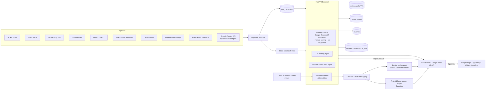
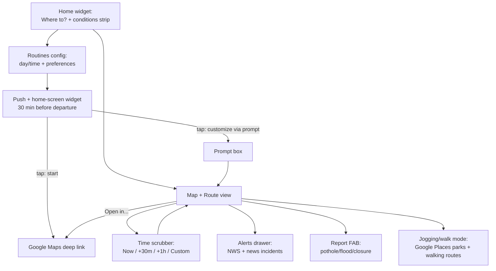

# MAPAY — Agent Build Guide

Miami-native hazard-aware navigation. Built at ShellHacks 2026, ~20-24hrs of dev time, 2 devs (+ optional 3rd on data/pitch/video).

**One-line pitch:** MAPAY knows which Miami streets will flood, close, or slow down before you get there, and routes you around it.

---

## Hard scope boundaries — read this before building anything

**DO NOT attempt these. They are future-work slide items only:**
- CarPlay integration (requires Apple Developer entitlement + physical device — not obtainable this weekend)
- Live/general satellite scanning of "all of Miami" for construction — CV at that scope is a research project
- Live per-station gas prices or a real toll-pricing API — neither exists publicly at usable cost/effort

**Scoped-down versions of ambitious asks (build these instead):**
- Satellite "construction/walkability check" → LLM vision call on 10-15 *known* 311/permit locations, not a live scanner
- Walkable path detection → Google Places (parks) + Routes API `WALK` travel mode (no CV needed)

**Full objectives (NOT scoped down):**
- **Duolingo-style pre-route widget + real push notifications.** See [Pre-route widget + push notifications](#pre-route-widget--push-notifications).
- **Historically busy corridors from Google Maps.** Routes API `computeRoutes` with `routingPreference: TRAFFIC_AWARE_OPTIMAL` and a *future* `departureTime` returns Google's predicted travel time for that hour/day, based on its historical traffic. Compare `duration` vs. `staticDuration` (no traffic) → congestion ratio per corridor per hour-of-week. Sample routine routes + key corridors (I-95, 836, 826, US-1, Brickell, Biscayne). FDOT AADT stays as a fallback layer only. Check Google Maps Platform terms on caching before storing samples long term.

**Non-negotiable for the demo:** everything above the fold (hazard map, weighted routing, tide-driven flood layer, time scrubber) must work live and be deployed at a public URL. Everything else can be mocked/hardcoded and disclosed as such if asked.

---

## Tech stack

- **Backend:** FastAPI (Python) + GeoPandas + Shapely + OSMnx + NetworkX for routing
- **DB:** MongoDB Atlas (free M0 cluster) via `motor` (async)
- **Frontend:** React + Vite + TypeScript
- **Map:** fully on Google Maps Platform. Maps JavaScript API via `@vis.gl/react-google-maps` for rendering (hazards drawn as our own layers, Google `TrafficLayer` for live traffic), Places API for search/autocomplete. No MapLibre/OSM tiles. Ship an "Open in Google Maps / Apple Maps / Waze" deep-link option using the Google Maps URLs API (`https://www.google.com/maps/dir/?api=1&origin=...&destination=...&waypoints=...`), noting Waze/Apple Maps can't preserve multi-waypoint shaping, only Google Maps can.
- **Routing:** Google Routes API (`computeRoutes`, `computeAlternativeRoutes: true`, `TRAFFIC_AWARE_OPTIMAL`). Routes API can't avoid custom hazard polygons, so hazard-awareness is ours and stays deterministic: (1) score each alternative's polyline against hazard geometries (Shapely), (2) pick the lowest score, (3) if every alternative crosses a severe hazard, add an intermediate `via: true` waypoint around it and re-request. The chosen waypoints go straight into the Google Maps deep link.
- **LLM:** Gemini via Google GenAI SDK, structured JSON output, kept OFF the routing decision path (routing is deterministic; LLM only explains it)
- **Push:** Firebase Cloud Messaging (Web Push) from the backend via `firebase-admin`; Cloud Scheduler triggers the send loop
- **Widget:** installable PWA (manifest + service worker) + Capacitor Android wrapper with a native home-screen widget
- **Deploy:** Backend on Cloud Run (`min-instances=1` during judging to kill cold starts), frontend on Vercel

---

## Pre-route widget + push notifications

A real objective, not a demo timer. Near a routine's departure (default 30 min before, `heads_up_minutes` per routine), the user gets a Duolingo-style heads-up with two actions: **Start** (Google Maps deep link) and **Customize** (prompt → Gemini → new route → deep link).

**Backend**
- `POST /internal/tick`: called every minute by Cloud Scheduler (OIDC auth). Finds routines whose next departure is within `heads_up_minutes` and that haven't been notified for that occurrence, computes the route + hazards on it, and sends an FCM message to each of the user's devices. Writes to `notifications_sent` so a routine never fires twice.
- `POST /devices`: registers/refreshes an FCM token. Drop tokens FCM reports as unregistered.
- `POST /internal/tick?routine_id=...&force=true`: fires one routine immediately, for the live demo.

**Frontend (PWA)**
- `manifest.webmanifest` + `firebase-messaging-sw.js` service worker. Ask notification permission from a user gesture (on the routines screen), then register the FCM token with `/devices`.
- Notification has actions `start` and `customize`. `notificationclick`: `start` → open the Google Maps deep link; `customize` or a plain tap → open `/?routine=<id>&customize=1`.
- In-app widget card: the big Duolingo-style card on the home screen whenever a routine is coming up, with the same two buttons.

**Home-screen widget**
- Android first: wrap the frontend with Capacitor, add a native App Widget that shows the next routine, leave time and top hazard, with Start / Customize buttons. It refreshes from `GET /routines/next` and when a push arrives.
- iOS WidgetKit: after Android works.

**Platform limits to plan around**
- iOS: web push works only when the PWA is added to the Home Screen (iOS 16.4+), and Safari doesn't show notification action buttons, so a tap opens the in-app card.
- Test on a real Android phone + desktop Chrome for the demo.

---

## Data sources

| Category | Source | Endpoint / notes | Key needed |
|---|---|---|---|
| Tide predictions | NOAA CO-OPS, station 8723214 (Virginia Key) | `api.tidesandcurrents.noaa.gov/api/prod/datagetter?station=8723214&product=predictions&datum=MHHW&interval=h&units=english&time_zone=lst_ldt&format=json` | No |
| Flood thresholds | NWS/NOAA local minor-flood level for 8723214 | Cross-check at bmcnoldy.earth.miami.edu/vk | No |
| FEMA flood zones | FEMA NFHL ArcGIS REST | `hazards.fema.gov/arcgis/rest/services/public/NFHL/MapServer` — query Miami bbox, `f=geojson` | No |
| Construction/closures | City of Miami Public Works | `gis.miami.gov/gis/rest/services/PublicWorks/RPW_Roadway_Infrastructure_Projects/FeatureServer` and `RPW_Permit_Status/MapServer` | No |
| Live incidents/closures | HERE Traffic API v7 (replaces FL511 — no public API) | `data.traffic.hereapi.com/v7/incidents?in=bbox:-80.45,25.55,-80.10,25.98&locationReferencing=shape` | Yes, free tier |
| Historical / typical traffic | Google Routes API `computeRoutes` with future `departureTime` + `TRAFFIC_AWARE_OPTIMAL`; `duration` vs `staticDuration` | developers.google.com/maps/documentation/routes | Yes |
| AADT (fallback busy-corridor layer) | FDOT Open Data Hub | gis-fdot.opendata.arcgis.com | No |
| Potholes | Miami-Dade 311 (2023 dataset — frame as "chronic corridors," not live) | opendata.miamidade.gov | No |
| Weather alerts | NWS API | `api.weather.gov/alerts/active?point=25.7617,-80.1918` (requires `User-Agent` header) | No |
| News | RSS (NBC6, WLRN, Local10, Miami Herald) + GDELT | `api.gdeltproject.org/api/v2/doc/doc?query=miami+crash&mode=artlist&format=json` | No |
| Events | Ticketmaster Discovery | developer.ticketmaster.com | Yes, free |
| Holidays | Nager.Date | `date.nager.at/api/v3/PublicHolidays/2026/US` | No |
| Gas price context | EIA Open Data (FL weekly avg regular, NOT per-station) | `api.eia.gov/v2/petroleum/pri/gnd/data/` | Yes, instant free |
| Toll segments | No public API — hardcode posted rates for routes you cover (Turnpike/826/836/Dolphin Expwy) | `data/tolls.json` | N/A |
| Walkability | Google Places API (parks) + Routes API `WALK` travel mode | developers.google.com/maps/documentation/places | Yes |
| Routing | Google Routes API (`computeRoutes`, `computeAlternativeRoutes: true`) — only supports avoidTolls/avoidHighways/avoidFerries/avoidIndoor, NOT custom hazard polygons, so hazard-awareness = our scoring of alternatives + `via` waypoints (see Tech stack) | developers.google.com/maps/documentation/routes | Yes |
| Push notifications | Firebase Cloud Messaging (`firebase-admin` on backend, Firebase JS SDK in service worker) | firebase.google.com/docs/cloud-messaging | Yes (Firebase project + VAPID key) |

---

## MongoDB schema

```python
# routes_cache — TTL 15 min, keyed by hash(origin, destination, departure_bucket)
{ "_id": str, "origin": [lat,lng], "destination": [lat,lng], "depart_bucket": str,
  "route_geojson": {...}, "hazards_avoided": [...], "computed_at": datetime }
# index: computed_at, expireAfterSeconds=900

# intel_cache — self-cleaning agent memory (news, police-report extractions, satellite spot-checks)
{ "_id": str, "type": "news"|"police"|"satellite_check", "location": {"type":"Point","coordinates":[lng,lat]},
  "severity": int, "summary": str, "source_url": str, "created_at": datetime, "expires_at": datetime }
# index: expires_at, expireAfterSeconds=0  (variable per-doc TTL)

# hazard_reports — persistent, user-submitted
{ "_id": str, "type": str, "location": {"type":"Point","coordinates":[lng,lat]},
  "reported_at": datetime, "confirmed_count": int }
# index: location, "2dsphere"

# routines — persistent, saved scheduled routes
{ "_id": str, "user_id": str, "origin": [lat,lng], "destination": [lat,lng],
  "days": ["fri"], "time_window": ["17:30","19:00"], "heads_up_minutes": 30,
  "preferences": {"avoid_tolls": bool, ...} }

# devices — persistent, one per FCM token
{ "_id": str, "user_id": str, "fcm_token": str, "platform": "web"|"android"|"ios", "last_seen_at": datetime }
# index: user_id; unique: fcm_token

# notifications_sent — dedupe for the pre-route push
{ "_id": str, "routine_id": str, "occurrence": str, "sent_at": datetime }
# unique index: (routine_id, occurrence); TTL on sent_at, expireAfterSeconds=604800

# traffic_samples — Google Routes API predictions per corridor and hour-of-week
{ "_id": str, "corridor_id": str, "hour_of_week": int, "duration_s": int, "static_duration_s": int,
  "congestion_ratio": float, "sampled_at": datetime }
# index: (corridor_id, hour_of_week); TTL per Google Maps Platform caching terms
```

---

## Folder structure

```
mapay/
  frontend/
    src/
      components/         # map, route card, alerts drawer, report FAB
      map/                # Google Maps wrapper, hazard layer renderers
      routines/           # schedule config UI + in-app pre-route widget card
      lib/                # API client, deep-link builders (Google/Apple/Waze), FCM registration
    public/
      manifest.webmanifest
      firebase-messaging-sw.js   # push handler + notification actions
    android/              # Capacitor Android project + native home-screen widget
  backend/
    app/
      main.py
      routers/
        routes.py         # /route — hazard-weighted routing
        layers.py         # /layers?t= — hazard GeoJSON for time t
        alerts.py         # /alerts — NWS + news-derived
        reports.py        # /report — crowd hazard POST
        routines.py       # saved routines CRUD + /routines/next
        devices.py        # FCM token registration
        internal.py       # /internal/tick — Cloud Scheduler entry point for pre-route pushes
      routing/            # Google Routes API client, alternative scoring against hazards, via-waypoint detours
      notifications/      # FCM sender (firebase-admin), heads-up message builder
      ingestion/          # pollers: tides, NWS, news/GDELT, 311, Google traffic samples, FDOT AADT, holidays, Ticketmaster
      agents/             # LLM briefing agent, news-extraction agent, satellite spot-check agent
      db/
        mongo.py          # motor client + init_indexes()
        models.py
      data/                # committed static files: FEMA export, tolls.json, curated flood hotspots
  docs/
    data-sources.md
    architecture.md        # mermaid diagrams below live here
  .env.example
  README.md
```

---

## Architecture (data flow)



## UI flow



---

## Roadmap (~20-24 hrs, 2 devs + optional C)

Dev A = backend/routing/data/AI. Dev B = frontend. C (if present) = data curation, tolls.json, pitch deck, demo video, Devpost.

| Hours | Dev A | Dev B |
|---|---|---|
| 0-1 | Repo scaffold, API contract, Atlas cluster + indexes, Firebase project | Google Maps shell (Maps JS API), destination widget + Places autocomplete |
| 1-4 | Routes API client, baseline `/route` with alternatives, FastAPI skeleton | Render mock layers, route comparison card |
| 4-7 | Score alternatives against hazards, via-waypoint detour, `/layers` real data | Draw both routes, layer toggles, deep-link "Open in..." button |
| 7-8 | **Integration #1 + deploy both** | |
| 8-11 | Tide pipeline (flood activation by depart time), holiday/event multipliers, FCM sender + `/devices` + `/internal/tick` + Cloud Scheduler | Time scrubber, flood animation, routines config UI, PWA manifest + service worker + FCM token registration |
| 11-14 | NWS + news→LLM extraction, briefing agent, hazard_reports endpoint | Alerts panel, report FAB, briefing text in route card |
| 14-15 | **Integration #2**, seed demo mode (pinned scenario) | |
| 15-16 | Google traffic samples → busy-corridors layer, satellite spot-check agent (10-15 locations only), tolls.json + EIA gas context if time allows | In-app widget card + notification actions, Capacitor Android home-screen widget, walk/jog overlay (Places parks) |
| 16-17 | **Feature freeze** | |
| 17-18 | Backup demo video, Devpost draft | |
| 18-20 | Rehearse 90s pitch, buffer |  |