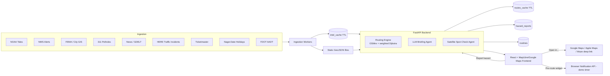
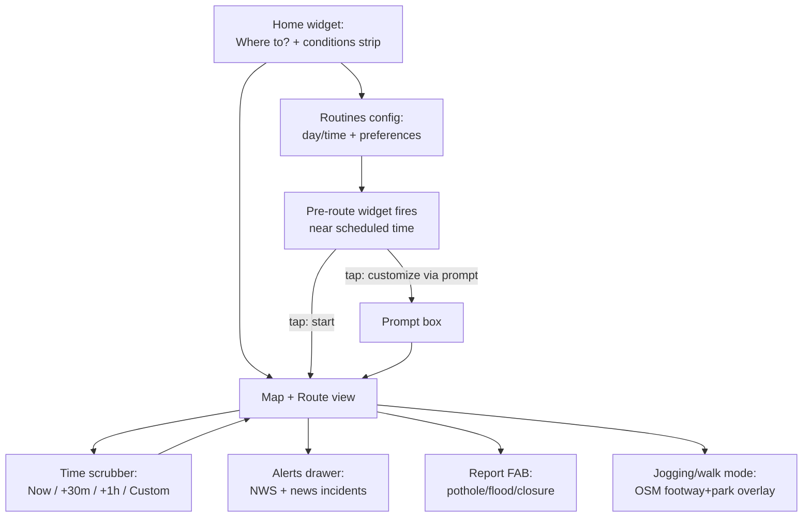

# MAPAY — Agent Build Guide

Miami-native hazard-aware navigation. Built at ShellHacks 2026, ~20-24hrs of dev time, 2 devs (+ optional 3rd on data/pitch/video).

**One-line pitch:** MAPAY knows which Miami streets will flood, close, or slow down before you get there, and routes you around it.

---

## Hard scope boundaries — read this before building anything

**DO NOT attempt these. They are future-work slide items only:**
- CarPlay integration (requires Apple Developer entitlement + physical device — not obtainable this weekend)
- Live/general satellite scanning of "all of Miami" for construction — CV at that scope is a research project
- Live per-station gas prices or a real toll-pricing API — neither exists publicly at usable cost/effort
- Multi-day historical traffic patterns — we have zero days of history before this event starts
- Real push notification infra (FCM/APNs) — treat the "pre-route widget" as a client-side timer demo only

**Scoped-down versions of ambitious asks (build these instead):**
- Satellite "construction/walkability check" → LLM vision call on 10-15 *known* 311/permit locations, not a live scanner
- Walkable path detection → OSM `sidewalk`/`highway=footway`/`leisure=park` tags (real data, no CV needed)
- "Historically busy corridors" → FDOT AADT static layer as a proxy, PLUS start logging real travel-time samples live during the event as the seed of real intelligence
- Duolingo-style pre-route widget → browser Notification API fired by a client-side timer against a demo clock

**Non-negotiable for the demo:** everything above the fold (hazard map, weighted routing, tide-driven flood layer, time scrubber) must work live and be deployed at a public URL. Everything else can be mocked/hardcoded and disclosed as such if asked.

---

## Tech stack

- **Backend:** FastAPI (Python) + GeoPandas + Shapely + OSMnx + NetworkX for routing
- **DB:** MongoDB Atlas (free M0 cluster) via `motor` (async)
- **Frontend:** React + Vite + TypeScript
- **Map:** MapLibre GL + OSM by default. If going all-in on the Google sponsor track, swap to `@vis.gl/react-google-maps` (Maps JS API) instead — decide this at hour 0, not mid-build. Either way, ship an "Open in Google Maps / Apple Maps / Waze" deep-link option using the Google Maps URLs API (`https://www.google.com/maps/dir/?api=1&origin=...&destination=...&waypoints=...`), noting Waze/Apple Maps can't preserve multi-waypoint shaping, only Google Maps can.
- **LLM:** Gemini via Google GenAI SDK, structured JSON output, kept OFF the routing decision path (routing is deterministic; LLM only explains it)
- **Deploy:** Backend on Cloud Run (`min-instances=1` during judging to kill cold starts), frontend on Vercel

---

## Data sources

| Category | Source | Endpoint / notes | Key needed |
|---|---|---|---|
| Tide predictions | NOAA CO-OPS, station 8723214 (Virginia Key) | `api.tidesandcurrents.noaa.gov/api/prod/datagetter?station=8723214&product=predictions&datum=MHHW&interval=h&units=english&time_zone=lst_ldt&format=json` | No |
| Flood thresholds | NWS/NOAA local minor-flood level for 8723214 | Cross-check at bmcnoldy.earth.miami.edu/vk | No |
| FEMA flood zones | FEMA NFHL ArcGIS REST | `hazards.fema.gov/arcgis/rest/services/public/NFHL/MapServer` — query Miami bbox, `f=geojson` | No |
| Construction/closures | City of Miami Public Works | `gis.miami.gov/gis/rest/services/PublicWorks/RPW_Roadway_Infrastructure_Projects/FeatureServer` and `RPW_Permit_Status/MapServer` | No |
| Live incidents/closures | HERE Traffic API v7 (replaces FL511 — no public API) | `data.traffic.hereapi.com/v7/incidents?in=bbox:-80.45,25.55,-80.10,25.98&locationReferencing=shape` | Yes, free tier |
| AADT (busy-corridor proxy) | FDOT Open Data Hub | gis-fdot.opendata.arcgis.com | No |
| Potholes | Miami-Dade 311 (2023 dataset — frame as "chronic corridors," not live) | opendata.miamidade.gov | No |
| Weather alerts | NWS API | `api.weather.gov/alerts/active?point=25.7617,-80.1918` (requires `User-Agent` header) | No |
| News | RSS (NBC6, WLRN, Local10, Miami Herald) + GDELT | `api.gdeltproject.org/api/v2/doc/doc?query=miami+crash&mode=artlist&format=json` | No |
| Events | Ticketmaster Discovery | developer.ticketmaster.com | Yes, free |
| Holidays | Nager.Date | `date.nager.at/api/v3/PublicHolidays/2026/US` | No |
| Gas price context | EIA Open Data (FL weekly avg regular, NOT per-station) | `api.eia.gov/v2/petroleum/pri/gnd/data/` | Yes, instant free |
| Toll segments | No public API — hardcode posted rates for routes you cover (Turnpike/826/836/Dolphin Expwy) | `data/tolls.json` | N/A |
| Walkability | OSM via existing OSMnx pull — filter `sidewalk`, `highway=footway`, `leisure=park` | N/A | No |
| Routing baseline | Google Routes API (`computeRoutes`) — note: only supports avoidTolls/avoidHighways/avoidFerries/avoidIndoor, NOT custom hazard-polygon avoidance, so this is a traffic-aware baseline only, never the hazard router | developers.google.com/maps/documentation/routes | Yes |

---

## MongoDB schema

```python
# routes_cache — TTL 15 min, keyed by hash(origin, destination, departure_bucket)
{ "_id": str, "origin": [lat,lng], "destination": [lat,lng], "depart_bucket": str,
  "route_geojson": {...}, "hazards_avoided": [...], "computed_at": datetime }
# index: computed_at, expireAfterSeconds=900

# intel_cache — self-cleaning agent memory (news, police-report extractions, satellite spot-checks)
{ "_id": str, "type": "news"|"police"|"satellite_check", "location": {"type":"Point","coordinates":[lng,lat]},
  "severity": int, "summary": str, "source_url": str, "created_at": datetime, "expires_at": datetime }
# index: expires_at, expireAfterSeconds=0  (variable per-doc TTL)

# hazard_reports — persistent, user-submitted
{ "_id": str, "type": str, "location": {"type":"Point","coordinates":[lng,lat]},
  "reported_at": datetime, "confirmed_count": int }
# index: location, "2dsphere"

# routines — persistent, saved scheduled routes
{ "_id": str, "user_id": str, "origin": [lat,lng], "destination": [lat,lng],
  "days": ["fri"], "time_window": ["17:30","19:00"], "preferences": {"avoid_tolls": bool, ...} }
```

---

## Folder structure

```
mapay/
  frontend/
    src/
      components/         # map, route card, alerts drawer, report FAB
      map/                # MapLibre or Google Maps wrapper, hazard layer renderers
      routines/           # schedule config UI + pre-route widget (notification demo)
      lib/                # API client, deep-link builders (Google/Apple/Waze)
  backend/
    app/
      main.py
      routers/
        routes.py         # /route — hazard-weighted routing
        layers.py         # /layers?t= — hazard GeoJSON for time t
        alerts.py         # /alerts — NWS + news-derived
        reports.py        # /report — crowd hazard POST
        routines.py       # saved routines CRUD
      routing/            # OSMnx graph, edge-weighting engine
      ingestion/          # pollers: tides, NWS, news/GDELT, 311, FDOT AADT, holidays, Ticketmaster
      agents/             # LLM briefing agent, news-extraction agent, satellite spot-check agent
      db/
        mongo.py          # motor client + init_indexes()
        models.py
      data/                # committed static files: FEMA export, tolls.json, curated flood hotspots
  docs/
    data-sources.md
    architecture.md        # mermaid diagrams below live here
  .env.example
  README.md
```

---

## Architecture (data flow)



## UI flow



---

## Roadmap (~20-24 hrs, 2 devs + optional C)

Dev A = backend/routing/data/AI. Dev B = frontend. C (if present) = data curation, tolls.json, pitch deck, demo video, Devpost.

| Hours | Dev A | Dev B |
|---|---|---|
| 0-1 | Repo scaffold, API contract, Atlas cluster + indexes | Map shell (MapLibre or Google Maps — decide now), destination widget |
| 1-4 | OSMnx graph pickled, baseline `/route`, FastAPI skeleton | Render mock layers, route comparison card |
| 4-7 | Hazard→edge spatial join, weighted route, `/layers` real data | Draw both routes, layer toggles, deep-link "Open in..." button |
| 7-8 | **Integration #1 + deploy both** | |
| 8-11 | Tide pipeline (flood activation by depart time), holiday/event multipliers | Time scrubber, flood animation, routines config UI |
| 11-14 | NWS + news→LLM extraction, briefing agent, hazard_reports endpoint | Alerts panel, report FAB, briefing text in route card |
| 14-15 | **Integration #2**, seed demo mode (pinned scenario) | |
| 15-16 | Satellite spot-check agent (10-15 locations only), tolls.json + EIA gas context if time allows | Pre-route widget (Notification API demo), OSM walk/jog overlay |
| 16-17 | **Feature freeze** | |
| 17-18 | Backup demo video, Devpost draft | |
| 18-20 | Rehearse 90s pitch, buffer |  |