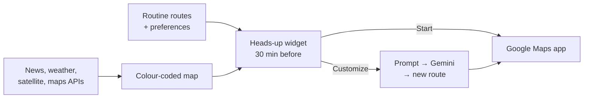
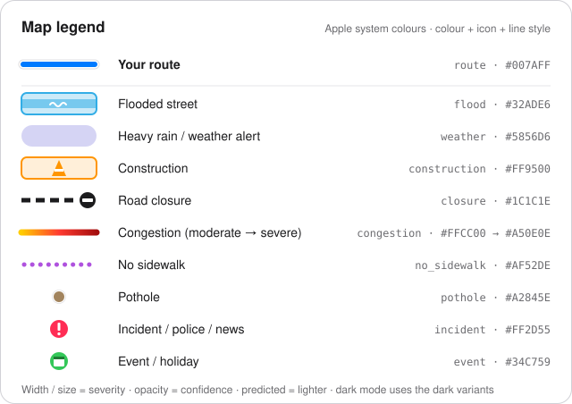
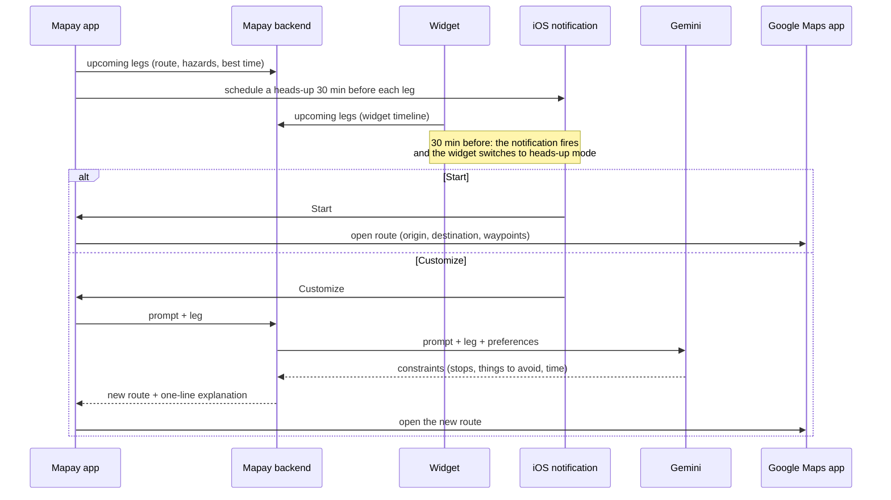
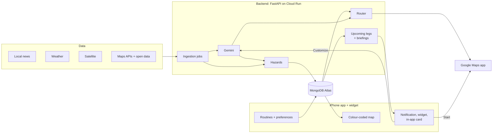

# Mapay

**A colour-coded map of what's wrong with Miami's streets, and a heads-up on your iPhone before your daily trips.**

Mapay puts street problems on one colour-coded map: flooded streets, construction, congestion, closures, missing sidewalks and more. You save your routine trips (say, MMC → BBC at 9:30 and back between 17:00 and 19:00), tell it what you'd rather avoid, and before each trip a big Duolingo-style widget pops up on your iPhone: **Start** the route in Google Maps, or **Customize** it with a prompt.

> **Status:** being built at ShellHacks 2026 in Miami as an **iPhone app**, tested in the iOS Simulator on a Mac and demoed on an iPhone via AltStore. This README is the product spec; [`docs/design.md`](docs/design.md) is the design spec (Apple-like); [`AGENTS.md`](AGENTS.md) is the build guide (platform, priorities, algorithms, data sources, schema, hour-by-hour plan).

---

## Contents

- [How it works](#how-it-works)
- [The map](#the-map)
- [Routine routes](#routine-routes)
- [Preferences](#preferences)
- [The heads-up widget](#the-heads-up-widget)
- [Where the data comes from](#where-the-data-comes-from)
- [Design](#design)
- [Platform: iPhone](#platform-iphone)
- [Also planned](#also-planned)
- [Architecture](#architecture)
- [Roadmap](#roadmap)
- [Open questions](#open-questions)
- [Repository layout](#repository-layout)
- [Spec history](#spec-history)
- [Setup and scaffold notes](#setup-and-scaffold-notes)

---

## How it works



1. **The map** shows every street problem we know about, colour-coded by type.
2. **Routine routes** know where you go, when, and what you want to avoid.
3. **The heads-up widget** brings both together before each trip: here's your route, here's what's on it, start it or change it.

---

## The map



Colours are Apple's system colours, with dark-mode variants (see [`docs/design.md`](docs/design.md#colour)).

| Category | Colour | Where the data comes from |
| --- | --- | --- |
| Flooded street | Cyan | Tide + rain predictions on known flood spots, satellite radar (Sentinel-1), news, user reports |
| Heavy rain / weather alert | Indigo | NWS alerts, radar |
| Construction | Orange | City of Miami projects and permits, HERE roadworks, satellite (Sentinel-2), news |
| Road closure | Black (white in dark mode), dashed | HERE incidents, city data, news |
| Congestion | Yellow → red → dark red | Google live traffic; typical traffic from Google's predictions |
| No sidewalk | Purple, dotted | OpenStreetMap sidewalk data |
| Pothole | Brown | Miami-Dade 311, user reports |
| Incident / police / news | Pink pin | Local news read by Gemini |
| Event / holiday | Green pin | Ticketmaster, holiday calendar, news |

- Colour is never the only signal: each category also has its own icon and line style.
- Thicker or bigger means more severe; fainter means less certain. Certainty is a Bayesian score per problem that rises and falls as evidence comes in (news, reports, satellite, tides); see [`docs/hazard-beliefs.md`](docs/hazard-beliefs.md). Predicted problems (e.g. a flood expected at high tide) are lighter and labelled "predicted".
- When a route is on screen, problems away from it fade and the ones on it get a badge along the line.
- Tap anything to see what it is, where it came from (with links), how sure we are, when it was seen (or when the satellite passed) and when it expires.
- The legend doubles as the layer on/off switches.
- You can report problems yourself: flood, construction, closure, pothole, no sidewalk.

---

## Routine routes

Save the places you go (e.g. **MMC** and **BBC**, FIU's two campuses) and the trips between them. Each direction is a **leg** with its own time:

| Leg | When | Repeat |
| --- | --- | --- |
| MMC → BBC | at 9:30 | Mon–Fri |
| BBC → MMC | between 17:00 and 19:00 (5–7 pm) | Mon–Fri |

- **Time per leg:** a specific time (*at 9:30*), a time range (*between 17:00 and 19:00*), or a mix of both across legs, like the example.
- **Repeat:** every day, every week, or custom days of the week (e.g. Mon, Wed, Fri).
- **The way back:** one tap adds the reverse leg (Y → X) with its own time.
- **Time ranges:** Mapay checks predicted traffic and hazards across the range and suggests the best moment to leave ("Leave at 17:45: 24 min instead of 38").
- **Arrive by** *(later, aspirational)*: say when you need to be there instead of when to leave, and Mapay works out the departure time. Google's routing API only accepts arrival times for transit, so for driving we'll search departure times ourselves.

---

## Preferences

Tell Mapay what you'd rather avoid. You set defaults for yourself and can override them per routine.

- **Per problem type:** *avoid*, *prefer to avoid* or *don't care* (e.g. avoid flooded areas, prefer to avoid construction, don't care about potholes).
- **Neighbourhoods by name:** "avoid Brickell", "avoid Little Havana". Covers City of Miami neighbourhoods, Miami-Dade cities and places like Westchester or Kendall.
- **Tolls and highways:** avoid them or not.
- **Navigation app:** Google Maps by default, because it keeps Mapay's waypoints; Apple Maps and Waze only get the origin and destination.

**How it's applied:** Google's routing API can only avoid tolls, highways and ferries, not a flooded street or a neighbourhood. So Mapay asks Google for alternative routes, scores each one against the map and your preferences, and picks the best. If needed, it adds a waypoint to steer around a problem, and those waypoints go with the route when it opens in Google Maps. If a problem can't be avoided (say, your destination is inside an avoided neighbourhood), Mapay tells you.

---

## The heads-up widget

Inspired by Duolingo's streak reminder. Before each leg (default **30 minutes** before; for a time range, before it starts), your iPhone shows the heads-up:

```
┌──────────────────────────────────────────────┐
│  MMC → BBC · leave in 30 min (9:30)          │
│  41 min with traffic                         │
│                                              │
│  ! Flooding expected near BBC (king tide)    │
│  ! Construction on your usual route          │
│                                              │
│     [ Start route ]      [ Customize ]       │
└──────────────────────────────────────────────┘
```

- **Start route** opens the route in the **Google Maps** app right away, including any waypoints Mapay added.
- **Customize** opens a prompt: *"stop at a Starbucks and stay off the Palmetto"*. Gemini turns it into constraints, Mapay's router builds the new route, and you see the old and new routes side by side before opening Google Maps.
- **Re-check before you leave:** 30–60 minutes before a leg, Mapay re-checks the problems on your saved route. If one became likely (or cleared), it recalculates the route and Gemini explains what changed.
- **Where it shows up:**
  - a **notification** with a map of the route; long-press it for Start / Customize;
  - the **large home-screen widget**, which switches into heads-up mode with a live countdown (medium and small sizes too);
  - a **huge card** at the top of the app;
  - later: a **Live Activity** on the Lock Screen and in the Dynamic Island.
- **Why the phone schedules it:** the demo build is sideloaded with a free Apple ID, which can't receive push notifications from a server. So the app schedules the reminders itself, and the app and widget refresh the route and hazards whenever iOS lets them. A paid Apple Developer account would add server push.



---

## Where the data comes from

### Local news, read by Gemini

Mapay scrapes Miami's local news (NBC6, WLRN, Local10, Miami Herald, CBS News Miami, plus the GDELT news index) every 15 minutes. Gemini reads each story and pulls out what matters for the street: what happened (flood, crash, closure, construction, police activity), where, when and how serious. Google geocoding puts it on the map, with a link to the story. Over time this builds a memory of which streets and intersections keep having problems.

### Weather

NWS weather alerts and hourly forecasts, plus a radar overlay. Rain and tides also drive the flood predictions.

### Satellite (near-real-time feed)

- **Floods:** Copernicus Global Flood Monitoring publishes flood maps automatically for every pass of the Sentinel-1 radar satellites, which see through clouds. We also run our own Sentinel-1 flood detection in Google Earth Engine.
- **Construction:** Sentinel-2 images in Earth Engine are compared over time to find new construction sites, and Gemini checks each candidate from before/after images.
- **What "live" means:** each pass reaches the map hours to about 2 days after the satellite flies over, and passes come every few days. No free satellite source shows street-level images minute by minute, so every satellite item shows when the pass happened.
- **Limits:** radar can miss water between buildings, and Sentinel-2's 10 m pixels only catch large sites. That's why floods also come from tides, rain, news and reports, and construction also comes from city permits.
- Google Maps satellite imagery isn't used for analysis: it isn't live, and Google's terms don't allow deriving data from it.

### Maps APIs and open data

| Source | Used for |
| --- | --- |
| Google Maps Platform | The map, live traffic, routing and alternatives, typical-traffic predictions, place search and saved places, geocoding news, the route image in notifications and the widget |
| HERE Traffic | Closures, roadworks, accidents, traffic flow |
| OpenStreetMap | Sidewalk data |
| Apple Maps, TomTom | Optional travel-time cross-checks (later) |
| NOAA, NWS, FEMA | Tides, flood thresholds, weather, flood zones |
| City of Miami, Miami-Dade | Construction projects, permits, 311 potholes, neighbourhood boundaries |
| Ticketmaster, holiday calendar | Events and holidays |
| You | Reports from the app |

---

## Design

**Apple-like.** Mapay should feel like it came with the iPhone: Apple Maps' layout (full-screen map with a bottom sheet), the calm of Weather, and Duolingo's friendly nudge. It follows Apple's Human Interface Guidelines and the current iOS look (Liquid Glass): SF Pro type with Dynamic Type, system colours with dark mode, glass controls floating over the map, iOS sheets and haptics.

- **Tabs:** Map, Routines, Preferences.
- **Quiet interface, loud data:** the interface stays grey and glass with one blue tint; colour is saved for hazards and the route.
- **The heads-up** looks the same on the notification, the widget and the in-app card: route, countdown, top hazards, Start / Customize.

The full spec (layouts, widget states, colour and type tokens, motion, copy, accessibility) is in [`docs/design.md`](docs/design.md). IBM Carbon's data-viz style is parked as a maybe for dense data screens later.

---

## Platform: iPhone

- **iPhone only.** The app is React + Ionic (iOS mode) inside Capacitor. The widget and Live Activity are native SwiftUI.
- **Development:** UI work runs in the browser on any laptop; the Mac builds the app for the **iOS Simulator** (widgets and notifications work there too).
- **Demo:** the app is sideloaded onto an iPhone with **AltStore**, using a free Apple ID. That means:
  - no push notifications from a server, so the phone schedules its own reminders;
  - room for exactly one extension (AltStore allows 3 apps, and the widget counts), so all widgets and the Live Activity share it;
  - the install expires after 7 days, so refresh it in AltStore before judging.
- **A public web preview** on Vercel lets judges without the iPhone click around.

---

## Also planned

- **Holidays and events:** a heads-up ahead of time when a holiday or big event changes traffic on your routine ("Monday is a holiday: your 9:30 leg will be lighter").
- **Walk and run:** *"I want to run 5 km on quiet streets"*: routes that use the sidewalk layer, parks and the same hazard data.
- **Smarter reminders:** show up earlier when there's trouble on the route; learn preferences from your prompts.
- **Later:** arrive-by routines, server push and TestFlight with a paid Apple Developer account, in-app navigation, CarPlay.

---

## Architecture



The detailed data flow and UI flow live in [`docs/architecture.md`](docs/architecture.md) and [`AGENTS.md`](AGENTS.md).

### Tech stack

| Area | Choice |
| --- | --- |
| iPhone app | React + Vite + TypeScript with Ionic React (iOS mode), wrapped with Capacitor |
| Widget + Live Activity | SwiftUI (WidgetKit, ActivityKit) in one widget extension |
| Reminders | iOS local notifications with Start / Customize actions |
| Map and routing | Google Maps Platform: Maps JavaScript, Routes, Places, Geocoding, Static Maps |
| Backend | FastAPI (Python) on Cloud Run |
| Database | MongoDB Atlas |
| Hazard confidence | Bayesian log-odds score per hazard, updated by evidence ([`docs/hazard-beliefs.md`](docs/hazard-beliefs.md)) |
| AI | Gemini (API key from Google AI Studio): reading news, turning prompts into route constraints, checking satellite images, explaining routes |
| Satellite | Copernicus Global Flood Monitoring + Google Earth Engine (Sentinel-1, Sentinel-2) |
| Accounts | Anonymous device id for the hackathon |
| Scheduled jobs | Cloud Scheduler |
| CI/CD | GitHub Actions: lint + tests on every push; the backend deploys to Cloud Run on pushes to `main` |
| Build and demo | Xcode + iOS Simulator on a Mac; AltStore sideload on the iPhone; web preview on Vercel |

---

## Roadmap

### ShellHacks 2026 (this weekend)

**Task board: [`TASKS.md`](TASKS.md)** and the [GitHub issues](https://github.com/TomasPessagno/mapay/issues/45): the two-person split into task-sized branches, with dependencies, checkpoints and how to test each one. Every task is an issue a person or a coding agent can pick up; [how the issues work](TASKS.md#working-with-the-issues) (what's in one, labels, running agents) is in `TASKS.md`. The hour-by-hour plan is in [`AGENTS.md`](AGENTS.md#roadmap-20-24-hrs).

**Must work in the demo (P0)**
- [ ] Runs on the iPhone (AltStore) and in the iOS Simulator, with the Apple-like design
- [ ] Colour-coded map with legend: flood, construction, congestion, closure, no sidewalk, weather, news incidents
- [ ] Hazard-aware routing with preferences (problem types + neighbourhoods) and "Open in Google Maps"
- [ ] Routine routes: legs both ways, at / between times, every day / every week / custom days
- [ ] Heads-up: notification + large home-screen widget + huge in-app card, with Start / Customize
- [ ] Customize with a prompt (Gemini)
- [ ] News → Gemini → map
- [ ] Satellite floods (Sentinel-1) and construction (Sentinel-2 + Gemini) on the map, with pass times
- [ ] Tide + rain flood predictions
- [ ] Backend deployed, public web preview

**Should have (P1):** Live Activity + Lock Screen widgets · best time to leave in a range · precomputed briefings · typical congestion · radar overlay · 311 potholes

**If time allows (P2):** time scrubber · holiday and event warnings · walk/run mode · toll and gas context · chronic-spot memory · learned preferences

### After ShellHacks

1. **Solid foundation:** paid Apple Developer account (server push, TestFlight, Sign in with Apple), more reliable pipelines.
2. **Smarter routines:** arrive-by, earlier reminders when there's trouble, learned preferences, holiday and event warnings.
3. **More ways to move:** walk/run mode, commercial high-res imagery for sharper flood and construction detection.
4. **In the car:** in-app navigation, CarPlay.

---

## Open questions

- **Apple Developer account:** do we get a paid one after ShellHacks? It unlocks server push (fresh hazards at T−30 without opening the app), TestFlight and Sign in with Apple.
- **Satellite coverage:** how much of Miami's streets does Copernicus flood monitoring actually cover? It masks out areas radar can't read, like dense blocks. Check in hour 0.
- **Sidewalk data:** is OpenStreetMap's sidewalk tagging good enough around MMC and BBC? If not, look for a county layer.
- **Heads-up lead time:** 30 minutes per routine is the default; do we want a different lead time per leg?
- **Design:** stay purely Apple-like, or add IBM Carbon-style data views for dense screens later?
- **Police reports:** which sources, and how do we avoid showing sensitive or unverified information?
- **User reports:** moderation and spam.
- **Privacy:** routines reveal where people live and study. Decide storage and retention before real accounts.
- **Costs:** Routes API calls (alternatives, time-range checks, traffic samples) and Gemini usage per user.

---

## Repository layout

```text
mapay/
├── frontend/          # React + Ionic (iOS mode) app: map, legend, routines, heads-up card
│   ├── public/mocks/  # API contract: example response for every endpoint
│   └── ios/           # Capacitor iOS project: the app + the widget extension (planned)
├── backend/           # FastAPI: routing, routines, heads-up briefings, ingestion jobs, Gemini agents
├── docs/              # design spec, hazard beliefs, architecture diagrams, data sources, legend.svg
├── .github/workflows/ # CI/CD: lint, tests, Cloud Run deploy
├── AGENTS.md          # Build guide: platform, priorities, algorithms, data sources, schema, hour plan
├── TASKS.md           # Task board: who does what, branches, dependencies, testing
└── README.md
```

---

## Spec history

<details>
<summary>Original spec (ES)</summary>

**IDEA GENERAL**

- aplicacion y webapp con mapa que marca problemas en las calles y reportes.
- opción de poner rutas rutinarias (rango horario o horas especificas) que recuerde preferencias

**UX/UI**

- Mobile + widget + quiza pagina + POTENCIAL CARPLAY
- Mapa principal que indique toda nuestra data ("INCONVENIENTES") en general:
  - potholes
  - inundaciones
  - calles cerradas
  - carriles reducidos
  - zonas con lluvia muy pesada?
  - reportes policiales
  - noticias locales
  - zonas de construccion (satelitalmente?)
  - calles/intersecciones con transito históricamente pesado en los ultimos x dias
- seccion de configuracion de rutas preestablecidas CON PREFERENCIAS sobre nuestra data
  - misma data que la de arriba
- Widget que salga un tiempo antes de la hora preestablecida para tocarlo y que de una empiece la ruta. OTRO BOTON QUE DÉ LA OPCION DE CUSTOMIZARLA CON UN PROMPT
- Seccion aparte con caminos de trote o preguntale cuanto queres correr y si en calle, plaza, calle interna.
- DICE SI HAY FESTIVIDADES O FERIADOS

**ESPECIFICACIONES**

- OpenStreetMap principalmente con switch de Google Maps, ideal integrar tambien, apple maps, waze
- alguna llm (seguro gemini)
- algun agente (adk?)
- cloud (google?) con base de datos
- agentes escanean satelitalmente los "INCONVENIENTES" y los muestran visualmente y texto? o glosario?
- agentes hacen scrape de las noticias locales y las incluyen en una "mente" diaria y considera reportes anteriores tambien para el "INCONVENIENTE" de las intersecciones/calles
- Widget sale antes de la hora establecida de la ruta (como el de duolingo para mantener la racha que sale 2h antes de perderla).
  - tiene boton de empezar la ruta o cambiarla con un prompt)
- pagina en vercel o cloudflare pages
- QUIZA carplay
- La opcion de caminar que una llm con vision interprete el prompt y que recomiende en base a info satelital.
- adapta el transito acorde con feriados y festividades y te AVISA DE ANTEMANO

</details>

<details>
<summary>Decisions and spec updates (Sept 26)</summary>

**Decisions:** the map and routing run fully on Google Maps Platform; the database is MongoDB; the heads-up reminders and the widget are real objectives, not demos; historical traffic comes from Google Maps.

**Spec update:**

> remember, what we want to do is a map app that shows visually on the map various reports like flooded street, no sidewalk, congestion, construction, etc. all colour-coded. Also, we want to have a routinary routes section where you can preset directions (from x to y and later from y to x) at specific times, time ranges, or combination of both (e.g. going from MMC to BBC at 9:30 and going from BBC to MMC between 5:00 and 7:00), and make it per day, every week, or custom days of the week. we should also add an option of when you want to arrive, not only when you want to go out, but that's for later and aspirational. Another setting is the user's preferences: if they want to avoid flooded areas, constructions, the specific name of a neighbourhood, etc. Then, some time before the routinary route starts, a huge duolingo-like widget appears on the phone prompting you to start the route or to customize it with a prompt.
>
> For the data itself, the idea is to scrape local news across miami and make them be interpreted with gemini. we are also getting weather data, and for the flooded areas and construction, we should also use a live satelite feed. Then for the rest it is pure data got from google maps api, apple maps api, whatever maps api, and other sources.

**Platform and design update:**

> we are strictly using apple by the way, i have access to a mac where we can test the iphone sim, but for the demo i have altstore on my iphone so we can sideload it there.
> The design spec should be "apple like" but maybe also have the ibm data style? or maybe not? for now apple like.

</details>

---

## Setup and scaffold notes

Miami-native hazard-aware navigation. MAPAY knows which Miami streets will flood, close, or slow down before you get there, and routes you around it.

### Setup

```bash
# create .env (root) and frontend/.env and fill in the keys -- they are gitignored, ask the team for values

# backend
cd backend && python -m venv .venv && source .venv/bin/activate
pip install -r requirements.txt
python -m scripts.init_db       # create indexes in Atlas (idempotent)
uvicorn app.main:app --reload    # http://localhost:8000/docs

# frontend
cd frontend && npm install && npm run dev   # http://localhost:5173
```

See `AGENTS.md` for scope, data sources, and roadmap; `docs/` for architecture.
