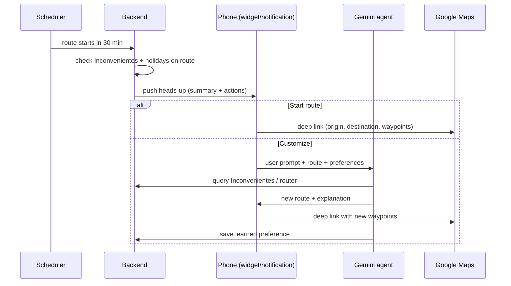
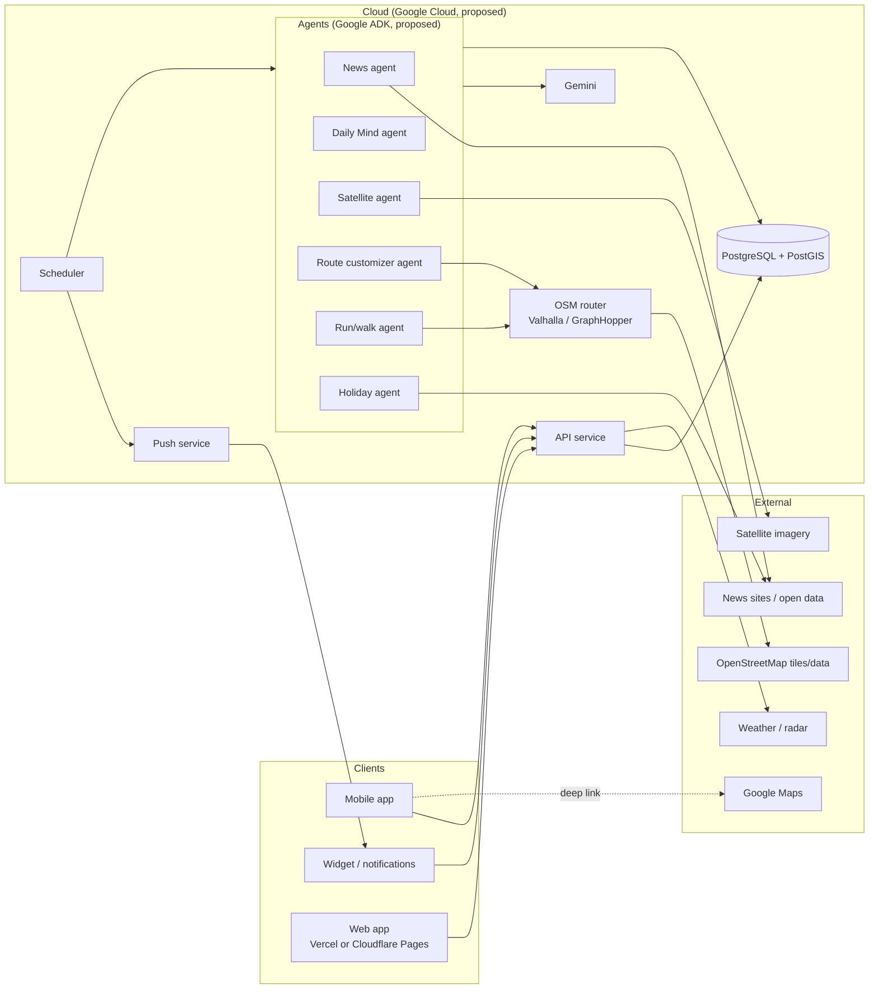

# Mapay

**A map that knows what's wrong with the streets before you drive them.**

Mapay is a mobile app + web app that puts every street problem (potholes, floods, closures, construction, heavy traffic, local news and more) on a single map. You save your routine routes, and before each one Mapay nudges you with a big widget to **start it now** or **change it with a prompt**.

> **Status:** planning. This README is where we keep scope and decisions. It covers the fundamentals first; more features are planned and will be added once the fundamentals ship.

---

## Contents

- [Core concepts](#core-concepts)
- [Fundamentals (MVP scope)](#fundamentals-mvp-scope)
- [Features](#features)
  - [1. Main map: Inconvenientes](#1-main-map-inconvenientes)
  - [2. Routine routes](#2-routine-routes)
  - [3. Heads-up widget](#3-heads-up-widget)
  - [4. Holidays and festivities](#4-holidays-and-festivities)
  - [5. Run and walk](#5-run-and-walk)
- [Platforms](#platforms)
- [Architecture](#architecture)
- [Data model (draft)](#data-model-draft)
- [Roadmap](#roadmap)
- [Open questions](#open-questions)
- [Repository layout (planned)](#repository-layout-planned)
- [Original spec (ES)](#original-spec-es)
- [Setup and scaffold notes](#setup-and-scaffold-notes)

---

## Core concepts

| Term | Meaning |
| --- | --- |
| **Inconveniente** | Anything on or near a street that makes a trip worse: pothole, flood, closure, reduced lanes, heavy rain, police report, news event, construction, historically heavy traffic. Every Inconveniente has a location, a type, a source, a confidence score and an expiry. |
| **Routine route** | A saved trip (origin → destination, plus optional stops) with a schedule and preferences. |
| **Schedule** | Either **specific times** (e.g. Mon–Fri 08:15) or a **time range** (e.g. "sometime between 17:30 and 19:00"). |
| **Preferences** | Per-route rules about Inconvenientes ("avoid floods", "don't care about potholes", "avoid Av. X after 18:00"). Mapay also **learns** preferences from the prompts you use to change routes. |
| **Heads-up widget** | The Duolingo-style widget/notification that shows up before a routine route starts, with two actions: **Start** and **Customize**. |
| **Daily Mind** | A daily summary built by agents. It combines news, reports and past Inconvenientes into a per-street/per-intersection picture of the city. |

---

## Fundamentals (MVP scope)

These come first. Everything else waits until they work end to end.

| # | Fundamental | Done when |
| --- | --- | --- |
| 1 | **Map with Inconvenientes** | OSM map shows Inconvenientes from at least a first set of sources (user reports, weather, closures/news, holidays), with a filterable legend. |
| 2 | **Routine routes** | User can create/edit/delete routes with specific times or time ranges, plus per-route preferences. |
| 3 | **Heads-up widget** | Shows up N minutes before a route (default **30 min**, configurable), with **Start** (opens Google Maps) and **Customize** (prompt → Gemini → new route → Google Maps). |
| 4 | **Holiday awareness** | Mapay tells you ahead of time when a holiday/festivity affects a routine route. |
| 5 | **Backend + agents skeleton** | Cloud database, API and at least one scheduled agent (news → Inconvenientes) in production. |

**Not in the MVP:** satellite scanning, the run/walk section, CarPlay, in-app turn-by-turn navigation, Apple Maps/Waze integration beyond a basic "open in" link.

---

## Features

### 1. Main map: Inconvenientes

One map that shows all our data. Each layer can be turned on and off, and each marker/area opens a card with a **visual + short text** explanation, the source, and when it was last confirmed.

| Inconveniente | Candidate sources | Notes |
| --- | --- | --- |
| Potholes | User reports, city open data, news | Free satellite imagery is **not** high enough resolution for potholes. Later: detection from phone accelerometer data while driving. |
| Floods | Weather/rain data, news, user reports, satellite (radar) for large floods | Short-lived, needs an aggressive expiry. |
| Closed streets | News agent, city open data, user reports | |
| Reduced lanes | News agent, city open data, user reports | |
| Very heavy rain zones | Weather radar / nowcasting API | Area overlay rather than points. |
| Police reports | News agent, official open data where it exists | Handle carefully (see [Open questions](#open-questions)). |
| Local news | News scraping agent → Daily Mind | Geocoded to streets/intersections. |
| Construction zones | City permits/open data, news, satellite change detection (later) | Satellite needs high-res imagery. |
| Historically heavy traffic | Our own traffic samples over the last *X* days (e.g. Google Routes API / other traffic provider) | Per street/intersection and time of day. |

**Display principles**

- Every Inconveniente shows **source**, **confidence** and **last seen**, so users can judge it.
- Expired Inconvenientes fade out instead of disappearing without notice.
- A glossary/legend explains each icon and colour.

### 2. Routine routes

A section to set up routes you take regularly.

- **Schedule:** specific times (`Mon–Fri 08:15`) or time ranges (`Sat 10:00–12:00`).
- **Preferences on our data:** the same Inconveniente types as the map, each with a weight: *avoid*, *prefer to avoid*, *don't care*.
- **Memory:** when a user customizes a route with a prompt ("avoid the viaduct, it floods"), the agent turns that into a stored preference, and the user can see and edit it.
- **Preferred navigation app:** Google Maps (default), later Waze / Apple Maps.

### 3. Heads-up widget

Inspired by Duolingo's streak widget, which shows up hours before you lose your streak.

```
┌──────────────────────────────────────────┐
│  Home → Office · leaves in 30 min        │
│                                          │
│  ! Flood reported on Av. Example         │
│  ! Holiday tomorrow: lighter traffic     │
│                                          │
│   [ ▶ Start route ]    [ ✎ Customize ]   │
└──────────────────────────────────────────┘
```

- **When:** N minutes before the scheduled time (default 30, configurable per route). For time-range routes, at the start of the range, or at the best departure time we suggest.
- **Later:** smart lead time, shown earlier when there are Inconvenientes on the route.
- **Start route:** opens the route in **Google Maps** right away (see [handoff](#map-providers-and-navigation-handoff)).
- **Customize:** opens a prompt ("I need to stop at the pharmacy", "avoid the center, there's a march"). Gemini + our data build a new route, then it opens in Google Maps.
- **Surfaces:** home-screen widget + actionable push notification. On iOS we'll also look at Live Activities.



### 4. Holidays and festivities

- Mapay shows when there's a **holiday (feriado)** or **festivity/event** coming up.
- **Warns ahead of time** when one affects a routine route ("Monday is a holiday: your 08:15 route will likely be empty", "Marathon Sunday: Av. X is closed 07:00–13:00").
- Adjusts expected traffic for those days.
- Sources: official holiday calendar + event info from the news agent.

### 5. Run and walk

A separate section for running and walking routes.

- Prompt-based: *"I want to run 5 km"*, plus a surface choice: **street**, **park/plaza**, or **internal/quiet streets**.
- A vision-capable LLM (Gemini) reads the prompt and uses **satellite imagery** + OSM data (parks, footways, lighting, traffic) to suggest loops.
- Uses the same Inconvenientes (e.g. avoid flooded parks).

---

## Platforms

| Platform | Priority | Notes |
| --- | --- | --- |
| Mobile app (iOS + Android) | **MVP** | Main experience. |
| Widget (iOS + Android) | **MVP** | Native widget code on both platforms (WidgetKit / Android Glance). |
| Web app / landing | MVP (basic) | Hosted on **Vercel** or **Cloudflare Pages**. Map + routes management. |
| CarPlay / Android Auto | Maybe, later | Needs platform approval and a navigation entitlement. |

---

## Architecture



### Agents

| Agent | Runs | Does |
| --- | --- | --- |
| **News agent** | Every few hours | Scrapes local news, extracts events (closures, floods, marches, police reports), geocodes them and writes Inconvenientes. |
| **Daily Mind agent** | Nightly | Merges the day's news + user reports + past Inconvenientes into one per-street/intersection summary; recomputes confidence and expiry; updates "historically heavy" traffic. |
| **Holiday agent** | Daily | Keeps the holiday/festivity calendar up to date and flags routine routes that will be affected. |
| **Route customizer agent** | On demand | Takes the prompt from the widget, checks Inconvenientes + preferences, asks the router for alternatives, explains the choice and saves learned preferences. |
| **Satellite agent** | Weekly/daily (later) | Scans imagery for construction and large floods, then writes Inconvenientes with visual evidence. |
| **Run/walk agent** | On demand (later) | Vision LLM + satellite + OSM → running/walking loops. |

### Map providers and navigation handoff

- **In-app map:** OpenStreetMap is the main map (rendered with MapLibre), with a **switch to Google Maps**. Apple Maps and Waze integration is a later goal.
- **Routing:** we run our own OSM router so we can **penalize or avoid Inconvenientes** (both Valhalla and GraphHopper support avoiding areas/locations).
- **Handoff:** Google Maps deep links can't express "avoid this street", only origin, destination, **waypoints** and a few avoid flags (tolls, highways, ferries). So a customized route is turned into a small set of **waypoints** that steer Google Maps onto our route.
  - Google Maps: origin + destination + waypoints ✅
  - Waze: destination only ⚠️ (customized routes can't be fully passed on)
  - Apple Maps: waypoint support to be checked
- **Later:** in-app turn-by-turn (e.g. Google Navigation SDK or an OSM-based SDK), needed for CarPlay anyway.

### Tech stack (proposed)

| Area | Choice | Status |
| --- | --- | --- |
| LLM | Gemini (fast model for bulk agent work, stronger model for route reasoning, vision for satellite/run) | Almost decided |
| Agent framework | Google ADK | Proposed |
| Cloud | Google Cloud (Cloud Run for API + agents, Cloud Scheduler, Cloud Storage for imagery) | Proposed |
| Database | PostgreSQL + PostGIS (Cloud SQL) for geospatial queries | Proposed |
| Push | Firebase Cloud Messaging (Android + iOS) | Proposed |
| Map rendering | MapLibre + OSM tiles; Google Maps SDK for the switch | Proposed |
| Router | Valhalla or GraphHopper on OSM data | To decide |
| Mobile framework | React Native (Expo) or Flutter, plus native widget code either way | To decide |
| Web hosting | Vercel or Cloudflare Pages | To decide |

---

## Data model (draft)

```text
Inconveniente
  id, type, geometry (point | line | polygon), severity (1–5),
  confidence (0–1), source (user | news | weather | open_data | satellite | traffic),
  evidence (urls, image refs, text), title, description,
  first_seen_at, last_seen_at, expires_at

RoutineRoute
  id, user_id, name, origin, destination, stops[],
  schedule: { kind: "times" | "range", days[], times[] | {start, end} },
  preferences: { [inconveniente_type]: "avoid" | "prefer_avoid" | "ignore" },
  heads_up_minutes (default 30), nav_app (google_maps | waze | apple_maps)

LearnedPreference
  id, user_id, route_id?, rule (text + structured form),
  origin_prompt, created_at, active

DailyMind
  date, area_id, summary, per_segment_scores[], sources[]

CalendarEvent
  date, kind (holiday | festivity | event), name, affected_area?, source
```

---

## Roadmap

**Phase 0: Foundations**
- [ ] Choose mobile framework, router and hosting
- [ ] Monorepo, CI, GCP project, database schema
- [ ] OSM map screen (mobile + web)
- [ ] Auth and user profile

**Phase 1: MVP (the fundamentals)**
- [ ] Inconvenientes API + map layers + legend
- [ ] User reports
- [ ] Weather / heavy-rain overlay
- [ ] News agent → Inconvenientes
- [ ] Holiday calendar + advance warnings
- [ ] Routine routes (times and ranges) + preferences
- [ ] Heads-up widget + notification (Start / Customize)
- [ ] Route customizer agent (Gemini) + Google Maps handoff with waypoints

**Phase 2: Intelligence**
- [ ] Daily Mind
- [ ] Historically heavy traffic per street/intersection
- [ ] Learned preferences (memory)
- [ ] Smart heads-up timing
- [ ] Google Maps switch in-app; Waze / Apple Maps handoff

**Phase 3: Eyes in the sky**
- [ ] Satellite agent (construction, large floods)
- [ ] Run and walk section with vision LLM

**Phase 4: In the car**
- [ ] In-app navigation
- [ ] CarPlay / Android Auto

---

## Open questions

- **Launch city:** which city do we start with? It decides news sources, open data and holiday calendar.
- **Start button:** is handing off to the Google Maps app enough for now, or do we want deeper integration (in-app navigation) sooner?
- **Heads-up lead time:** fixed 30 min, per-route, or dynamic based on conditions?
- **Time-range routes:** notify at the start of the range, or suggest the best time inside it?
- **Satellite imagery:** free (lower resolution) vs. commercial high-res. This decides whether construction detection is realistic.
- **Inconvenientes display:** icons + text card, a glossary, or both?
- **Police reports:** which sources, and how do we avoid showing sensitive or unverified info?
- **User reports:** moderation and spam/abuse handling.
- **Privacy:** routine routes reveal home/work locations. Decide on storage, encryption and retention early.
- **Costs:** Gemini, Google Maps Platform and traffic API usage per active user.

---

## Repository layout (planned)

```text
mapay/
├── apps/
│   ├── mobile/        # iOS + Android app (+ native widget targets)
│   └── web/           # Web app (Vercel / Cloudflare Pages)
├── services/
│   └── api/           # Backend API
├── agents/            # ADK agents: news, daily-mind, holiday, route, satellite, run
├── packages/
│   └── shared/        # Shared types (Inconveniente, RoutineRoute, ...)
├── infra/             # Cloud / DB setup, migrations
└── docs/              # Design notes, decisions
```

---

## Original spec (ES)

<details>
<summary>Speclist original</summary>

**IDEA GENERAL**

- aplicacion y webapp con mapa que marca problemas en las calles y reportes.
- opción de poner rutas rutinarias (rango horario o horas especificas) que recuerde preferencias

**UX/UI**

- Mobile + widget + quiza pagina + POTENCIAL CARPLAY
- Mapa principal que indique toda nuestra data ("INCONVENIENTES") en general:
  - potholes
  - inundaciones
  - calles cerradas
  - carriles reducidos
  - zonas con lluvia muy pesada?
  - reportes policiales
  - noticias locales
  - zonas de construccion (satelitalmente?)
  - calles/intersecciones con transito históricamente pesado en los ultimos x dias
- seccion de configuracion de rutas preestablecidas CON PREFERENCIAS sobre nuestra data
  - misma data que la de arriba
- Widget que salga un tiempo antes de la hora preestablecida para tocarlo y que de una empiece la ruta. OTRO BOTON QUE DÉ LA OPCION DE CUSTOMIZARLA CON UN PROMPT
- Seccion aparte con caminos de trote o preguntale cuanto queres correr y si en calle, plaza, calle interna.
- DICE SI HAY FESTIVIDADES O FERIADOS

**ESPECIFICACIONES**

- OpenStreetMap principalmente con switch de Google Maps, ideal integrar tambien, apple maps, waze
- alguna llm (seguro gemini)
- algun agente (adk?)
- cloud (google?) con base de datos
- agentes escanean satelitalmente los "INCONVENIENTES" y los muestran visualmente y texto? o glosario?
- agentes hacen scrape de las noticias locales y las incluyen en una "mente" diaria y considera reportes anteriores tambien para el "INCONVENIENTE" de las intersecciones/calles
- Widget sale antes de la hora establecida de la ruta (como el de duolingo para mantener la racha que sale 2h antes de perderla).
  - tiene boton de empezar la ruta o cambiarla con un prompt)
- pagina en vercel o cloudflare pages
- QUIZA carplay
- La opcion de caminar que una llm con vision interprete el prompt y que recomiende en base a info satelital.
- adapta el transito acorde con feriados y festividades y te AVISA DE ANTEMANO

</details>

---

## Setup and scaffold notes

Miami-native hazard-aware navigation. MAPAY knows which Miami streets will flood, close, or slow down before you get there, and routes you around it.

### Setup

```bash
# create .env (root) and frontend/.env and fill in the keys -- they are gitignored, ask the team for values

# backend
cd backend && python -m venv .venv && source .venv/bin/activate
pip install -r requirements.txt
python -m scripts.init_db       # create indexes in Atlas (idempotent)
uvicorn app.main:app --reload    # http://localhost:8000/docs

# frontend
cd frontend && npm install && npm run dev   # http://localhost:5173
```

See `AGENTS.md` for scope, data sources, and roadmap; `docs/` for architecture.
