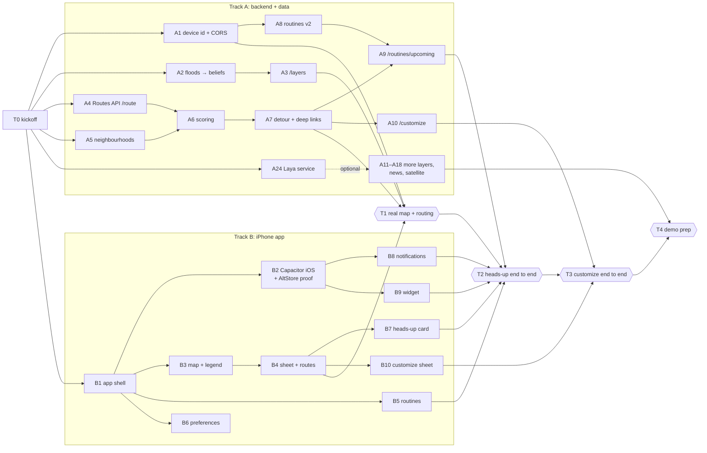

# Mapay task board

How two people build Mapay in parallel. The work is split evenly into **Tomas's queue** and **Jean's queue** (below), and every issue is assigned to its owner on GitHub. Take the next task in your queue, make a branch with the task's name, open a PR into `main` when it works. **Status lives in the issues and PRs** (open PR = in progress, closed = done), so nobody has to edit this file to track progress.

**Every task is a GitHub issue** ([task board #45](https://github.com/TomasPessagno/mapay/issues/45)); see [Working with the issues](#working-with-the-issues) below.

Background: [`docs/orchestration.md`](docs/orchestration.md) (running Tomas's queue with Antigravity + OpenCode), [`README.md`](README.md) (product), [`docs/design.md`](docs/design.md) (design), [`AGENTS.md`](AGENTS.md) (how it's built), [`docs/hazard-beliefs.md`](docs/hazard-beliefs.md) (hazard confidence), [`frontend/public/mocks/`](frontend/public/mocks/) (API contract).

---

## Working with the issues

Every task in this file is a GitHub issue, written so either of you or a coding agent can pick it up with no extra context. [#45](https://github.com/TomasPessagno/mapay/issues/45) is the overview: every task, what's blocked, and what can start now.

**What an issue contains:** track, priority and branch name; **Blocked by** (links to other issues); the goal; links to the docs and mock responses it relies on; **Scope** (the files it may touch); a **Done when** checklist; and the checks to run before the PR.

| Label | Meaning |
| --- | --- |
| `agent-ready` | A coding agent can finish it end to end in a Linux container: code and tests |
| `needs-mac` | Swift, iOS Simulator or iPhone work. An agent can draft it; one of you builds and checks it on the Mac |
| `human` | Decisions, accounts, secrets, device checks and the integration checkpoints |
| `portable` | Either person can take it |
| `backend` / `ios-app` / `together` | Track |
| `P0` / `P1` | Must have / should have |

**Running agents (or yourselves) on them**
1. Take the next open issue in your queue (it's assigned to you) whose **Blocked by** issues are all closed and that has no open PR yet.
2. Give the agent the issue link. It reads [`AGENTS.md`](AGENTS.md#working-on-a-task-people-and-coding-agents) (OpenCode, Codex, Jules and Copilot do this on their own; Claude Code through `CLAUDE.md`), works on the branch named in the issue, and opens a PR that says `Closes #<issue>`.
3. One agent per issue, so two agents never share a branch.
4. Review the PR and merge when CI is green. The issue closes, and whatever it was blocking can start.
5. `needs-mac` and `human` issues need one of you: the Mac, the iPhone or an account.

---

## Who does what

The work is split by rough effort (mostly agent time): **Tomas ≈ 34.5 h, Jean ≈ 28.5 h of must-have (P0) work**, plus should-haves (P1): 6 h for Tomas, 8.5 h for Jean. Every issue is assigned to its owner on GitHub. **Tomas** has all the iPhone work (Mac and iPhone access) plus six backend tasks, including the news pipeline (local news → Gemini); **Jean** has the rest of the backend + data, the cloud, and Laya (it runs on his laptop). The code areas stay the same: `backend/**` and `frontend/**`.

To **swap a task**, reassign its issue on GitHub first, then update the queues here in a small PR. If you're ahead, take the next unblocked issue from the other queue the same way.

### Tomas's queue (assigned to `TomasPessagno`)

| # | Issue | Task | Est. | Notes |
| --- | --- | --- | --- | --- |
| 1 | [#12](https://github.com/TomasPessagno/mapay/issues/12) | B1 · App shell (Ionic, tabs, theme, API client + mocks) | 2 h | browser |
| 2 | [#10](https://github.com/TomasPessagno/mapay/issues/10) | A1 · Device id + CORS | 1 h | backend · agent |
| 3 | [#4](https://github.com/TomasPessagno/mapay/issues/4) | A5 · Neighbourhood polygons + `/neighborhoods` | 1.5 h | backend · agent · Jean's #17 waits on it |
| 4 | [#5](https://github.com/TomasPessagno/mapay/issues/5) | A11 · City construction + closures | 1.5 h | backend · agent · Jean's #16 waits on it |
| 5 | [#7](https://github.com/TomasPessagno/mapay/issues/7) | A13 · NWS weather | 1 h | backend · agent |
| 6 | [#8](https://github.com/TomasPessagno/mapay/issues/8) | A14 · OSM no-sidewalk layer | 1 h | backend · agent |
| 7 | [#15](https://github.com/TomasPessagno/mapay/issues/15) | A16 · Local news → Gemini → evidence | 3.5 h | backend · agent · AI Studio key · Laya first pass once Jean's #46 is live (optional) |
| 8 | [#19](https://github.com/TomasPessagno/mapay/issues/19) | B2 · Capacitor iOS + widget target + AltStore proof | 2 h | Mac + iPhone |
| 9 | [#20](https://github.com/TomasPessagno/mapay/issues/20) | B3 · Map + legend | 2.5 h | browser |
| 10 | [#27](https://github.com/TomasPessagno/mapay/issues/27) | B4 · Sheet, search, route options, Open in Google Maps | 3 h | browser → Simulator |
| — | [#38](https://github.com/TomasPessagno/mapay/issues/38) | **T1 · Integration: real map + routing** | | together |
| 11 | [#21](https://github.com/TomasPessagno/mapay/issues/21) | B5 · Routines tab + editor | 3 h | browser |
| 12 | [#22](https://github.com/TomasPessagno/mapay/issues/22) | B6 · Preferences tab | 1.5 h | browser |
| 13 | [#34](https://github.com/TomasPessagno/mapay/issues/34) | B7 · Heads-up card | 1.5 h | browser |
| 14 | [#28](https://github.com/TomasPessagno/mapay/issues/28) | B8 · Local notifications + deep links | 2 h | Simulator |
| 15 | [#29](https://github.com/TomasPessagno/mapay/issues/29) | B9 · Home-screen widget (SwiftUI) | 3 h | Mac |
| — | [#42](https://github.com/TomasPessagno/mapay/issues/42) | **T2 · Integration: heads-up end to end** | | together |
| 16 | [#35](https://github.com/TomasPessagno/mapay/issues/35) | B10 · Customize sheet | 1.5 h | browser |
| — | [#43](https://github.com/TomasPessagno/mapay/issues/43) | **T3 · Integration: Customize end to end** | | together |
| 17 | [#30](https://github.com/TomasPessagno/mapay/issues/30) | B11 · Hazard detail sheet + report | 1.5 h | browser |
| 18 | [#36](https://github.com/TomasPessagno/mapay/issues/36) | B12 · Demo button | 1 h | Simulator + iPhone |
| 19 | [#31](https://github.com/TomasPessagno/mapay/issues/31) | B13 · Vercel web preview | 0.5 h | Vercel account |

**P1:** [#37](https://github.com/TomasPessagno/mapay/issues/37) B14 Live Activity + Lock Screen widgets (2.5 h, Mac) · [#41](https://github.com/TomasPessagno/mapay/issues/41) B15 Design polish (2 h, iPhone) · [#24](https://github.com/TomasPessagno/mapay/issues/24) A22 Potholes + radar overlay (1.5 h, backend).

### Jean's queue (assigned to `Jeanm2005`)

| # | Issue | Task | Est. | Notes |
| --- | --- | --- | --- | --- |
| 1 | [#11](https://github.com/TomasPessagno/mapay/issues/11) | A4 · Routes API client + `/route` alternatives | 2.5 h | ✅ done: [#61](https://github.com/TomasPessagno/mapay/pull/61) |
| 2 | [#3](https://github.com/TomasPessagno/mapay/issues/3) | A2 · Floods → beliefs (tides + FEMA + hotspots) | 2.5 h | ✅ done: [#62](https://github.com/TomasPessagno/mapay/pull/62) |
| 3 | [#6](https://github.com/TomasPessagno/mapay/issues/6) | A12 · HERE incidents + flow | 1.5 h | ✅ done: [#63](https://github.com/TomasPessagno/mapay/pull/63) |
| 4 | [#9](https://github.com/TomasPessagno/mapay/issues/9) | A17 · Satellite floods (GFM / Earth Engine) | 3 h | ✅ done: [#89](https://github.com/TomasPessagno/mapay/pull/89), [#91](https://github.com/TomasPessagno/mapay/pull/91) · live runs wait for a GFM account or Earth Engine registration |
| 5 | [#46](https://github.com/TomasPessagno/mapay/issues/46) | A24 · Laya service on Jean's laptop | 1 h | ✅ done: [#102](https://github.com/TomasPessagno/mapay/pull/102) · runs on Jean's laptop; `LAYA_URL` stays unset until a fixed tunnel + the #47 checkpoint |
| 6 | [#13](https://github.com/TomasPessagno/mapay/issues/13) | A3 · `/layers` from beliefs | 1.5 h | ✅ done: [#64](https://github.com/TomasPessagno/mapay/pull/64) |
| 7 | [#14](https://github.com/TomasPessagno/mapay/issues/14) | A15 · `/internal/ingest` + Cloud Scheduler | 1.5 h | ✅ done: [#70](https://github.com/TomasPessagno/mapay/pull/70), [#71](https://github.com/TomasPessagno/mapay/pull/71) · jobs created in Cloud Scheduler |
| 8 | [#17](https://github.com/TomasPessagno/mapay/issues/17) | A6 · Route scoring | 2 h | ✅ done: [#72](https://github.com/TomasPessagno/mapay/pull/72) |
| 9 | [#26](https://github.com/TomasPessagno/mapay/issues/26) | A7 · Detour + deep links | 2 h | ✅ done: [#74](https://github.com/TomasPessagno/mapay/pull/74) |
| — | [#38](https://github.com/TomasPessagno/mapay/issues/38) | **T1 · Integration: real map + routing** | | together |
| 10 | [#18](https://github.com/TomasPessagno/mapay/issues/18) | A8 · Routines v2 (legs, places, preferences) | 2.5 h | ✅ done: [#75](https://github.com/TomasPessagno/mapay/pull/75) |
| 11 | [#32](https://github.com/TomasPessagno/mapay/issues/32) | A9 · `/routines/upcoming` + briefings + demo | 3 h | ✅ done: [#80](https://github.com/TomasPessagno/mapay/pull/80), [#81](https://github.com/TomasPessagno/mapay/pull/81), [#83](https://github.com/TomasPessagno/mapay/pull/83) |
| — | [#42](https://github.com/TomasPessagno/mapay/issues/42) | **T2 · Integration: heads-up end to end** | | together |
| 12 | [#33](https://github.com/TomasPessagno/mapay/issues/33) | A10 · `/customize` | 2.5 h | ✅ done: [#79](https://github.com/TomasPessagno/mapay/pull/79), [#85](https://github.com/TomasPessagno/mapay/pull/85) |
| — | [#43](https://github.com/TomasPessagno/mapay/issues/43) | **T3 · Integration: Customize end to end** | | together |
| 13 | [#16](https://github.com/TomasPessagno/mapay/issues/16) | A18 · Satellite construction (Sentinel-2 + Gemini) | 3 h | ✅ done: [#90](https://github.com/TomasPessagno/mapay/pull/90) · live runs wait for Earth Engine registration |

**P1 (all done):** ✅ [#47](https://github.com/TomasPessagno/mapay/issues/47) A25 Fine-tune Laya ([#111](https://github.com/TomasPessagno/mapay/pull/111); trained on CPU, held-out road stories passing 0.2: 59 % → 86 %) · ✅ [#39](https://github.com/TomasPessagno/mapay/issues/39) A19 Best time inside a window ([#97](https://github.com/TomasPessagno/mapay/pull/97)) · ✅ [#40](https://github.com/TomasPessagno/mapay/issues/40) A20 Precomputed briefings ([#99](https://github.com/TomasPessagno/mapay/pull/99)) · ✅ [#23](https://github.com/TomasPessagno/mapay/issues/23) A21 Typical congestion ([#101](https://github.com/TomasPessagno/mapay/pull/101)) · ✅ [#25](https://github.com/TomasPessagno/mapay/issues/25) A23 Deploy hygiene ([#100](https://github.com/TomasPessagno/mapay/pull/100)).

**Also merged from Jean's side:** belief evaluation in one query ([#69](https://github.com/TomasPessagno/mapay/pull/69)), sidewalks + City GIS jobs fixed and hazard titles kept ([#88](https://github.com/TomasPessagno/mapay/pull/88)), `/layers` payload and caching ([#92](https://github.com/TomasPessagno/mapay/pull/92), [#93](https://github.com/TomasPessagno/mapay/pull/93), [#94](https://github.com/TomasPessagno/mapay/pull/94)), HERE titles ([#96](https://github.com/TomasPessagno/mapay/pull/96)). **Left for Jean:** the together checkpoints T1–T4 and the human steps (satellite account, re-running `backend/scripts/scheduler.sh`, a fixed Laya tunnel).

#### Jean's accounts and follow-ups (owned by Jean; agents: don't pick these up)

These are in progress on Jean's side, with his accounts and laptop. **Coding agents working Tomas's queue should not
start, reopen or re-implement any of them** or edit the files named here for these purposes; ask Jean first.

| Item | State (Sept 27) | Next step, and who |
| --- | --- | --- |
| **Hugging Face model** (#47) | ✅ fine-tuned Laya uploaded to the **private** repo `jeanmrjr/laya-mapay-news`; `services/laya/serve.py` serves it with `LAYA_CHECKPOINT=jeanmrjr/laya-mapay-news` (checked). `HF_TOKEN` lives only in Jean's local `.env`. | Nothing in code. |
| **Laya in production** (#46, #47) | ⛔ **Decided (Sept 27): not used for the hackathon.** The news pipeline stays Gemini-only; `LAYA_URL` / `LAYA_API_KEY` stay unset. The launcher and the fine-tuned model (`jeanmrjr/laya-mapay-news`) exist for the pitch and for later. | **Nobody:** don't add the Laya secrets, and **don't change `RELEVANCE_MIN`** in `news_triage.py` (it only matters with Laya on). Revisit after ShellHacks. |
| **GFM satellite floods** (#9) | ✅ **No account needed**: the job reads GFM from EODC's open STAC catalog (`stac.eodc.eu`), reading only the Miami window of each pass and skipping passes that didn't observe Miami. It's live-tested: in the last 14 days no pass observed Miami (4 skipped), so nothing was applied; the Sept 6 pass would add 79 polygons (~228 ha, mostly western wetland edges). No `GFM_*` secrets or variables are needed. | Jean: add `gfm` via `scheduler.sh`. For the demo (T4), optionally a one-off run with a longer lookback. |
| **Earth Engine** (#9 fallback, #16) | Code merged; project not registered. | Jean: register `vibrant-grammar-509821-f5` for noncommercial Earth Engine and give `gemini-runner` the Earth Engine roles. |
| **Scheduler jobs** (#14) | ✅ All 11 jobs in Cloud Scheduler (Sept 27): news, weather, HERE, tides, City GIS, sidewalks, potholes, gfm, s2, briefings, traffic. | `s2` fails until Earth Engine is registered (see above); it's harmless and can be paused. |

#### Ops note: Cloud Run memory (Sept 27): for Tomas

**What happened:** from ~05:15 UTC the `mapay-api` instance was **killed for exceeding 512 MiB** about every 5 minutes (Cloud Run log:
"Memory limit of 512 MiB exceeded with 514–566 MiB used"). Every request in flight got a **503**, so the first attempt of `/internal/ingest/news`
(and the other jobs) usually failed and only Scheduler's retry got through. That's why news looked stuck after 02:45 UTC. It wasn't Laya (not
configured) or Gemini quota (every article got an answer in a replay).

**Fixed (Jean, [#120](https://github.com/TomasPessagno/mapay/pull/120), live 07:20 UTC):** the deploy sets `--memory 1Gi`, and a change to
`ci-cd.yml` now redeploys by itself.

**Why memory ran out:** with ~29.6k beliefs (City permits), one request path uses ~310 MiB (app ~104 + cached beliefs ~110 + `/layers` build
~80). Jobs on the same minute overlap with the `/layers` snapshot rebuild that runs after every job.

| For Tomas | Why |
| --- | --- |
| **#108 snapshot:** rebuild only when the finished job actually changed hazards, and don't hold two full copies during a rebuild | Weather and HERE finish every 5 min, so a rebuild overlaps most job runs; this is the main memory spike |
| **#108 snapshot:** don't rely on background tasks between requests | Cloud Run gives CPU only while requests are served, so a background rebuild can stall mid-way while holding its memory |
| **#15 news:** let unmatched `closure` / `construction` news create a hazard, as `incident` does | E.g. "Junkyard fire shuts down roadway in Opa-locka" was skipped: no registered closure within ~150 m |
| **#15 news:** record a "last run" time separate from "last hazard added" | `/layers` freshness `news` only moves when a hazard changes, so a quiet night looks like a stalled job |
| **Check after a heavy change:** the Cloud Run memory log | `gcloud logging read 'resource.type="cloud_run_revision" AND resource.labels.service_name="mapay-api" AND textPayload:"Memory limit"' --project vibrant-grammar-509821-f5 --freshness=6h --limit=10` |

**Both:** [#2](https://github.com/TomasPessagno/mapay/issues/2) T0 kickoff → [#38](https://github.com/TomasPessagno/mapay/issues/38) T1 → [#42](https://github.com/TomasPessagno/mapay/issues/42) T2 → [#43](https://github.com/TomasPessagno/mapay/issues/43) T3 → [#44](https://github.com/TomasPessagno/mapay/issues/44) T4 demo prep.

**Where one of you waits on the other:** Jean's [#17](https://github.com/TomasPessagno/mapay/issues/17) needs Tomas's [#4](https://github.com/TomasPessagno/mapay/issues/4), [#18](https://github.com/TomasPessagno/mapay/issues/18) needs [#10](https://github.com/TomasPessagno/mapay/issues/10), and [#16](https://github.com/TomasPessagno/mapay/issues/16) needs [#5](https://github.com/TomasPessagno/mapay/issues/5), so Tomas hands those three to agents first thing. Tomas's [#15](https://github.com/TomasPessagno/mapay/issues/15) uses Jean's [#46](https://github.com/TomasPessagno/mapay/issues/46) (the Laya service) once it's live, but doesn't wait for it: without `LAYA_URL` the news pipeline runs Gemini-only. Everything else meets through the mocks and the checkpoints. One shared file: `backend/app/routing/belief_config.py` is edited by [#7](https://github.com/TomasPessagno/mapay/issues/7) and [#15](https://github.com/TomasPessagno/mapay/issues/15) (Tomas) and [#9](https://github.com/TomasPessagno/mapay/issues/9) (Jean). Keep those edits additive (new keys only) and merge `main` before opening the PR.

### Prompting your agent

**Tomas runs his queue with Antigravity + OpenCode:** which tool gets each task, the waves that can run in parallel, one git worktree per task, and ready prompts are in [`docs/orchestration.md`](docs/orchestration.md).

Next task from your queue (swap the name and GitHub login for Tomas):

> Read AGENTS.md and TASKS.md in TomasPessagno/mapay. Take the first open issue in **Jean's queue** (assigned to `Jeanm2005`) whose "Blocked by" issues are all closed and that has no open PR yet. Follow AGENTS.md › "Working on a task": use the branch named in the issue, stay inside its Scope, run the checks, and open a PR into `main` that says `Closes #<issue>`.

For Tomas's agents, add: *skip `needs-mac` issues unless you are running on the Mac.*

One specific issue:

> Read AGENTS.md, then do issue #&lt;N&gt; in TomasPessagno/mapay following "Working on a task".

| | Track A: backend + data | Track B: iPhone app |
| --- | --- | --- |
| Code | `backend/**` | `frontend/**`, including `frontend/ios/` |
| Tests with | `pytest`, `uvicorn` + `/docs`, curl | Browser → iOS Simulator → iPhone (AltStore) |

**Shared files** (small separate PRs, tell the other person): `AGENTS.md`, `README.md`, `TASKS.md`, `docs/**`, `.github/**`, `.env.example`, and the contract: `frontend/public/mocks/**`, `frontend/src/lib/types.ts`, `backend/app/db/models.py`.

The two sides only meet through the API contract, so after the kickoff almost everything runs in parallel. The together points are T0 (kickoff) and the three integrations (T1–T3), plus demo prep (T4).

**Already on `main`:** the hazard belief model + pre-route check (backend), the CI/CD workflow (lint + tests green on both sides), the scaffold routers, and draft mocks for every endpoint. `/route` returns 503 until A4 replaces the OSMnx graph with Routes API. The Cloud Run deploy job fails until the GitHub secrets are added (T0).

---

## T0 · Kickoff (~30 min, first) · [#2](https://github.com/TomasPessagno/mapay/issues/2)

**Together (10 min)**
- [ ] **Routing engine:** confirm Google Routes API (as in AGENTS.md) over the current OSMnx engine. Jean built the OSMnx one, so decide it together; if you keep OSMnx, update AGENTS.md now.
- [ ] **Contract:** skim `frontend/public/mocks/*.json` (mainly `layers`, `route`, `routines-upcoming`) and fix any shape you disagree with. After this, shapes change only through PRs that update mock + `types.ts` + `models.py` together.
- [ ] **One GCP project** for everything (Cloud Run, Maps Platform, Earth Engine, the AI Studio key) with billing on; whoever creates it adds the other as Owner.
- [ ] **Identity:** header `X-Device-Id` for the anonymous device id.

**Jean: backend + cloud**
- [ ] **GCP:** enable Cloud Run, Cloud Build, Artifact Registry and Cloud Scheduler; create the deploy service account with the roles listed at the top of `.github/workflows/ci-cd.yml`, plus a JSON key; note the project id, region and Cloud Run service name. Give the key to Tomas privately (never in git or in an issue).
- [ ] **MongoDB Atlas:** connection string + database name.
- [ ] **HERE** API key.
- [ ] **Satellite accounts:** Earth Engine noncommercial registration on the project; Copernicus GFM account.
- [ ] **Root `.env`** with the backend values; share it with Tomas privately.

**Tomas: repo owner + app**
- [ ] **GitHub secrets:** Settings → Secrets and variables → Actions (on a personal repo only the owner can add them). Add the secrets and variables listed at the top of `ci-cd.yml` with Jean's values: `GCP_SA_KEY`, the Mongo values, the API keys, `GCP_PROJECT_ID`, `GCP_REGION`, `CLOUD_RUN_SERVICE_NAME`. The Ticketmaster, EIA and VAPID ones can stay empty.
- [ ] **Google Maps Platform** in the shared project:
  - enable Maps JavaScript, Routes, Places, Geocoding and Static Maps;
  - create a browser key (Maps JS + Places, restricted to `capacitor://localhost`, `http://localhost:5173` and later the Vercel domain);
  - create a server key (Routes, Places, Geocoding, Static Maps) and the Static Maps URL-signing secret;
  - create light and dark Map IDs with muted styling.
- [ ] **Gemini** API key in Google AI Studio (on the shared project) → `GEMINI_API_KEY`, shared with Jean.
- [ ] **Apple:** bundle ids `com.<you>.mapay` and `com.<you>.mapay.widget` (fixed for the whole event); check Xcode and AltServer on the Mac and AltStore on the iPhone.
- [ ] **`frontend/.env`:** Maps browser key, both Map IDs, `VITE_API_BASE_URL`, and `VITE_USE_MOCKS=true` for now.

**Then start** from your queues:
- **Jean:** [#11](https://github.com/TomasPessagno/mapay/issues/11) Routes API yourself (critical path); hand [#3](https://github.com/TomasPessagno/mapay/issues/3), [#6](https://github.com/TomasPessagno/mapay/issues/6), [#9](https://github.com/TomasPessagno/mapay/issues/9) to agents.
- **Tomas:** [#12](https://github.com/TomasPessagno/mapay/issues/12) app shell yourself, then [#19](https://github.com/TomasPessagno/mapay/issues/19); hand [#10](https://github.com/TomasPessagno/mapay/issues/10), [#4](https://github.com/TomasPessagno/mapay/issues/4), [#5](https://github.com/TomasPessagno/mapay/issues/5), [#7](https://github.com/TomasPessagno/mapay/issues/7), [#8](https://github.com/TomasPessagno/mapay/issues/8) to agents first thing (three of Jean's tasks wait on [#10](https://github.com/TomasPessagno/mapay/issues/10), [#4](https://github.com/TomasPessagno/mapay/issues/4), [#5](https://github.com/TomasPessagno/mapay/issues/5)), and [#15](https://github.com/TomasPessagno/mapay/issues/15) once the AI Studio key exists.

---

## Dependencies

The queues above give the order; this shows what depends on what.

---

## Track A · backend + data (reference)

Owners are in the queues above: A1, A5, A11, A13, A14, A16 and A22 are Tomas's; the rest are Jean's. Paths are under `backend/app/` unless noted. "Beliefs" = `register_hazard` / `add_evidence` from `routing/beliefs.py`.

| Task · branch | What | Main files | Needs | Done when |
| --- | --- | --- | --- | --- |
| **A1** [#10](https://github.com/TomasPessagno/mapay/issues/10) · `a1-device-id-cors` | Anonymous identity + CORS | `deps.py` (new), `config.py`, `main.py`, routers | T0 | User endpoints read `X-Device-Id` and upsert `users`; CORS allows `capacitor://localhost`, `http://localhost:5173` and the Vercel domain |
| **A2** [#3](https://github.com/TomasPessagno/mapay/issues/3) · `a2-flood-beliefs` | Floods → beliefs: tides + FEMA + hotspots | `ingestion/tides.py`, `ingestion/fema.py`, `data/flood_hotspots.geojson` | — | Hotspots registered with FEMA + tide priors; a test covers the prior with a saved NOAA response |
| **A3** [#13](https://github.com/TomasPessagno/mapay/issues/13) · `a3-layers-from-beliefs` | `GET /layers` from beliefs | `routers/layers.py` | A2 (any layer) | Same shape as `layers.json`: one collection per legend key, probability, predicted/observed, freshness |
| **A4** [#11](https://github.com/TomasPessagno/mapay/issues/11) · `a4-routes-api` | Routes API client, `/route` with alternatives | `routing/google_routes.py` (new), `routing/engine.py`, `routers/routes.py`, `db/models.py` | T0 | `/route` returns `route.json`'s shape with real Google alternatives (scoring comes in A6); no OSMnx graph needed |
| **A5** [#4](https://github.com/TomasPessagno/mapay/issues/4) · `a5-neighborhoods` *(portable)* | Neighbourhood polygons + `GET /neighborhoods` | `backend/scripts/build_neighborhoods.py` (new), `data/neighborhoods.geojson`, `routers/neighborhoods.py` (new) | — | City of Miami neighbourhoods + Miami-Dade municipalities + Census places merged with stable ids; endpoint matches `neighborhoods.json` |
| **A6** [#17](https://github.com/TomasPessagno/mapay/issues/17) · `a6-route-scoring` | Score alternatives: beliefs + preferences + neighbourhoods | `routing/scoring.py` (new), `routers/routes.py` | A4, A5 | Ranking follows AGENTS.md › Routing step 2; unit tests with fixture polylines |
| **A7** [#26](https://github.com/TomasPessagno/mapay/issues/26) · `a7-detour-deeplinks` | Via-waypoint detour + deep links | `routing/detour.py` (new), `routing/deeplinks.py` (new) | A6 | Blocked routes get a via waypoint (≤ 3 waypoints total); `deep_links` for Google / Apple / Waze in the response |
| **A8** [#18](https://github.com/TomasPessagno/mapay/issues/18) · `a8-routines-v2` | Routines with legs, saved places, preferences | `db/models.py`, `routers/routines.py`, `routers/places.py` (new), `routers/me.py` (new), `routing/pre_route.py`, `backend/tests/test_pre_route.py` | A1 | CRUD matches `routines.json` / `places.json` / `preferences.json`; the pre-route check works per leg; tests updated |
| **A9** [#32](https://github.com/TomasPessagno/mapay/issues/32) · `a9-upcoming-briefings` | `/routines/upcoming`, briefings, `/demo/heads-up` | `scheduling/occurrences.py` (new), `briefings/builder.py` (new), `routers/routines.py`, `routers/demo.py` (new) | A7, A8 | Matches `routines-upcoming.json` (DST-safe, Miami time); signed Static Maps `image_url`; the demo override makes a leg due in 30 min |
| **A10** [#33](https://github.com/TomasPessagno/mapay/issues/33) · `a10-customize` | `POST /customize` | `agents/customize.py` (new), `routers/customize.py` (new) | A5, A7 | Gemini → constraints JSON → router → `customize.json`'s shape; stops via Places Text Search; roads (Overpass) and neighbourhoods resolved to geometry |
| **A11** [#5](https://github.com/TomasPessagno/mapay/issues/5) · `a11-city-gis-beliefs` | City construction + closures → beliefs | `ingestion/closures.py` | — | Projects/permits registered with status priors |
| **A12** [#6](https://github.com/TomasPessagno/mapay/issues/6) · `a12-here-beliefs` | HERE incidents + flow → beliefs | `ingestion/here_incidents.py` | — | Closures/roadworks/accidents registered; flow feeds `congestion` |
| **A13** [#7](https://github.com/TomasPessagno/mapay/issues/7) · `a13-nws-weather` *(portable)* | NWS alerts → beliefs | `ingestion/nws.py`, `routing/belief_config.py` | — | Alert polygons registered as `weather` hazards |
| **A14** [#8](https://github.com/TomasPessagno/mapay/issues/8) · `a14-osm-sidewalks` *(portable)* | OSM no-sidewalk layer | `ingestion/sidewalks.py` (new) | — | `sidewalk=no/none` ways around campus appear in `/layers.no_sidewalk`; coverage checked |
| **A15** [#14](https://github.com/TomasPessagno/mapay/issues/14) · `a15-ingest-scheduler` | `/internal/ingest/{job}` + Cloud Scheduler | `routers/internal.py` (new) | A2 | Every ingestion job runs from Cloud Scheduler with its OIDC token |
| **A16** [#15](https://github.com/TomasPessagno/mapay/issues/15) · `a16-news-gemini` | News → Gemini → evidence | `ingestion/news.py`, `agents/news_extraction.py`, `agents/news_triage.py` (new), `config.py` | A5 | RSS + GDELT every 15 min; Laya first pass when `LAYA_URL` is set, Gemini-only otherwise; matching news adds evidence; new incidents registered; pins in `/layers.incident` |
| **A17** [#9](https://github.com/TomasPessagno/mapay/issues/9) · `a17-satellite-floods` | Satellite floods (GFM, Earth Engine fallback) | `ingestion/gfm.py` (new), `ingestion/earth_engine_s1.py` (new), `routing/belief_config.py` (+ `satellite` source), tests | — | GFM flood extents become evidence / new flood hazards, with the pass time |
| **A18** [#16](https://github.com/TomasPessagno/mapay/issues/16) · `a18-satellite-construction` | Satellite construction (Sentinel-2 + Gemini vision) | `ingestion/earth_engine_s2.py` (new), `agents/satellite_check.py` | A11 | Candidates confirmed by Gemini with before/after images; fallback: image chips at permit sites |
| **A24** [#46](https://github.com/TomasPessagno/mapay/issues/46) · `a24-laya-service` | Laya decision service (open source, Jev-compatible) on Jean's laptop, through a free tunnel | `services/laya/serve.py` (new), `services/laya/requirements.txt` (new), `services/laya/README.md` (new), `.github/workflows/ci-cd.yml` | — | The tunnel URL answers `POST /v1/systemone` with the multilingual checkpoint behind `LAYA_API_KEY`; `LAYA_URL` / `LAYA_API_KEY` reach the backend |

**P1 (after the P0 above):** A19 [#39](https://github.com/TomasPessagno/mapay/issues/39) `a19-best-time` best time inside a window (`scheduling/best_time.py`, needs A9) · A20 [#40](https://github.com/TomasPessagno/mapay/issues/40) `a20-precomputed-briefings` (needs A9, A15) · A21 [#23](https://github.com/TomasPessagno/mapay/issues/23) `a21-traffic-samples` typical congestion (needs A15) · A22 [#24](https://github.com/TomasPessagno/mapay/issues/24) `a22-potholes-radar` 311 potholes + radar overlay · A23 [#25](https://github.com/TomasPessagno/mapay/issues/25) `a23-deploy-hygiene` pin `requirements.txt`, drop `osmnx`/`networkx` after A4, align the Dockerfile's Python 3.11 with CI's 3.14 · A25 [#47](https://github.com/TomasPessagno/mapay/issues/47) `a25-laya-finetune` fine-tune Laya on Miami news (labels from Claude, Kaggle's free GPUs; needs A24 to serve it).

---

## Track B · iPhone app (reference)

All Tomas's. Paths are under `frontend/` unless noted. Build against the mocks (`VITE_USE_MOCKS=true`) until the real endpoint lands.

| Task · branch | What | Main files | Needs | Done when (where to test) |
| --- | --- | --- | --- | --- |
| **B1** [#12](https://github.com/TomasPessagno/mapay/issues/12) · `b1-app-shell` | Ionic React (iOS mode) shell | `package.json`, `src/main.tsx`, `src/App.tsx`, `src/theme/*` (new), `src/lib/api.ts`, `src/lib/types.ts` | T0 | Tabs Map / Routines / Preferences; theme tokens from `docs/design.md`; `api.ts` reads `/mocks/*.json` when `VITE_USE_MOCKS=true`; Vite boilerplate gone; CI green (browser) |
| **B2** [#19](https://github.com/TomasPessagno/mapay/issues/19) · `b2-capacitor-ios` | Capacitor iOS + widget target + AltStore proof | `capacitor.config.ts`, `ios/**`, `frontend/scripts/build-ipa.sh` (new) | B1 | Runs in the Simulator; `mapay://` scheme registered; empty `MapayWidget` extension; sideloaded once on the iPhone; device id logged in app + widget and they match (Simulator + iPhone) |
| **B3** [#20](https://github.com/TomasPessagno/mapay/issues/20) · `b3-map-legend` | Map + legend | `src/map/MapView.tsx`, `src/map/layers.ts`, `src/map/legend.ts` (new), `src/components/LegendSheet.tsx` (new) | B1 | Google map with light/dark Map IDs draws `layers.json` in the legend styles; the legend sheet toggles layers (browser) |
| **B4** [#27](https://github.com/TomasPessagno/mapay/issues/27) · `b4-sheet-routes` | Bottom sheet, search, route options, Open in Google Maps | `src/components/MapSheet.tsx`, `SearchField.tsx`, `RouteOptions.tsx` (new), `src/lib/deepLinks.ts` | B3 | Apple Maps-style sheet with detents; Places search; route cards from `route.json`; focus mode; Google Maps opens through App Launcher (browser, then Simulator) |
| **B5** [#21](https://github.com/TomasPessagno/mapay/issues/21) · `b5-routines` | Routines tab + editor | `src/routines/*` | B1 | Legs with at / between, "add the way back", repeat, heads-up time, per-routine preferences, saved places (browser) |
| **B6** [#22](https://github.com/TomasPessagno/mapay/issues/22) · `b6-preferences` *(portable)* | Preferences tab | `src/routines/PreferencesTab.tsx` (new) | B1 | Per-hazard menus, neighbourhood token search (`neighborhoods.json`), tolls/highways, nav app (browser) |
| **B7** [#34](https://github.com/TomasPessagno/mapay/issues/34) · `b7-headsup-card` | Huge in-app heads-up card | `src/headsup/HeadsUpCard.tsx` (new) | B4 | Card in the sheet for legs inside their window (`routines-upcoming.json`): countdown, top hazards, Start / Customize, haptic (browser, Simulator) |
| **B8** [#28](https://github.com/TomasPessagno/mapay/issues/28) · `b8-notifications` | Local notifications + `mapay://` deep links | `src/headsup/notifications.ts`, `src/headsup/deeplinks.ts` (new) | B2 | One notification per upcoming leg with Start / Customize and the route image; rescheduled on foreground; deep links open the right screen (Simulator) |
| **B9** [#29](https://github.com/TomasPessagno/mapay/issues/29) · `b9-widget` | Home-screen widget (SwiftUI) | `ios/MapayWidget/**`, `ios/App/App/MapayNative*.swift` | B2 | Large/medium/small from `/routines/upcoming` (mock URL in the Simulator); switches to heads-up at `heads_up_at`; Start / Customize links; `reloadWidgets` callable from JS (Simulator) |
| **B10** [#35](https://github.com/TomasPessagno/mapay/issues/35) · `b10-customize-sheet` | Customize sheet | `src/headsup/CustomizeSheet.tsx` (new) | B4 | Prompt + chips → `customize.json` → old vs new route + explanation → Open in Google Maps (browser) |
| **B11** [#30](https://github.com/TomasPessagno/mapay/issues/30) · `b11-hazard-sheet-report` | Hazard detail sheet + report | `src/components/HazardSheet.tsx` (new), `src/components/ReportFab.tsx` | B3 | Tap a hazard → sheet with sources, probability, pass time; reports post with optional `hazard_id` / `cleared` (browser) |
| **B12** [#36](https://github.com/TomasPessagno/mapay/issues/36) · `b12-demo-button` | "Fire heads-up now" | `src/headsup/demo.ts` (new) | B8, B9 | Debug action calls `/demo/heads-up`, schedules the notification 10 s out and reloads the widgets (Simulator + iPhone) |
| **B13** [#31](https://github.com/TomasPessagno/mapay/issues/31) · `b13-vercel-preview` | Public web preview | Vercel project (root `frontend`) | B3 | Public URL pointing at the Cloud Run API (browser) |

**P1:** B14 [#37](https://github.com/TomasPessagno/mapay/issues/37) `b14-live-activity` Live Activity + Lock Screen widgets (`ios/MapayWidget/**`, `MapayNative`, needs B9) · B15 [#41](https://github.com/TomasPessagno/mapay/issues/41) `b15-design-polish` glass, dark mode, Dynamic Type and haptics checked on the iPhone.

---

## Together

| Checkpoint | Needs | What you do |
| --- | --- | --- |
| **T1** [#38](https://github.com/TomasPessagno/mapay/issues/38) · real map + routing | A1, A3, A7, B4 | Point `VITE_API_BASE_URL` at Cloud Run, turn mocks off, fix contract drift, first AltStore build with real data |
| **T2** [#42](https://github.com/TomasPessagno/mapay/issues/42) · heads-up end to end | A9, B5, B7, B8, B9 | Create the MMC ↔ BBC routine in the app, fire the demo heads-up: notification + widget + card; Start opens Google Maps (Simulator, then iPhone) |
| **T3** [#43](https://github.com/TomasPessagno/mapay/issues/43) · Customize end to end | A10, B10 | "stop at a Starbucks and stay off the Palmetto" → new route → Google Maps |
| **T4** [#44](https://github.com/TomasPessagno/mapay/issues/44) · demo prep | everything | Seed the king-tide scenario, pre-run satellite, Cloud Run `min-instances=1`, final AltStore build + refresh, backup screen recording, Devpost, rehearse the 90 s pitch |

---

## Git workflow

- **Ownership:** every issue is assigned per the queues. To swap, reassign it on GitHub before starting.
- **One branch per task**, created when you start it (not up front): `git switch main && git pull && git switch -c a4-routes-api`.
- **Small PRs into `main`.** CI must be green; then squash-merge it yourself and tell the other person. Ask for a look only when you touch the contract or a shared file.
- **Stay current:** merge `origin/main` into your branch before opening the PR (or rebase your own branch).
- **Contract changes** update the mock, `frontend/src/lib/types.ts` and `backend/app/db/models.py` in the same PR.
- **Backend merges deploy:** a merge that touches `backend/` deploys to Cloud Run, so run `pytest` and `ruff check .` in `backend/` first.
- **Keep branches short** (≈ 3 hours of work). Merge partial work behind mocks rather than letting a branch drift.

## Testing

- **Backend:** `cd backend && pytest && ruff check .`, then `uvicorn app.main:app --reload` and try endpoints at `http://localhost:8000/docs`.
- **App UI, first in the browser:** `cd frontend && npm run dev`, iPhone-size responsive view, `VITE_USE_MOCKS=true`. Fastest loop; covers most of B1–B7, B10, B11.
- **Anything native, in the iOS Simulator on the Mac:** notifications, deep links, the widget, the Live Activity, handing off to Google Maps.
  - `npx cap run ios -l --external` gives live reload inside the Simulator.
  - Add the widget from the Home Screen (long-press); long-press a notification to see Start / Customize.
  - `xcrun simctl openurl booted "mapay://start?routine=rt-fiu&leg=0"` tests deep links.
  - The Simulator reaches the Mac's `localhost` (Vite on 5173, API on 8000).
- **On the iPhone (AltStore), only at checkpoints:** B2 (pipeline proof), T1, T2 and the demo build. Each install is a Release build → `.ipa` → AltStore (about 10 min), installs expire after 7 days, and the bundle ids must not change.

## If we fall behind, cut in this order

1. All P1 items (A19–A23, A25, B14–B15).
2. B13 Vercel preview.
3. A24 → no Laya; A16 runs Gemini-only.
4. A18 → only the permit-site fallback.
5. A17 → only one flood source (GFM or Earth Engine, whichever works first).
6. A12 flow (keep incidents), A14 sidewalks.
7. A16 → RSS only, no GDELT.
