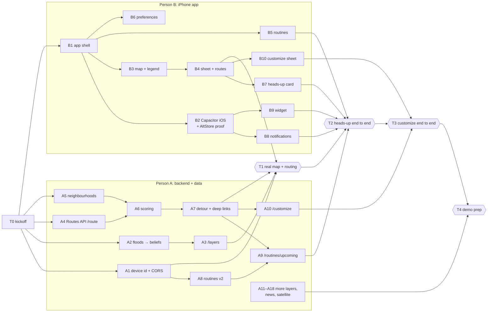

# Mapay task board

How two people build Mapay in parallel. Grab the next task in your column, make a branch with the task's name, open a PR into `main` when it works. This file is the menu; **status lives in branches and PRs** (open PR = in progress, merged = done), so nobody has to edit this file to claim a task.

Background: [`README.md`](README.md) (product), [`docs/design.md`](docs/design.md) (design), [`AGENTS.md`](AGENTS.md) (how it's built), [`docs/hazard-beliefs.md`](docs/hazard-beliefs.md) (hazard confidence), [`frontend/public/mocks/`](frontend/public/mocks/) (API contract).

---

## Who does what

| | Person A: backend + data | Person B: iPhone app |
| --- | --- | --- |
| Suggested | Jean (built the backend, beliefs and CI so far) | Tomas (has the Mac and the iPhone) |
| Owns | `backend/**` | `frontend/**`, including `frontend/ios/` |
| Tests with | `pytest`, `uvicorn` + `/docs`, curl | Browser → iOS Simulator → iPhone (AltStore) |

**Shared files** (small separate PRs, tell the other person): `AGENTS.md`, `README.md`, `TASKS.md`, `docs/**`, `.github/**`, `.env.example`, and the contract: `frontend/public/mocks/**`, `frontend/src/lib/types.ts`, `backend/app/db/models.py`.

The two sides only meet through the API contract, so after the kickoff almost everything runs in parallel. The together points are T0 (kickoff) and the three integrations (T1–T3), plus demo prep (T4).

**Already on `main`:** the hazard belief model + pre-route check (backend), the CI/CD workflow (lint + tests green on both sides), the scaffold routers, and draft mocks for every endpoint. `/route` returns 503 until A4 replaces the OSMnx graph with Routes API. The Cloud Run deploy job fails until the GitHub secrets are added (T0).

---

## T0 · Kickoff together (~30 min, first)

- [ ] **Routing engine:** confirm Google Routes API (as in AGENTS.md). The current OSMnx engine stays until A4 replaces it. If you pick OSMnx instead, update AGENTS.md now.
- [ ] **Contract:** walk through `frontend/public/mocks/*.json` together and fix any shape you disagree with. After this, shapes change only through PRs that update mock + `types.ts` + `models.py` together.
- [ ] **Keys:** fill `.env` (root) and `frontend/.env`: Maps browser key + server key + signing secret, light/dark Map IDs, Gemini, HERE, Atlas URI.
- [ ] **Deploy secrets:** in GitHub → Settings → Secrets and variables → Actions, add `GCP_SA_KEY` and the other secrets + variables listed at the top of `.github/workflows/ci-cd.yml`. Until then every backend merge shows a red `deploy-backend` job (it fails at the Google Cloud login step).
- [ ] **Identity + bundle ids:** header `X-Device-Id`; bundle ids `com.<you>.mapay` and `com.<you>.mapay.widget` (fixed for the whole event).

---

## Order at a glance

**A:** A1 → A2 → A3 → A4 → A5 → A6 → A7 → **T1** → A8 → A9 → **T2** → A10 → **T3** → A11 … A18 → **T4**

**B:** B1 → B2 → B3 → B4 → **T1** → B5 → B6 → B7 → B8 → B9 → **T2** → B10 → **T3** → B11 → B12 → B13 → **T4**

If you're ahead, grab a task marked *portable* from the other column (no Mac needed, few dependencies).

---

## Person A · backend + data

Paths are under `backend/app/` unless noted. "Beliefs" = `register_hazard` / `add_evidence` from `routing/beliefs.py`.

| Task · branch | What | Main files | Needs | Done when |
| --- | --- | --- | --- | --- |
| **A1** · `a1-device-id-cors` | Anonymous identity + CORS | `deps.py` (new), `config.py`, `main.py`, routers | T0 | User endpoints read `X-Device-Id` and upsert `users`; CORS allows `capacitor://localhost`, `http://localhost:5173` and the Vercel domain |
| **A2** · `a2-flood-beliefs` | Floods → beliefs: tides + FEMA + hotspots | `ingestion/tides.py`, `ingestion/fema.py`, `data/flood_hotspots.geojson` | — | Hotspots registered with FEMA + tide priors; a test covers the prior with a saved NOAA response |
| **A3** · `a3-layers-from-beliefs` | `GET /layers` from beliefs | `routers/layers.py` | A2 (any layer) | Same shape as `layers.json`: one collection per legend key, probability, predicted/observed, freshness |
| **A4** · `a4-routes-api` | Routes API client, `/route` with alternatives | `routing/google_routes.py` (new), `routing/engine.py`, `routers/routes.py`, `db/models.py` | T0 | `/route` returns `route.json`'s shape with real Google alternatives (scoring comes in A6); no OSMnx graph needed |
| **A5** · `a5-neighborhoods` *(portable)* | Neighbourhood polygons + `GET /neighborhoods` | `backend/scripts/build_neighborhoods.py` (new), `data/neighborhoods.geojson`, `routers/neighborhoods.py` (new) | — | City of Miami neighbourhoods + Miami-Dade municipalities + Census places merged with stable ids; endpoint matches `neighborhoods.json` |
| **A6** · `a6-route-scoring` | Score alternatives: beliefs + preferences + neighbourhoods | `routing/scoring.py` (new), `routers/routes.py` | A4, A5 | Ranking follows AGENTS.md › Routing step 2; unit tests with fixture polylines |
| **A7** · `a7-detour-deeplinks` | Via-waypoint detour + deep links | `routing/detour.py` (new), `routing/deeplinks.py` (new) | A6 | Blocked routes get a via waypoint (≤ 3 waypoints total); `deep_links` for Google / Apple / Waze in the response |
| **A8** · `a8-routines-v2` | Routines with legs, saved places, preferences | `db/models.py`, `routers/routines.py`, `routers/places.py` (new), `routers/me.py` (new), `routing/pre_route.py`, `backend/tests/test_pre_route.py` | A1 | CRUD matches `routines.json` / `places.json` / `preferences.json`; the pre-route check works per leg; tests updated |
| **A9** · `a9-upcoming-briefings` | `/routines/upcoming`, briefings, `/demo/heads-up` | `scheduling/occurrences.py` (new), `briefings/builder.py` (new), `routers/routines.py`, `routers/demo.py` (new) | A7, A8 | Matches `routines-upcoming.json` (DST-safe, Miami time); signed Static Maps `image_url`; the demo override makes a leg due in 30 min |
| **A10** · `a10-customize` | `POST /customize` | `agents/customize.py` (new), `routers/customize.py` (new) | A5, A7 | Gemini → constraints JSON → router → `customize.json`'s shape; stops via Places Text Search; roads (Overpass) and neighbourhoods resolved to geometry |
| **A11** · `a11-city-gis-beliefs` | City construction + closures → beliefs | `ingestion/closures.py` | — | Projects/permits registered with status priors |
| **A12** · `a12-here-beliefs` | HERE incidents + flow → beliefs | `ingestion/here_incidents.py` | — | Closures/roadworks/accidents registered; flow feeds `congestion` |
| **A13** · `a13-nws-weather` *(portable)* | NWS alerts → beliefs | `ingestion/nws.py`, `routing/belief_config.py` | — | Alert polygons registered as `weather` hazards |
| **A14** · `a14-osm-sidewalks` *(portable)* | OSM no-sidewalk layer | `ingestion/sidewalks.py` (new) | — | `sidewalk=no/none` ways around campus appear in `/layers.no_sidewalk`; coverage checked |
| **A15** · `a15-ingest-scheduler` | `/internal/ingest/{job}` + Cloud Scheduler | `routers/internal.py` (new) | A2 | Every ingestion job runs from Cloud Scheduler with its OIDC token |
| **A16** · `a16-news-gemini` | News → Gemini → evidence | `ingestion/news.py`, `agents/news_extraction.py`, `agents/evidence.py` | A5 | RSS + GDELT every 15 min; matching news adds evidence; new incidents registered; pins in `/layers.incident` |
| **A17** · `a17-satellite-floods` | Satellite floods (GFM, Earth Engine fallback) | `ingestion/gfm.py` (new), `ingestion/earth_engine_s1.py` (new), `routing/belief_config.py` (+ `satellite` source), tests | — | GFM flood extents become evidence / new flood hazards, with the pass time |
| **A18** · `a18-satellite-construction` | Satellite construction (Sentinel-2 + Gemini vision) | `ingestion/earth_engine_s2.py` (new), `agents/satellite_check.py` | A11 | Candidates confirmed by Gemini with before/after images; fallback: image chips at permit sites |

**P1 (after the P0 above):** A19 `a19-best-time` best time inside a window (`scheduling/best_time.py`, needs A9) · A20 `a20-precomputed-briefings` (needs A9, A15) · A21 `a21-traffic-samples` typical congestion (needs A15) · A22 `a22-potholes-radar` 311 potholes + radar overlay · A23 `a23-deploy-hygiene` pin `requirements.txt`, drop `osmnx`/`networkx` after A4, align the Dockerfile's Python 3.11 with CI's 3.14.

---

## Person B · iPhone app

Paths are under `frontend/` unless noted. Build against the mocks (`VITE_USE_MOCKS=true`) until the real endpoint lands.

| Task · branch | What | Main files | Needs | Done when (where to test) |
| --- | --- | --- | --- | --- |
| **B1** · `b1-app-shell` | Ionic React (iOS mode) shell | `package.json`, `src/main.tsx`, `src/App.tsx`, `src/theme/*` (new), `src/lib/api.ts`, `src/lib/types.ts` | T0 | Tabs Map / Routines / Preferences; theme tokens from `docs/design.md`; `api.ts` reads `/mocks/*.json` when `VITE_USE_MOCKS=true`; Vite boilerplate gone; CI green (browser) |
| **B2** · `b2-capacitor-ios` | Capacitor iOS + widget target + AltStore proof | `capacitor.config.ts`, `ios/**`, `frontend/scripts/build-ipa.sh` (new) | B1 | Runs in the Simulator; `mapay://` scheme registered; empty `MapayWidget` extension; sideloaded once on the iPhone; device id logged in app + widget and they match (Simulator + iPhone) |
| **B3** · `b3-map-legend` | Map + legend | `src/map/MapView.tsx`, `src/map/layers.ts`, `src/map/legend.ts` (new), `src/components/LegendSheet.tsx` (new) | B1 | Google map with light/dark Map IDs draws `layers.json` in the legend styles; the legend sheet toggles layers (browser) |
| **B4** · `b4-sheet-routes` | Bottom sheet, search, route options, Open in Google Maps | `src/components/MapSheet.tsx`, `SearchField.tsx`, `RouteOptions.tsx` (new), `src/lib/deepLinks.ts` | B3 | Apple Maps-style sheet with detents; Places search; route cards from `route.json`; focus mode; Google Maps opens through App Launcher (browser, then Simulator) |
| **B5** · `b5-routines` | Routines tab + editor | `src/routines/*` | B1 | Legs with at / between, "add the way back", repeat, heads-up time, per-routine preferences, saved places (browser) |
| **B6** · `b6-preferences` *(portable)* | Preferences tab | `src/routines/PreferencesTab.tsx` (new) | B1 | Per-hazard menus, neighbourhood token search (`neighborhoods.json`), tolls/highways, nav app (browser) |
| **B7** · `b7-headsup-card` | Huge in-app heads-up card | `src/headsup/HeadsUpCard.tsx` (new) | B4 | Card in the sheet for legs inside their window (`routines-upcoming.json`): countdown, top hazards, Start / Customize, haptic (browser, Simulator) |
| **B8** · `b8-notifications` | Local notifications + `mapay://` deep links | `src/headsup/notifications.ts`, `src/headsup/deeplinks.ts` (new) | B2 | One notification per upcoming leg with Start / Customize and the route image; rescheduled on foreground; deep links open the right screen (Simulator) |
| **B9** · `b9-widget` | Home-screen widget (SwiftUI) | `ios/MapayWidget/**`, `ios/App/App/MapayNative*.swift` | B2 | Large/medium/small from `/routines/upcoming` (mock URL in the Simulator); switches to heads-up at `heads_up_at`; Start / Customize links; `reloadWidgets` callable from JS (Simulator) |
| **B10** · `b10-customize-sheet` | Customize sheet | `src/headsup/CustomizeSheet.tsx` (new) | B4 | Prompt + chips → `customize.json` → old vs new route + explanation → Open in Google Maps (browser) |
| **B11** · `b11-hazard-sheet-report` | Hazard detail sheet + report | `src/components/HazardSheet.tsx` (new), `src/components/ReportFab.tsx` | B3 | Tap a hazard → sheet with sources, probability, pass time; reports post with optional `hazard_id` / `cleared` (browser) |
| **B12** · `b12-demo-button` | "Fire heads-up now" | `src/headsup/demo.ts` (new) | B8, B9 | Debug action calls `/demo/heads-up`, schedules the notification 10 s out and reloads the widgets (Simulator + iPhone) |
| **B13** · `b13-vercel-preview` | Public web preview | Vercel project (root `frontend`) | B3 | Public URL pointing at the Cloud Run API (browser) |

**P1:** B14 `b14-live-activity` Live Activity + Lock Screen widgets (`ios/MapayWidget/**`, `MapayNative`, needs B9) · B15 `b15-design-polish` glass, dark mode, Dynamic Type and haptics checked on the iPhone.

---

## Together

| Checkpoint | Needs | What you do |
| --- | --- | --- |
| **T1** · real map + routing | A1, A3, A7, B4 | Point `VITE_API_BASE_URL` at Cloud Run, turn mocks off, fix contract drift, first AltStore build with real data |
| **T2** · heads-up end to end | A9, B5, B7, B8, B9 | Create the MMC ↔ BBC routine in the app, fire the demo heads-up: notification + widget + card; Start opens Google Maps (Simulator, then iPhone) |
| **T3** · Customize end to end | A10, B10 | "stop at a Starbucks and stay off the Palmetto" → new route → Google Maps |
| **T4** · demo prep | everything | Seed the king-tide scenario, pre-run satellite, Cloud Run `min-instances=1`, final AltStore build + refresh, backup screen recording, Devpost, rehearse the 90 s pitch |

---

## Git workflow

- **One branch per task**, created when you start it (not up front): `git switch main && git pull && git switch -c a4-routes-api`.
- **Small PRs into `main`.** CI must be green; then squash-merge it yourself and tell the other person. Ask for a look only when you touch the contract or a shared file.
- **Stay current:** merge `origin/main` into your branch before opening the PR (or rebase your own branch).
- **Contract changes** update the mock, `frontend/src/lib/types.ts` and `backend/app/db/models.py` in the same PR.
- **Backend merges deploy:** a merge that touches `backend/` deploys to Cloud Run, so run `pytest` and `ruff check .` in `backend/` first.
- **Keep branches short** (≈ 3 hours of work). Merge partial work behind mocks rather than letting a branch drift.

## Testing

- **Backend:** `cd backend && pytest && ruff check .`, then `uvicorn app.main:app --reload` and try endpoints at `http://localhost:8000/docs`.
- **App UI, first in the browser:** `cd frontend && npm run dev`, iPhone-size responsive view, `VITE_USE_MOCKS=true`. Fastest loop; covers most of B1–B7, B10, B11.
- **Anything native, in the iOS Simulator on the Mac:** notifications, deep links, the widget, the Live Activity, handing off to Google Maps.
  - `npx cap run ios -l --external` gives live reload inside the Simulator.
  - Add the widget from the Home Screen (long-press); long-press a notification to see Start / Customize.
  - `xcrun simctl openurl booted "mapay://start?routine=rt-fiu&leg=0"` tests deep links.
  - The Simulator reaches the Mac's `localhost` (Vite on 5173, API on 8000).
- **On the iPhone (AltStore), only at checkpoints:** B2 (pipeline proof), T1, T2 and the demo build. Each install is a Release build → `.ipa` → AltStore (about 10 min), installs expire after 7 days, and the bundle ids must not change.

## If we fall behind, cut in this order

1. All P1 items (A19–A23, B14–B15).
2. B13 Vercel preview.
3. A18 → only the permit-site fallback.
4. A17 → only one flood source (GFM or Earth Engine, whichever works first).
5. A12 flow (keep incidents), A14 sidewalks.
6. A16 → RSS only, no GDELT.
