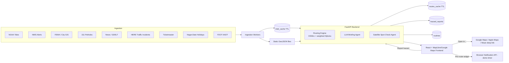
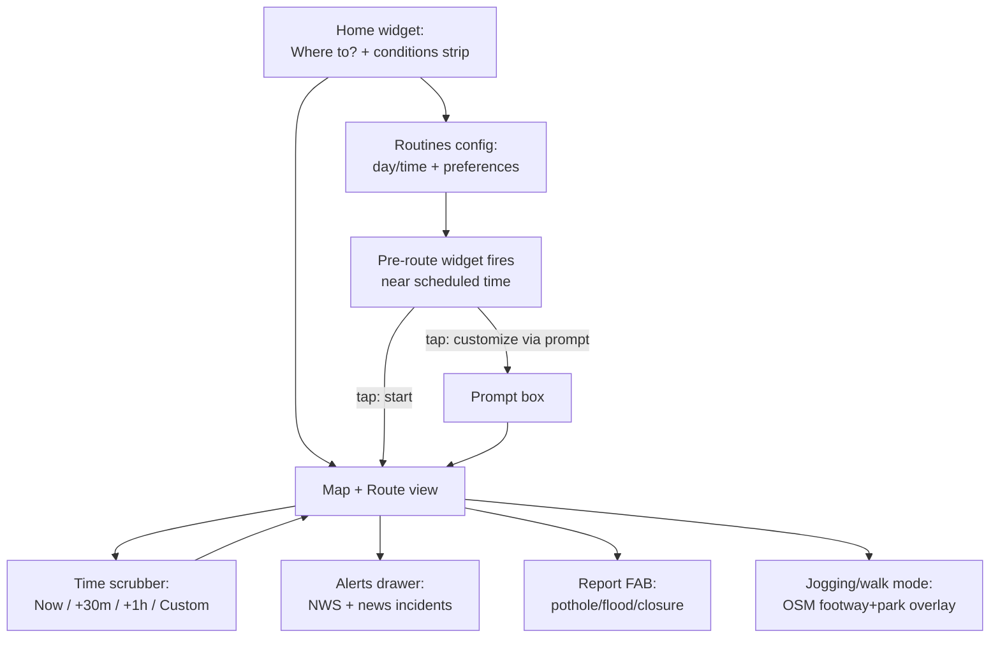

## Architecture (data flow)

```mermaid
flowchart LR
    subgraph Ingestion
        A1[NOAA Tides]
        A2[NWS Alerts]
        A3[FEMA / City GIS]
        A4[311 Potholes]
        A5[News / GDELT]
        A9[HERE Traffic Incidents]
        A6[Ticketmaster]
        A7[Nager.Date Holidays]
        A8[FDOT AADT]
    end

    Ingestion --> W[Ingestion Workers]
    W --> M1[(intel_cache TTL)]
    W --> S[Static GeoJSON files]

    subgraph Backend[FastAPI Backend]
        R[Routing Engine\nOSMnx + weighted Dijkstra]
        LB[LLM Briefing Agent]
        SC[Satellite Spot-Check Agent]
    end

    M1 --> Backend
    S --> Backend
    Backend --> M2[(routes_cache TTL)]
    Backend --> M3[(hazard_reports)]
    Backend --> M4[(routines)]

    Backend --> F[React + MapLibre/Google Maps Frontend]
    F -->|Open in...| Ext[Google Maps / Apple Maps / Waze deep link]
    F -->|Report hazard| Backend
    F -->|Pre-route widget| Notif[Browser Notification API - demo timer]
```

## UI flow

```mermaid
flowchart TD
    Home[Home widget:\nWhere to? + conditions strip] --> Map[Map + Route view]
    Home --> Routines[Routines config:\nday/time + preferences]
    Routines --> Widget[Pre-route widget fires\nnear scheduled time]
    Widget -->|tap: start| Map
    Widget -->|tap: customize via prompt| Prompt[Prompt box] --> Map
    Map --> Scrubber[Time scrubber:\nNow / +30m / +1h / Custom]
    Scrubber --> Map
    Map --> Alerts[Alerts drawer:\nNWS + news incidents]
    Map --> ReportFAB[Report FAB:\npothole/flood/closure]
    Map --> Walk[Jogging/walk mode:\nOSM footway+park overlay]
```

