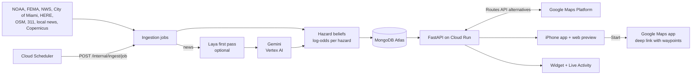

# MAPAY: technical reference

One place for how MAPAY is built and run, as it stands on `main`. For the plan and the rules, see [`AGENTS.md`](../AGENTS.md). For the product, see [`README.md`](../README.md). For the visual spec, see [`design.md`](design.md). Production status is as of Sept 27, 2026.

## How it works, step by step

### 1. Data comes in (Cloud Scheduler → ingestion jobs)

1. Cloud Scheduler calls `POST /internal/ingest/{job}` on a fixed schedule (see Jobs), with a Google-signed token that the backend checks. Each job runs inside that request, since Cloud Run gives no CPU between requests.
2. Each job fetches its source: NOAA tides, FEMA zones and curated hotspots, NWS alerts, HERE incidents and flow, City of Miami projects and permits, OSM sidewalks, 311 potholes, Copernicus GFM flood maps, local news.
3. Map layers become **hazards**. For each feature, the job calls `register_hazard(stable_id, kind, geometry, properties)`. The id stays the same across refreshes (the same permit is always the same hazard).
   - A new id creates a belief with its **prior**: a starting probability from what the source says. For a flood, that's the FEMA zone plus how far the tide is above the minor-flood threshold. For a permit, its status (closed 0.95, active 0.8, …).
   - An existing id only gets its prior updated, and the evidence it has already collected is kept.
4. News goes through its own pipeline: new articles (never the same one twice) → Laya's yes/no filter if `LAYA_URL` is set (not in production) → Gemini extracts category, place, time, severity and summary → Google geocodes the place inside Miami-Dade → either
   - it's within ~150 m of an existing hazard of the same kind: it becomes **evidence** on that hazard, or
   - it's new (a crash, police activity, a closure): it registers a new hazard with a fixed prior, and the article is attached as evidence so its link shows on the map.
5. Satellite (GFM) flood areas do the same: evidence on the flood hazards they overlap, and new flood hazards elsewhere.
6. User reports (`POST /report`) linked to a hazard add crowd evidence, or "cleared" evidence if the user says it's gone.
7. After each job, the backend records the run (shown as freshness on the map) and rebuilds the `/layers` snapshot if any hazard changed. This check is the one that currently re-reads the whole database (see Known limits).

### 2. The model updates (hazard beliefs)

1. Each hazard stores a **log-odds** value: `log(p / (1 − p))`. Adding evidence is just adding a number:

   | Evidence | Adds | Decay |
   |---|---|---|
   | News article | +0.5 | None |
   | Satellite detection | +1.0 | None |
   | User report | +1.5 | Fades to 0 over 2 h |
   | "Cleared" report | −1.5 | Fades to 0 over 2 h |

2. Every piece of evidence is counted **once** (keyed by source + id), with a single atomic database update, so a re-delivered article or report never counts twice.
3. When a prior changes (e.g. the tide rises), only the difference is applied, so the evidence stays.
4. Decay isn't written by a timer. Whenever the backend reads the beliefs (for `/route`, `/layers`, upcoming legs), it recomputes the decaying contributions for "now".
5. A hazard is **active** at log-odds ≥ 1.0, i.e. p ≥ 0.73. Only active hazards affect routing. Below that, the map shows it as "unconfirmed", and a hazard with only its prior shows as "predicted".
6. Beliefs never expire. News-only hazards are filtered by age on the map instead (crash 3 h, flood 12 h, closure 24 h or its stated end, construction 30 days).

Example: a street in FEMA zone AE starts at p 0.6 (log-odds 0.41, not active). One news article (+0.5) takes it to 0.91, which is p 0.71: still not active. A user report (+1.5) takes it to 2.41, p 0.92: now it's active and routes avoid it. Two hours later, with the report faded, it's back to 0.91.

### 3. The map shows it (`GET /layers`)

1. The app asks for `/layers` for the visible area.
2. The backend serves it from an in-memory snapshot of all hazards: one GeoJSON collection per category, each hazard with its probability, severity, sources and times, plus freshness per source.
3. The app draws each category with its own colour, icon and line style (`frontend/src/map/legend.ts`). Severity sets the line width, probability sets the opacity. Tapping a hazard opens its sources and confidence.

### 4. A route is calculated (`POST /route`)

1. The app sends origin, destination, departure time and the user's preferences (per category: avoid / prefer to avoid / don't care, avoided neighbourhoods, tolls, highways).
2. The backend asks **Google Routes API** for up to 3 alternatives at that departure time, with Google's own traffic prediction.
3. It loads the current beliefs (cached for 60 s per server) and keeps the active ones.
4. It **scores** each alternative: `predicted minutes + Σ penalty`, one penalty per active hazard within ~30 m of the route. `penalty = weight × severity × p × 3 min`, where weight is 10 for "avoid", 2 for "prefer to avoid", 0 for "don't care". An avoided neighbourhood counts as a severity-5 hazard with p = 1. The cheapest route wins.
   - Example: a 25-min route through an active flood (severity 4, p 0.9, "avoid") costs 25 + 10 × 4 × 0.9 × 3 = 133. A 31-min route with no hazards costs 31, so it wins.
5. **Detour:** if the winner still crosses an "avoid" hazard of severity ≥ 4, the backend picks a point ~300 m past the hazard's edge, on the side with fewer hazards, and asks Google again with that point as a pass-through waypoint. At most 2 rounds and 3 waypoints. If nothing avoids it (e.g. the destination is in an avoided neighbourhood), it returns the best route and says so.
6. The response has the chosen route, the scored alternatives, the hazards on the route, a short briefing, and deep links: Google Maps with the waypoints, Apple Maps and Waze with origin → destination only.
7. **Start** opens Google Maps with that link. Google drives; MAPAY's waypoints steer it around the hazard.
8. With `routine_id` + `leg`, the route and a snapshot of the beliefs on it are saved on that leg (`route_state`).

### 5. Customize with a prompt (`POST /customize`)

1. The user types e.g. "stop at a Starbucks and stay off the Palmetto".
2. Gemini returns **constraints only** as JSON: stops, categories to avoid, neighbourhoods, roads, tolls, highways, departure time. A keyword parser takes over if Gemini is down.
3. The backend resolves them: stops with Places Text Search near the current route, neighbourhood names to ids, road names to road geometry from a stored OpenStreetMap snapshot.
4. The same scoring + detour runs with those constraints (an avoided road counts after ≥ 300 m of overlap).
5. Gemini writes a 1–2 sentence explanation from the router's result. The app shows the old and new routes side by side.

### 6. Routines and the heads-up

1. A routine is a set of legs between saved places, each at a time ("at 09:30") or in a window ("between 17:00 and 19:00"), repeating daily, weekly or on chosen weekdays, in the routine's timezone.
2. `GET /routines/upcoming` lists the next occurrences over 7 days. For each leg it **recomputes the route against the current beliefs** (the same scoring + detour; cached 15 min per server), and adds the top hazards, a signed Static Maps image and, for windows, the best time to leave (departures tried every 15 min across the window).
3. The `briefings` job precomputes this every 10 min for legs leaving in the next 2 h, so the app and widget load it instantly.
4. The **app** fetches it on launch, on resume and after routine edits. It schedules one local notification per leg at departure − 30 min (Start / Customize actions, route image), updates the in-app card and the Live Activity, and asks the widget to reload.
5. The **widget** fetches the same list on its own (no App Groups on a free Apple ID), switches to heads-up mode at departure − 30 min with a countdown, and reloads 15 min before the next heads-up.

### 7. Recalculating when conditions change

1. **In practice:** every fetch of `/routines/upcoming` (the app refreshing, the widget reloading, the `briefings` job) routes the leg again with the latest beliefs. If a flood became active since the last fetch, the new route avoids it, and the notification, widget and card show the new route.
2. **The pre-route check** (`POST /routines/{id}/pre-route-check`): 30–60 min before a leg, it compares the beliefs on the saved route with the snapshot saved on the leg.
   - No hazard crossed the 0.73 line: nothing is recalculated and Gemini isn't called.
   - A hazard crossed it: the backend reroutes (scoring only, without the detour step), saves the new route and snapshot, and Gemini explains what changed ("NE 151st St flood confirmed by a user report").
   - The endpoint works, but **no client calls it yet**: the app and widget use `/routines/upcoming` instead. The demo's "Fire heads-up now" uses `POST /demo/heads-up`, which makes a leg due in 30 min.

## At a glance

| Part | What | Where it runs |
|---|---|---|
| iPhone app | React 18 + Ionic 9 (iOS mode) + Capacitor 8, iOS 17+, bundle id `com.tomaspessagno.mapay` | The iPhone (AltStore sideload) and the iOS Simulator |
| Native iOS | One widget extension, `MapayWidget`: WidgetKit widgets (small, medium, large) + the ActivityKit Live Activity. App-local plugin `MapayNative` | Inside the app bundle |
| Web preview | The same app built for the browser | GitHub Pages: https://tomaspessagno.github.io/mapay/ (main). Vercel: https://mapay-blue.vercel.app/ (secondary; its Hobby plan hit its daily deploy limit) |
| Backend | FastAPI on Python 3.14, Docker image | Cloud Run service `mapay-api`, `us-east1`: https://mapay-api-lgfe7q5oja-ue.a.run.app |
| Database | MongoDB Atlas (free M0) through `motor` | Atlas |
| Jobs | Cloud Scheduler → `POST /internal/ingest/{job}` with an OIDC token | Google Cloud |
| AI | Gemini on Vertex AI (`google-genai`, default model `gemini-3.8-flash`). Laya (open source, fine-tuned) as an optional news first pass, not used in production | Vertex AI |
| Maps | Google Maps Platform: Maps JavaScript, Places (New), Routes, Geocoding, Maps Static | Google |

## Architecture

Gemini *interprets* and *explains*. It never chooses the route: the router is deterministic.

## Backend

Code: `backend/app/`. Entry point `main.py`: CORS, gzip (the `/layers` payload is ~14 MB of JSON, under 1 MB gzipped), and at startup the Mongo indexes and a background warm-up of the `/layers` snapshot. There are no in-process pollers; Cloud Run throttles CPU between requests.

### Endpoints

User endpoints identify the device with the `X-Device-Id` header (anonymous, no real auth). Example responses for each endpoint: `frontend/public/mocks/` (the contract).

| Method + path | What |
|---|---|
| `GET /health` | Liveness |
| `GET /layers?t=&bbox=` | One GeoJSON FeatureCollection per category, plus per-source freshness and the last run of each ingest job |
| `POST /route` | Scored alternatives, hazards on the route, deep links, briefing; with `routine_id` + `leg` it saves the route and a belief snapshot on that leg |
| `POST /customize` | `{prompt, routine_id, leg}` or `{prompt, origin, destination}` → constraints, old vs new route, explanation |
| `GET/POST/PUT/DELETE /places` | Saved places |
| `GET/POST/PUT/DELETE /routines` | Routines (legs) |
| `GET /routines/upcoming?days=7` | Next leg occurrences with route summary, top hazards, best time and a signed Static Maps image. The widget uses `?compact=1&limit=3` |
| `POST /routines/{id}/pre-route-check` | `{leg, departure}` 30–60 min before a leg: recompute only if a hazard crossed the threshold |
| `GET/PUT /me/preferences` | Default preferences |
| `GET /neighborhoods` | Neighbourhood ids + names (polygons stay on the server) |
| `POST /report`, `GET /report` | User reports; with `hazard_id` they add crowd / cleared evidence |
| `GET /alerts` | NWS alerts + news items |
| `POST /demo/heads-up` | Makes a leg "due in 30 min" for the live demo |
| `POST /internal/ingest/{job}` | Cloud Scheduler only (see Jobs) |

### Routing (`backend/app/routing/`)

1. `google_routes.py` calls Routes API `computeRoutes` with alternatives on, `TRAFFIC_AWARE_OPTIMAL`, the departure time and Google's `avoidTolls` / `avoidHighways`. Up to 3 routes come back (1 when intermediate stops are set).
2. `scoring.py` ranks them: `cost = predicted minutes + Σ penalty` over **active** hazards within ~30 m of the route. `penalty = weight × severity × p × 3 min`, with weights `avoid` 10, `prefer_avoid` 2, `ignore` 0. An avoided neighbourhood counts as severity 5 with p = 1. A road avoided in Customize counts only after ≥ 300 m of overlap.
3. `detour.py`: if the best route still crosses an `avoid` hazard of severity ≥ 4, it adds a `via` waypoint ~300 m past the hazard's edge and asks Google again. At most 2 rounds and 3 waypoints; hazards wider than 6 km are skipped.
4. `deeplinks.py`: Google Maps link with up to 3 waypoints; Apple Maps and Waze get origin → destination only.
5. `engine.py` is now just a thin wrapper over Routes API. The old OSMnx graph is gone.

`routes_cache` has a 15-minute TTL index, but no code writes to it, so every `/route` call reaches Google. Upcoming-leg routes use a separate 15-minute in-memory cache per server (`briefings/builder.py`).

### Hazard beliefs (`beliefs.py`, `belief_config.py`)

Every hazard is a Bayesian log-odds belief stored in `intel_cache` as `belief:<hazard_id>`. Source layers register hazards with a prior; news, reports and satellite add evidence. All values are hand-tuned heuristics, not calibrated forecasts.

| Setting | Value |
|---|---|
| Active for routing | log-odds ≥ 1.0 (p ≈ 0.73) |
| Evidence (log-odds added) | news +0.5, crowd +1.5, satellite +1.0, cleared −1.5 (street_view +2.5 has no producer, by design) |
| Crowd / cleared decay | Linear over 2 h |
| Route corridor | ~30 m (0.0003°) |
| Flood prior | FEMA zone VE/V 0.7, AE/A 0.6, X 0.1, default 0.3, plus 1.0 log-odds per foot of tide above the minor-flood threshold |
| Construction / closure prior | By status: closed 0.95, active 0.8, approved 0.5, pending 0.2, completed/cleared 0.05 |
| Other priors | Incident 0.7, news closure 0.55, news construction 0.5, satellite flood 0.75, satellite construction 0.7, pothole 0.1 + 0.2 per complaint/km |

Beliefs never expire. `docs/hazard-beliefs.md` still describes the pre-route check against the old OSMnx graph; the logic is the same, but routing now goes through Routes API.

### Jobs (`routers/internal.py`, cadences in `backend/scripts/scheduler.sh`)

Every call must carry a Google-signed OIDC token with `INTERNAL_AUDIENCE` as the audience and `SCHEDULER_SERVICE_ACCOUNT` as the email. Each successful run is recorded in `ingest_runs`, and `/layers` shows it as freshness.

| Job | Cron (America/New_York) | Source → category |
|---|---|---|
| `news` | every 15 min | 5 RSS feeds (NBC6, WLRN, Local10, Miami Herald, CBS Miami) + 5 GDELT queries → Laya (optional) → Gemini → geocode → evidence or new `incident` / `closure` / `construction` hazards |
| `weather` | every 5 min (**paused**, see Known limits) | NWS alerts for Miami-Dade → `weather` |
| `here` | every 5 min (**paused**) | HERE Traffic v7 incidents + flow → `closure`, `construction`, `congestion` |
| `tides` | hourly | NOAA Virginia Key (8723214) tides + FEMA zones + curated hotspots → `flood` |
| `city_gis` | daily 06:00 | City of Miami Public Works projects + permits → `construction`, `closure` |
| `sidewalks` | daily 03:00 | OSM Overpass `sidewalk=no/none` → `no_sidewalk` |
| `potholes` | Mondays 04:00 | Miami-Dade 311 (2023 dataset, "chronic corridors") → `pothole` |
| `gfm` | hourly at :15 | Copernicus GFM (EODC's open STAC catalog, no account) → `flood`; falls back to Earth Engine Sentinel-1 |
| `s1` | not scheduled | Earth Engine Sentinel-1 run on its own (needs Earth Engine, not registered) |
| `s2` | Mondays 05:00 | Earth Engine Sentinel-2 change detection + Gemini vision → `construction`; falls back to checking City permit sites. **Both modes need Earth Engine, which isn't registered, so this job can't produce anything.** It has never run on schedule (first run: Monday 05:00) |
| `briefings` | every 10 min | Precomputed heads-up briefings |
| `traffic` | hourly at :05 | Routes API predicted durations per corridor and hour of week (typical congestion) |

News expiry: incident 3 h, flood 12 h, closure = stated end or 24 h, construction 30 days. An article is never processed twice (`news_seen:<hash>`, 3-day TTL).

### Laya (`services/laya/`, `agents/news_triage.py`)

- Open-source decision model ([Laya](https://github.com/NandhaKishorM/laya), Apache-2.0), `multilingual` checkpoint, served by `services/laya/serve.py` on `127.0.0.1:8001` behind a tunnel, bearer token `LAYA_API_KEY`.
- Asks one yes/no question per article ("street problem in Miami-Dade?"). Articles below p 0.2 are dropped; any Laya failure keeps the article.
- Without `LAYA_URL` the pipeline runs Gemini-only. **That's production today:** Laya has been fine-tuned (#47), but `LAYA_URL` isn't set on Cloud Run. (Zero-shot Laya kept only 2 of 10 real road stories, which is why it stayed off until the fine-tune.)
- Fine-tune scripts: `services/laya/finetune/` (Claude-labelled Miami news, Kaggle GPUs).

### Gemini (`backend/app/agents/`)

- One client builder: `genai_client.py`. Every agent uses `get_genai_client()` and `settings.gemini_model`.
- Active backend: Vertex AI (`GOOGLE_GENAI_USE_VERTEXAI=true`). The AI Studio key path is parked (its project is out of credit).
- Agents: `news_extraction.py` (structured event JSON), `customize.py` (prompt → constraints JSON, plus a keyword parser when Gemini is unavailable), `satellite_check.py` (vision on Sentinel-2 chips), `briefing.py` (route-change explanation). Each falls back to fixed text if Gemini fails.

## iPhone app (`frontend/`)

- **Data source:** Demo (bundled mocks in `public/mocks/`) or Live (the backend), switchable in Preferences. The build default comes from `VITE_USE_MOCKS`; native builds pointed at `localhost` fall back to the Cloud Run URL (`src/lib/dataSource.ts`).
- **Map:** Google Maps JavaScript through `@vis.gl/react-google-maps`, Map ID `3175b3df38b9e69a72a689c7`. Colours, icons and line styles per category live only in `src/map/legend.ts`.
- **Search:** Places Autocomplete (New) straight from the app with the browser key (`src/components/SearchField.tsx`). "Search isn't available right now" means Google rejected the request.
- **Heads-up:** local notifications with Start / Customize actions (`src/headsup/`), `mapay://` deep links, the in-app card, and the Live Activity started from the app (`src/lib/native.ts` → `MapayNativePlugin.swift`).
- **Widget:** `ios/App/MapayWidget/`. It fetches `/routines/upcoming` itself with `identifierForVendor` as `X-Device-Id`, builds idle → heads-up → next-leg entries, and reloads 15 min before the next heads-up.
- **Free Apple ID limits:** no server push, no App Groups, 3 apps including AltStore (so exactly one extension), and apps expire after 7 days in AltStore.

## Build and deploy

| Workflow | Trigger | Does |
|---|---|---|
| `ci-cd.yml` | Every push and PR | Backend: `ruff check . && pytest`. Frontend: lint, type check, build. On `main` with `backend/` changes: deploys to Cloud Run from `GCP_SA_KEY`, passing the env vars below |
| `pages.yml` | `main`, `frontend/` changes | Builds the web preview (Live data, Cloud Run URL) → GitHub Pages |
| `ipa.yml` | `main`, `frontend/` changes, or manual | Builds an unsigned `.ipa` on a macOS runner → pre-release `latest-ipa` (`test-ipa` for manual runs). Get it with `gh release download latest-ipa -R TomasPessagno/mapay -p Mapay.ipa`, install with AltStore |

**The Pages preview and the CI-built `.ipa` both take their Maps key from the GitHub secret `VITE_GOOGLE_MAPS_API_KEY`**, not from anyone's `frontend/.env`. If that secret holds an old or rotated key, the map shows `ExpiredKeyMapError` and search fails in both.

## Configuration

Backend: root `.env` locally, GitHub secrets/variables in production. Check your local files with `scripts/check-env.sh`. Values are never committed.

| Name | Used for |
|---|---|
| `MONGODB_URI`, `MONGODB_DB_NAME` | Atlas (required; the backend won't start without them) |
| `GOOGLE_MAPS_API_KEY` | Server key: Routes, Places (New), Geocoding, Maps Static. No application restriction |
| `GOOGLE_MAPS_SIGNING_SECRET` | Signs Static Maps URLs for heads-up images |
| `GOOGLE_GENAI_USE_VERTEXAI`, `GOOGLE_CLOUD_PROJECT`, `GOOGLE_CLOUD_LOCATION`, `GEMINI_SERVICE_ACCOUNT` | Gemini on Vertex AI; Cloud Run runs as the service account |
| `EARTH_ENGINE_PROJECT` | Earth Engine (Sentinel-1/2) |
| `HERE_API_KEY`, `NWS_USER_AGENT` | HERE traffic; NWS requires a contact User-Agent |
| `LAYA_URL`, `LAYA_API_KEY` | Laya first pass (optional) |
| `CORS_ORIGINS` | Allowed app origins, e.g. `http://localhost:5173,capacitor://localhost,https://mapay-blue.vercel.app,https://tomaspessagno.github.io` |
| `INTERNAL_AUDIENCE`, `SCHEDULER_SERVICE_ACCOUNT` | Who may call `/internal/*` |
| `VITE_GOOGLE_MAPS_API_KEY`, `VITE_GOOGLE_MAPS_MAP_ID`, `VITE_API_BASE_URL`, `VITE_USE_MOCKS` | Frontend (`frontend/.env` locally; secret + workflow values in CI) |

### Maps keys

| Key | Restrictions | Used by |
|---|---|---|
| Server key | Application: none. APIs: Routes API, Places API (New), Geocoding API, Maps Static API | The backend (`GOOGLE_MAPS_API_KEY`) |
| Browser key | Application: none during the event (re-restrict afterwards). APIs: Maps JavaScript API, Places API (New) | The app and web preview (`VITE_GOOGLE_MAPS_API_KEY`) |

Key errors from Google, and what they mean:
- `API_KEY_SERVICE_BLOCKED`: the key's API list doesn't include that API.
- `SERVICE_DISABLED`: the API isn't enabled in the key's project.
- `API_KEY_HTTP_REFERRER_BLOCKED`: the key has a website restriction; server keys need none.
- `ExpiredKeyMapError`: an old, rotated or deleted key.

The Console only offers an API in a key's API list once that API is enabled in the key's project.

## Known limits

- Satellite is near real time, not live: Sentinel passes are days apart and arrive hours to ~2 days later. Radar misses water between buildings; Sentinel-2 is 10 m and blocked by clouds.
- A missing OSM sidewalk tag means *unknown*, not "no sidewalk".
- Confidence values are heuristics.
- Anonymous device ids are not authentication.
- `/route` isn't cached (see Routing).
- **MongoDB Atlas M0 throttling (Sept 27):** single-document queries took ~7.7 s, so Live `/route` and `/layers` timed out. Cause in the code: after every ingest job, `hazards_fingerprint` (`routers/layers.py`) streams every belief and evidence document from Atlas to decide whether to rebuild the `/layers` snapshot, and `weather` + `here` run every 5 min. Atlas Metrics showed ~14 MB/s network spikes every ~5 min and a ~300 ops/s spike. `weather` and `here` are paused until the fix (#150) is deployed; resume them with `gcloud scheduler jobs resume mapay-ingest-weather --location us-east1` (and `…-here`). If the throttle lasts, the Atlas Flex tier removes the M0 limits, at a monthly cost.

## Production status (Sept 27)

- **Google Cloud:** one project runs Cloud Run, Cloud Scheduler, Vertex AI and both Maps keys. Two keys: the browser key (`frontend/.env` → `VITE_GOOGLE_MAPS_API_KEY`) and the server key (root `.env` → `GOOGLE_MAPS_API_KEY`). The GitHub secrets were updated after the server key's rotation.
- **Jobs:** all 11 scheduled jobs exist in `us-east1` and run. `weather` and `here` are paused (Atlas throttling). `s2` can't work without Earth Engine.
- **Satellite:** GFM has produced flood detections over Miami. Earth Engine isn't registered (its sign-up asks for an agreement), so the Sentinel-1 fallback and Sentinel-2 construction detection are off.
- **Laya:** fine-tuned, not used in production (Gemini-only news).
- **Cloud Run:** `min-instances=1` for judging.
